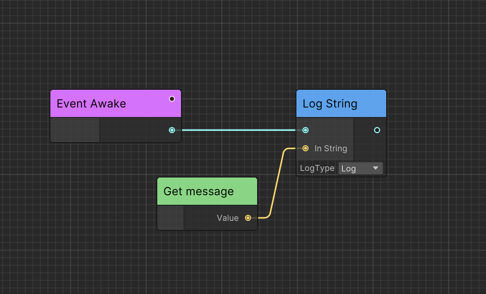

# Concept of Ceres

Introducing the core concepts of Ceres.

## Node

`CeresNode` is the logic and data container.

## Port

`CeresPort` enables you to get data from other nodes.

Ceres use `CeresPort<T>` to set get generic data from other Node and use `NodePort` to get a `NodeReference` which can convert to `CeresNode` at runtime.

## Graph

`CeresGraph` contains everything and acts as a virtual machine.

## Data

Ceres serialize node, port and graph to an additional data structure:  `CeresNodeData`, `CeresPortData` and `CeresGraphData` which contains the actual serialized data and metadata.

## Variable

`SharedVariable` is a data container that can be shared between nodes and graphs.

Compared with `CeresPort`, `SharedVariable` can be edited out of graph and not contain any connection data since it not need to know where the data comes from.  

## Execution Path

Node can be executed in two way:

<b>Forward</b>: Graph can execute nodes one by one.

<b>Dependency</b>: Graph should execute node's dependencies before execute node.

As shown in the figure, to execute `Log String`, we need first get the variable `message`. However, since `Get message` has no outer connect it, it has not been executed before. So the graph need consider `Get message` as dependency and execute it before executing `Log String`.