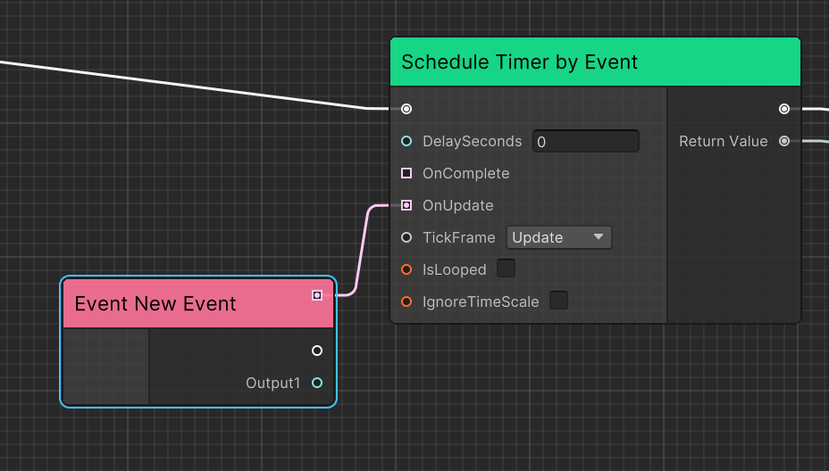
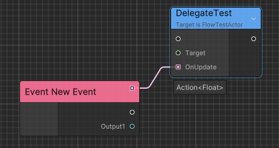
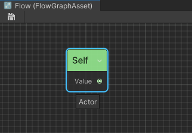
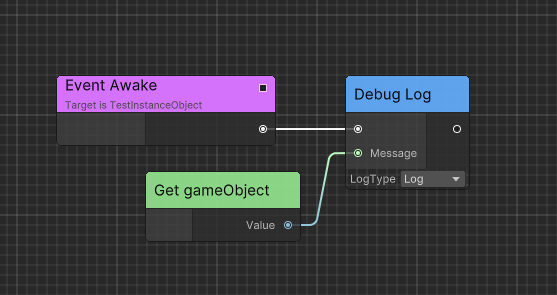

# Flow
Powerful visual scripting solution inspired from Unreal's Blueprint.

  - [Conecpt](#conecpt)
    - [Execution Event](#execution-event)
    - [Implementable Event](#implementable-event)
    - [Executable Function](#executable-function)
      - [Conventions and Restrictions](#conventions-and-restrictions)
    - [Generic Node](#generic-node)
    - [Runtime Architecture](#runtime-architecture)
      - [FlowGraphObject](#flowgraphobject)
      - [FlowGraphAsset](#flowgraphasset)
      - [FlowGraphInstanceObject](#flowgraphinstanceobject)
      - [FlowGraphScriptableObject](#flowgraphscriptableobject)
  - [Advanced](#advanced)
    - [Port Implict Conversation](#port-implict-conversation)
    - [Node has Port Array](#node-has-port-array)
    - [Code Generation](#code-generation)
      - [ILPP](#ilpp)
  - [Debug](#debug)
    - [Breakpoint Support](#breakpoint-support)


## Conecpt

Before start up Flow, I recommend to read [Ceres Concept](./ceres_concept.md) before.

Flow thinks of game logic as an execution chain to let the game objects do things in 
order according to your design.

Flow visualize those execution as nodes so you can connect them to get a graph.

### Execution Event

Each execution starts from an external event and can contain input data.


> You can double click the event node and rename it.

By default, Execution Event without parameters can be created in search window.

Execution event with parameters can be created when you drag any port with type `EventDelegate<>`.



Also support port with type `Action<>` by [implicit conversation](#port-implict-conversation).



### Implementable Event

Implementable events can be defined in C# to allow the script to call Flow execution.

Following is an implementation example.

```C#
public class FlowTest : FlowGraphObject
{
    [ImplementableEvent]
    public void Awake()
    {
        /* ProcessEvent is a bridge method*/
        this.ProcessEvent();
    }

    [ImplementableEvent]
    public void PrintFloat(float data)
    {
        this.ProcessEvent<float>(data);
    }

    [ImplementableEvent]
    public void ExecuteTest(string data)
    {
        this.ProcessEvent<string>(data);
    }
}
```


### Executable Function

You can add `ExecutableFunctionAttribute` in two ways.

1. For instance method, add `ExecutableFunctionAttribute` directly.

```C#
public class MyComponent: Component
{
    [ExecutableFunction]
    public void DoSomething(int arg1, float arg2)
    {
        // DoSomething
    }
}
```

2. For static method, create a new <b>partial</b> class and implement `ExecutableFunctionLibrary` to 
   add static executable functions, then add `ExecutableFunctionAttribute`. 
   
   >You must add `partial` modifier to let source generator work. Source generator will register static function pointer to the flow reflection system instead of using MethodInfo to enhance runtime performance.
   

```C#
public partial class UnityExecutableFunctionLibrary: ExecutableFunctionLibrary
{
    // IsScriptMethod will consider UObject as function target type
    // IsSelfTarget will let graph pass self reference as first parameter if self is UObject
    [ExecutableFunction(IsScriptMethod = true, IsSelfTarget = true), CeresLabel("GetName")]
    public static string Flow_UObjectGetName(UObject uObject)
    {
        return uObject.name;
    }

    // ResolveReturnAttribute will let graph editor display return type by this parameter result
    // Only support SerializedType<T> from Chris.Serialization
    [ExecutableFunction]
    public static UObject Flow_FindObjectOfType(
        [ResolveReturn] 
        SerializedType<UObject> type)
    {
        return UObject.FindObjectOfType(type);
    }
}
```

#### Conventions and Restrictions

1. For methods defined in the same class and its inheritance hierarchy, 
   methods with the same name and the same parameter count can only have
    one marker `ExecutableFunctionAttribute`.

2. For methods with the same name but different number of parameters in 1, 
   you should use `CeresLabelAttribute` to distinguish their names displayed 
   in the editor.

3. Generic methods are not supported using `ExecutableFunctionAttribute`, they
    need to be defined in a generic node which will be explained in 
    [Generic Node](#generic-node) below.

4. Try to keep the number of input parameters less than or equal to 6, otherwise the 
   editor will use Uber nodes to support method calls with any parameters. The 
   default parameter values ​​will not be serialized and the runtime overhead will 
   be greater.

Wrong example:

```C#
[ExecutableFunction]
public static string Flow_GetName(UObject uObject)
{
    return uObject.name;
}

[ExecutableFunction]
public static string Flow_GetName(Component component)
{
    return component.name;
}

[ExecutableFunction]
public static void Flow_DoSomething(string arg1, int arg2)
{
    
}

[ExecutableFunction]
public static string Flow_DoSomething(string arg1)
{
    
}
```

Correct example:

```C#
[ExecutableFunction]
public static string Flow_UObjectGetName(UObject uObject)
{
    return uObject.name;
}
[ExecutableFunction]
public static string Flow_ComponentGetName(Component component)
{
    return component.name;
}

[ExecutableFunction, CeresLabel("DoSomething with 2 Arguements")]
public static void Flow_DoSomething(string arg1, int arg2)
{
    
}

[ExecutableFunction]
public static string Flow_DoSomething(string arg1)
{
    
}
```

### Generic Node
Generic nodes define type restrictions through template classes, so that argument 
types can be obtained in the editor and the generic node instance can be constructed 
at runtime. This helps reduce lines of code.

Following is an implementation example.

```C#
[NodeGroup("Utilities")]
[CeresLabel("Cast to {0}")]
[CeresMetadata("style = ConstNode")]
public class FlowNode_CastT<T, TK>: ForwardNode where TK: T
{
    [OutputPort(false), CeresLabel("")]
    public NodePort exec;
    
    // HideInGraphEditorAttribute is used in input port to restrict
    // users to edit fields only by connecting edges
    [InputPort, HideInGraphEditor, CeresLabel("Source")]
    public CeresPort<T> sourceValue;
    
    [OutputPort, CeresLabel("Cast Failed")]
    public NodePort castFailed;
            
    [OutputPort, CeresLabel("Result")]
    public CeresPort<TK> resultValue;

    protected sealed override UniTask Execute(ExecutionContext executionContext)
    {
        try
        {
            resultValue.Value = (TK)sourceValue.Value;
            executionContext.SetNext(exec.GetT<ExecutableNode>());
        }
        catch (InvalidCastException)
        {
            executionContext.SetNext(castFailed.GetT<ExecutableNode>());
        }

        return UniTask.CompletedTask;
    }
}
```

Then define a class named as `{node name}_Template` implementing `IGenericNodeTemplate` or 
derived from `GenericNodeTemplate`.

```C#
public class FlowNode_CastT_Template: GenericNodeTemplate
{
    // Notify editor FlowNode_CastT need user to drag a port
    public override bool RequirePort()
    {
        return true;
    }
    
    public override Type[] GetGenericArguments(Type portValueType, Type selectArgumentType)
    {
        return new[] { portValueType, selectArgumentType };
    }

    public override Type[] GetAvailableArgumentTypes(Type portValueType)
    {
        return CeresPort.GetAssignedPortValueTypes()
                        .Where(x => x.IsAssignableTo(portValueType) && x != portValueType)
                        .ToArray();
    }
    
    protected override string GetGenericNodeBaseName(string label, Type[] argumentTypes)
    {
        /* Cast to {selectArgumentType} */
        return string.Format(label, argumentTypes[1].Name);
    }
}
```


### Runtime Architecture

#### FlowGraphObject

In Unity, we use MonoBehaviour to add functionality to GameObjects in the scene. In Flow, you can use `FlowGraphObject` and its inherited components to implement your game logic, such as character controllers, interactions, etc.

#### FlowGraphAsset

`FlowGraphAsset` is a ScriptableObject used to reuse FlowGraph. You can set the `IFlowGraphRuntime` type it plays at runtime. 


In Editor Mode, the graph editor will consider the owner of the Flow Graph to be the type you set, which is the `Actor` type as shown in the figure. Create `Property/Self Reference` node, you will see the port type is `Actor`.



#### FlowGraphInstanceObject

`FlowGraphInstanceObject` is a MonoBehaviour used to creating flow graph from `FlowGraphAsset` at runtime.

Here is an example, create a new class named `TestInstanceObject`:

```C#
using Ceres.Graph.Flow;
using Ceres.Graph.Flow.Annotations;
public class TestInstanceObject: FlowGraphInstanceObject
{
    [ImplementableEvent]
    public void Awake()
    {
        this.ProcessEvent();
    }
}
```

Then create a new `FlowGraphAsset` and set the `RuntimeType`. Open flow graph and implement `Awake` event.



Create a new `GameObject` in scene and add `TestInstanceObject` component to the `GameObject`. Drag the `FlowGraphAsset` to the `TestInstanceObject` and you will see the `Awake` event is invoked after entering play mode.

#### FlowGraphScriptableObject

Beside the use of data sharing, `ScriptableObject` can also be used as a logic container. You can use `FlowGraphScriptableObject` to implement logic from `ScriptableObject` directly which is useful to create skill, state machine, buff, dialogue, etc.

Compared with `FlowGraphAsset`, `FlowGraphScriptableObject` owns an instance of `FlowGraph` at runtime.


## Advanced

### Port Implict Conversation

For reference type objects, such as `MonoBehaviour`, `Component`, 
ports can be converted based on the inheritance hierarchy automatically.

For example, output port `MonoBehaviour` can be connected to input port `Component`.

However, for value type objects, such as `int`, `float`, `struct`, etc and 
other types that require implicit conversion. 
You need to register them manually.

Here is an example that convert custom `struct` to `double`:

```C#
public class GameplaySetup
{
    [RuntimeInitializeOnLoadMethod]
#if UNITY_EDITOR
    [UnityEditor.InitializeOnLoadMethod]
#endif
    private static unsafe void InitializeOnLoad()
    {/
        CeresPort<SchedulerHandle>.MakeCompatibleTo<double>(handle =>
        {
            double value = default;
            UnsafeUtility.CopyStructureToPtr(ref handle, &value);
            return value;
        });
        CeresPort<double>.MakeCompatibleTo<SchedulerHandle>(d =>
        {
            SchedulerHandle handle = default;
            UnsafeUtility.CopyStructureToPtr(ref d, &handle);
            return handle;
        });
    }
}
```

### Node has Port Array

For nodes that need a resizeable port array for example `FlowNode_Sequence`, 
you can implement `IPortArrayNode` to define the port array, however, only 
one port array is supported for each node type.

```C#
public class FlowNode_Sequence : ForwardNode, ISerializationCallbackReceiver, IPortArrayNode
{
    // DefaultLength metadata is used to define the default port array length
    [OutputPort(false), CeresLabel("Then"), CeresMetadata("DefaultLength = 2")]
    public NodePort[] outputs;

    [HideInGraphEditor]
    public int outputCount;
    
    protected sealed override async UniTask Execute(ExecutionContext executionContext)
    {
        foreach (var output in outputs)
        {
            var next = output.GetT<ExecutableNode>();
            if(next == null) continue;
            await executionContext.Forward(output.GetT<ExecutableNode>());
        }
    }


    public void OnBeforeSerialize()
    {
        
    }

    public void OnAfterDeserialize()
    {
        outputs = new NodePort[outputCount];
        for (int i = 0; i < outputCount; i++)
        {
            outputs[i] = new NodePort();
        }
    }

    public int GetPortArrayLength()
    {
        return outputCount;
    }

    public string GetPortArrayFieldName()
    {
        return nameof(outputs);
    }

    public void SetPortArrayLength(int newLength)
    {
        outputCount = newLength;
    }
}

```

Then create a custom node view for it.

```C#
/// <summary>
/// Node view for <see cref="FlowNode_Sequence"/>
/// </summary>
[CustomNodeView(typeof(FlowNode_Sequence))]
public sealed class FlowNode_SequenceNodeView: ExecutablePortArrayNodeView
{
    public FlowNode_SequenceNodeView(Type type, CeresGraphView graphView) : base(type, graphView)
    {
    }
}
```

### Code Generation

#### ILPP

`ImplementableEvent` let user implement custom event and invoke them in code.

By default, ILPP will inject bridge method call before your implementation.

As following diff result using `dnspy`:

```C#
[ImplementableEvent, ExecutableFunction]
public void ExecuteTest(string data)
{
    Debug.Log("Implement ExecuteTest");
}
```


If ILPP is disabled or you want to customize the timing for calling bridge methods, you need to add bridge method yourself as shown below.

```C#
[ImplementableEvent]
public void Test()
{
    var stopWatch = new Stopwatch();
    stopWatch.Start();
    this.ProcessEvent();
    stopWatch.Stop(); 
    Debug.Log($"{nameof(Test)} used: {stopWatch.ElapsedMilliseconds}ms");
}
```

#### Source Generator

In [executable function part](#executable-function), it is mentioned that source generator will register static methods to improve runtime performance.

The following shows what SourceGenerator does.

Source code:

```C#
/// <summary>
/// Executable function library for ceres
/// </summary>
[CeresGroup("Ceres")]
public partial class CeresExecutableLibrary: ExecutableFunctionLibrary
{
    [ExecutableFunction, CeresLabel("Set LogLevel")]
    public static void Flow_SetLogLevel(LogType logType)
    {
        CeresAPI.LogLevel = logType;
    }
    
    [ExecutableFunction(ExecuteInDependency = true), CeresLabel("Get LogLevel")]
    public static LogType Flow_GetLogLevel()
    {
        return CeresAPI.LogLevel;
    }
}
```

Generated code:

```C#
[CompilerGenerated]
public partial class CeresExecutableLibrary
{
    protected override unsafe void CollectExecutableFunctions()
    {                
        RegisterExecutableFunctions<CeresExecutableLibrary>(nameof(Flow_SetLogLevel), 1, (delegate* <LogType, void>)&Flow_SetLogLevel);                
        RegisterExecutableFunctions<CeresExecutableLibrary>(nameof(Flow_GetLogLevel), 0, (delegate* <LogType>)&Flow_GetLogLevel);
    }
}
```

## Debug

To enable and disable debug mode, click `debug` button in the upper right corner.

Then, you can click `Next Frame` to execute the graph node by node.

### Breakpoint Support

You can right click node and `Add Breakpoint`, and click `Next Breakpoint` in toolbar to execute the graph breakpoint by breakpoint.


