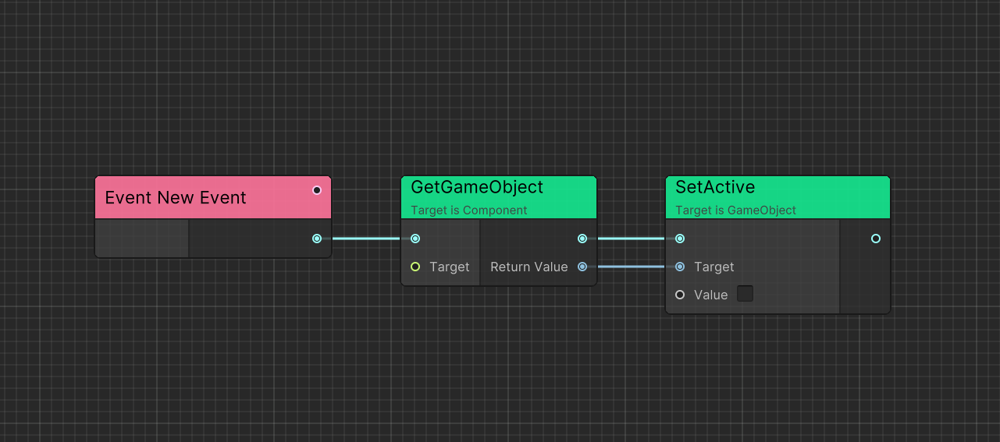
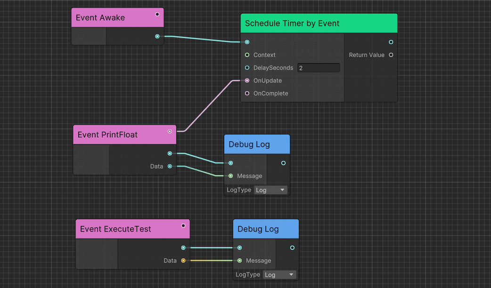

# Flow
Powerful visual scripting solution inspired from Unreal's Blueprint.

## HighLights

- Generic and delegate support
- Graph and C# Integration
- Editor debugging
- Easy implementation

## Conecpt

Before start up Flow, I recommend to read [Ceres Concept](./ceres_concept.md) before.

Flow thinks of game logic as an execution chain to let the game objects do things in order according to your design.

Flow visualize those execution as nodes so you can connect them to get a visual execution chain.

## Execution Event

Each execution starts from an external event and can contain input data.



> You can double click the event node and rename it.

## Implementable Event

You can implement custom event from C#.

```C#
public class FlowTestActor : CeresActor
{
    [ImplementableEvent]
    public void Awake()
    {
        ProcessEvent();
    }

    [ImplementableEvent]
    public void PrintFloat(float data)
    {
        ProcessEvent(parameter: data);
    }

    [ImplementableEvent]
    public void ExecuteTest(string data)
    {
        ProcessEvent(parameter: data);
    }
}
```



## Executable Function

You can add `ExecutableFunctionAttribute` to non-static method.

```C#
public class MyComponent: Component
{
    public void DoSomething(int arg1, float arg2)
    {
        // DoSomething
    }
}
```

Or implement `ExecutableFunctionLibrary` to add static executable functions.

```C#
public class UnityExecutableFunctionLibrary: ExecutableFunctionLibrary
{
    // IsScriptMethod will consider UObject as function target type
    // IsSelfTarget will let graph pass self reference as first parameter if self is UObject
    [ExecutableFunction(IsScriptMethod = true, IsSelfTarget = true), CeresLabel("GetName")]
    public static string Flow_UObjectGetName(UObject uObject)
    {
        return uObject.name;
    }

    [ExecutableFunction(IsSelfTarget = true)]
    public static UObject Flow_FindObjectOfType(
        // RESOLVE_RETURN metadata will let graph editor display return type by this parameter result
        // Only support SerializedType<T>
        [CeresMetadata(ExecutableFunction.RESOLVE_RETURN)] SerializedType<UObject> type)
    {
        return UObject.FindObjectOfType(type);
    }
}
```

## Generic Node

Following is an implementation example.

```C#
[NodeGroup("Utilities")]
[CeresLabel("Cast to {0}")]
[CeresMetadata("style = ConstNode")]
public class FlowNode_CastT<T, TK>: ForwardNode where TK: T
{
    [OutputPort(false), CeresLabel("")]
    public NodePort exec;
    
    [InputPort, HideInGraphEditor, CeresLabel("Source")]
    public CeresPort<T> sourceValue;
    
    [OutputPort, CeresLabel("Cast Failed")]
    public NodePort castFailed;
            
    [OutputPort, CeresLabel("Result")]
    public CeresPort<TK> resultValue;

    protected sealed override UniTask Execute(ExecutionContext executionContext)
    {
        try
        {
            resultValue.Value = (TK)sourceValue.Value;
            executionContext.SetNext(exec.GetT<ExecutableNode>());
        }
        catch (InvalidCastException)
        {
            executionContext.SetNext(castFailed.GetT<ExecutableNode>());
        }

        return UniTask.CompletedTask;
    }
}
```

Then define a template named as `{node name}_Template`.

```C#
public class FlowNode_CastT_Template: GenericNodeTemplate
{
    public override bool RequirePort()
    {
        return true;
    }
    
    public override Type[] GetGenericArguments(Type portValueType, Type selectArgumentType)
    {
        return new[] { portValueType, selectArgumentType };
    }

    public override Type[] GetAvailableArgumentTypes(Type portValueType)
    {
        return CeresPort.GetAssignedPortValueTypes()
                        .Where(x=>x.IsAssignableTo(portValueType) && x != portValueType)
                        .ToArray();
    }
    
    protected override string GetGenericNodeBaseName(string label, Type[] argumentTypes)
    {
        /* Cast to {value type} */
        return string.Format(label, argumentTypes[1].Name);
    }
}
```


## Debug

To enable and disable debug mode, click `debug` button in the upper right corner.

Then, you can click `Next Frame` to execute the graph node by node.

Furthermore, you can right click node and `Add Breakpoint`, and click `Next Breakpoint` in toolbar to execute the graph breakpoint by breakpoint.


