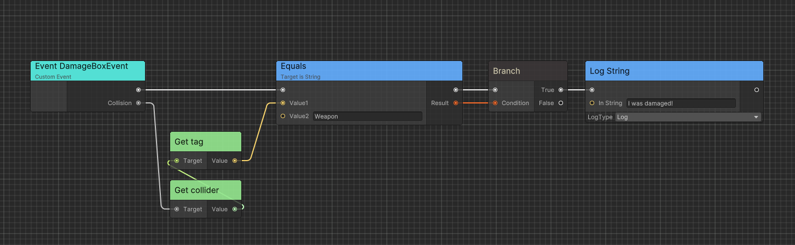

# Flow
Powerful visual scripting solution inspired from Unreal's Blueprint.

- [Flow](#flow)
- [Conecpt](#conecpt)
  - [Events](#events)
  - [Functions](#functions)
  - [Container](#container)
- [Quick Start](#quick-start)
- [Executable Event](#executable-event)
  - [Execution Event](#execution-event)
  - [Implementable Event](#implementable-event)
  - [Custom Event](#custom-event)
    - [Technique Details](#technique-details)
- [Executable Function](#executable-function)
  - [Instance Function](#instance-function)
  - [Static Function](#static-function)
  - [Conventions and Restrictions](#conventions-and-restrictions)
- [Runtime Architecture](#runtime-architecture)
  - [FlowGraphObject](#flowgraphobject)
  - [FlowGraphAsset](#flowgraphasset)
  - [FlowGraphInstanceObject](#flowgraphinstanceobject)
  - [FlowGraphScriptableObject](#flowgraphscriptableobject)
- [Advanced](#advanced)
  - [Port Implict Conversation](#port-implict-conversation)
  - [Node has Port Array](#node-has-port-array)
  - [Generic Node](#generic-node)
  - [Custom Function](#custom-function)
- [Code Generation](#code-generation)
  - [IL Post Process](#il-post-process)
  - [Source Generator](#source-generator)
- [Debug](#debug)
  - [Use Breakpoint](#use-breakpoint)
  - [Use FlowGraphTracker](#use-flowgraphtracker)


# Conecpt

Before start up Flow, I recommend to read [Ceres Concept](./ceres_concept.md) before.

Flow thinks of game logic as an execution chain to let the game objects do things in order according to your design.

Flow visualizes these executions as nodes so that you can connect them to implement gameplay and functionality.

The following are the core parts of Flow:

## Events

Each execution chain starts from an event which can contain input data.


You can define events in Flow Graph or C# scripts.

## Functions

Functions are components that implement game functions. They complete specified functions by calling the engine or your custom API. Through wiring, you can combine these method calls to complete your creativity.

## Container

We already have events and functions, so how do I apply logic to my GameObject? 

For any FlowGraph instance, there needs to be a specified Container at runtime. 

It can be your custom `MonoBehaviour` (need to implement interface) or inherit from a series of parent classes provided by Ceres. 

You can find more details in [Runtime Architecture](#runtime-architecture).

# Quick Start

Here is an example of using Flow to output a "Hello World" message.

1. Ceate a new C# script `MyFlowObject.cs` and make it inherit from `FlowGraphObject`.

2. Add a `Start` method to the newly created class so that Unity can call this method when the game starts.

3. Add `ImplementableEventAttribute` to `Start` method so that we can implement its logic in Flow Graph.

```C#
using Ceres.Graph.Flow;
using Ceres.Graph.Flow.Annotations;
public class MyFlowObject: FlowGraphObject
{
    [ImplementableEvent]
    private void Start()
    {

    }
}
```

4. Now create a new GameObject in the scene and attach `MyFlowObject` component to it.

5. Click `Open Flow Graph` in the Inspector panel to open the Flow Graph Editor.

    

6. Right click graph and click `Create Node/Select Events/Implement Start`.

    

7. Then click `Create Node` and search `Log String`, connect the white port (exec) to the `Start` node's output (exec). 

8. Fill in "Hello World!" in the `In String` field of the `Log String` node.
    
    

9. Click save button in the left upper corner.

10. Play the game and you will see "Hello World!" in the console.

# Executable Event

Following are the different types of Events in Flow.

## Execution Event

`ExecutionEvent` is a common event that can be used to trigger the execution of a FlowGraph instance.


> You can double click the event node and rename it.

By default, `ExecutionEvent` without parameters can be created in search window.

`ExecutionEvent` with parameters can be created when you drag any port with type `EventDelegate<>`.


Also support port with type `Action<>` by [implicit conversation](#port-implict-conversation).


## Implementable Event

Implementable events can be defined in [Container](#container) C# script to allow the script side to execute Flow logic.

Following is an implementation example.

```C#
public class FlowTest : FlowGraphObject /* Inherit from MonoBehaviour */
{
    [ImplementableEvent]
    public void Awake()
    {

    }

    [ImplementableEvent]
    public void PrintFloat(float data)
    {

    }

    [ImplementableEvent]
    public void ExecuteTest(string data)
    {

    }
}
```


## Custom Event

`CustomEvent` allows you to define a event across flow graph and containers. 

Here is an implementation example:

```C#
/* Add ExecutableEventAttribute to custom event in order to let event be exposed in flow graph */
[ExecutableEvent]
public class DamageBoxEvent: EventBase<DamageBoxEvent>
{
    public Collision Collision { get; private set; }

    /* Add ExecutableEventAttribute to static create function in order to let event can be created in flow graph */
    [ExecutableEvent]
    public static DamageBoxEvent Create(Collision collision)
    {
        var evt = GetPooled();
        evt.Collision = collision;
        return evt;
    }
}

public class DamageBox: MonoBehaviour
{
    private void OnCollisionEnter(Collision other) 
    {
        using var evt = DamageBoxEvent.Create(other);
        GetComponentInParent<FlowGraphObject>().SendEvent(evt);
    }
}
```



In this case, we create a collision event and send an Event to the Flow Graph when the DamageBox is hit. 
By using `CustomEvent`, we can ignore whether the `Container` has a corresponding implementation and only focus on the event itself.
Similar to the usage of Unity's `GameObject.SendMessage`.

### Technique Details

The implementation of `CustomEvent` is based on source generator and [Chris.Events](https://github.com/AkiKurisu/Chris/blob/main/Docs/Events.md), a contextual event system.

# Executable Function

You can define `ExecutableFunction` in two ways.

## Instance Function

For instance method, add `ExecutableFunctionAttribute` directly.

```C#
public class MyComponent: Component
{
    [ExecutableFunction]
    public void DoSomething(int arg1, float arg2)
    {
        // DoSomething
    }
}
```

## Static Function

For static method, create a new <b>partial</b> class and implement `ExecutableFunctionLibrary` to 
   add static executable functions, then add `ExecutableFunctionAttribute`. 
   
   >You must add `partial` modifier to let source generator work. Source generator will register static function pointer to the flow reflection system instead of using MethodInfo to enhance runtime performance.
   

```C#
public partial class UnityExecutableFunctionLibrary: ExecutableFunctionLibrary
{
    // IsScriptMethod will consider UObject as function target type
    // IsSelfTarget will let graph pass self reference as first parameter if self is UObject
    [ExecutableFunction(IsScriptMethod = true, IsSelfTarget = true), CeresLabel("GetName")]
    public static string Flow_UObjectGetName(UObject uObject)
    {
        return uObject.name;
    }

    // ResolveReturnAttribute will let graph editor display return type by this parameter result
    // Only support SerializedType<T> from Chris.Serialization
    [ExecutableFunction]
    public static UObject Flow_FindObjectOfType(
        [ResolveReturn] 
        SerializedType<UObject> type)
    {
        return UObject.FindObjectOfType(type);
    }
}
```

## Conventions and Restrictions

1. For methods defined in the same class and its inheritance hierarchy, 
   methods with the same name and the same parameter count can only have
    one marker `ExecutableFunctionAttribute`.

2. For methods with the same name but different number of parameters in 1, 
   you should use `CeresLabelAttribute` to distinguish their names displayed 
   in the editor.

3. Generic methods are not supported using `ExecutableFunctionAttribute`, they
    need to be defined in a generic node which will be explained in 
    [Advanced/Generic Node](#generic-node) below.

4. Try to keep the number of input parameters less than or equal to 6, otherwise the 
   editor will use Uber nodes to support method calls with any parameters. The 
   default parameter values ​​will not be serialized and the runtime overhead will 
   be greater.

Wrong example:

```C#
[ExecutableFunction]
public static string Flow_GetName(UObject uObject)
{
    return uObject.name;
}

[ExecutableFunction]
public static string Flow_GetName(Component component)
{
    return component.name;
}

[ExecutableFunction]
public static void Flow_DoSomething(string arg1, int arg2)
{
    
}

[ExecutableFunction]
public static string Flow_DoSomething(string arg1)
{
    
}
```

Correct example:

```C#
[ExecutableFunction]
public static string Flow_UObjectGetName(UObject uObject)
{
    return uObject.name;
}
[ExecutableFunction]
public static string Flow_ComponentGetName(Component component)
{
    return component.name;
}

[ExecutableFunction, CeresLabel("DoSomething with 2 Arguements")]
public static void Flow_DoSomething(string arg1, int arg2)
{
    
}

[ExecutableFunction]
public static string Flow_DoSomething(string arg1)
{
    
}
```

# Runtime Architecture

Following is the runtime architecture of Flow. Flow provides a variety of different Container types, 
which are highly compatible with Unity's native `MonoBehaviour` and `ScriptableObject` architecture, allowing you to choose your favorite workflow.

## FlowGraphObject

In Unity, we use MonoBehaviour to add functionality to GameObjects in the scene. 
In Flow, you can use `FlowGraphObject` and its inherited components to implement your game logic, such as character controllers, interactions, etc.

## FlowGraphAsset

`FlowGraphAsset` is a ScriptableObject used to reuse FlowGraph. You can set the `IFlowGraphRuntime` type it plays at runtime. 


In Editor Mode, the graph editor will consider the owner of the Flow Graph to be the type you set, which is the `Actor` type as shown in the figure. Create `Property/Self Reference` node, you will see the port type is `Actor`.


## FlowGraphInstanceObject

`FlowGraphInstanceObject` is a MonoBehaviour used to creating flow graph from `FlowGraphAsset` at runtime.

Here is an example, create a new class named `TestInstanceObject`:

```C#
using Ceres.Graph.Flow;
using Ceres.Graph.Flow.Annotations;
public class TestInstanceObject: FlowGraphInstanceObject
{
    [ImplementableEvent]
    public void Awake()
    {

    }
}
```

Then create a new `FlowGraphAsset` and set the `RuntimeType`. Open flow graph and implement `Awake` event.


Create a new `GameObject` in scene and add `TestInstanceObject` component to the `GameObject`. Drag the `FlowGraphAsset` to the `TestInstanceObject` and you will see the `Awake` event is invoked after entering play mode.

## FlowGraphScriptableObject

Beside the use of data sharing, `ScriptableObject` can also be used as a logic container. You can use `FlowGraphScriptableObject` to implement logic from `ScriptableObject` directly which is useful to create skill, state machine, buff, dialogue, etc.

Compared with `FlowGraphAsset`, `FlowGraphScriptableObject` owns an instance of `FlowGraph` at runtime.


# Advanced

The following is an explanation of the advanced usages in Flow. 
You can use the following features to improve your workflow while 
maintaining high performance.

## Port Implict Conversation

For reference type objects, such as `MonoBehaviour`, `Component`, 
ports can be converted based on the inheritance hierarchy automatically.

For example, output port `MonoBehaviour` can be connected to input port `Component`.

However, for value type objects, such as `int`, `float`, `struct`, etc and other types that require implicit conversion. 
You need to register them manually.

Here is an example that convert custom `struct` to `double`:

```C#
public class GameplaySetup
{
    [RuntimeInitializeOnLoadMethod]
#if UNITY_EDITOR
    [UnityEditor.InitializeOnLoadMethod]
#endif
    private static unsafe void InitializeOnLoad()
    {/
        CeresPort<SchedulerHandle>.MakeCompatibleTo<double>(handle =>
        {
            double value = default;
            UnsafeUtility.CopyStructureToPtr(ref handle, &value);
            return value;
        });
        CeresPort<double>.MakeCompatibleTo<SchedulerHandle>(d =>
        {
            SchedulerHandle handle = default;
            UnsafeUtility.CopyStructureToPtr(ref d, &handle);
            return handle;
        });
    }
}
```

## Node has Port Array

For nodes that need a resizeable port array for example `FlowNode_Sequence`, 
you can implement `IPortArrayNode` to define the port array, however, only 
one port array is supported for each node type.

```C#
public class FlowNode_Sequence : ForwardNode, ISerializationCallbackReceiver, IPortArrayNode
{
    // DefaultLength metadata is used to define the default port array length
    [OutputPort(false), CeresLabel("Then"), CeresMetadata("DefaultLength = 2")]
    public NodePort[] outputs;

    [HideInGraphEditor]
    public int outputCount;
    
    protected sealed override async UniTask Execute(ExecutionContext executionContext)
    {
        foreach (var output in outputs)
        {
            var next = output.GetT<ExecutableNode>();
            if(next == null) continue;
            await executionContext.Forward(output.GetT<ExecutableNode>());
        }
    }


    public void OnBeforeSerialize()
    {
        
    }

    public void OnAfterDeserialize()
    {
        outputs = new NodePort[outputCount];
        for (int i = 0; i < outputCount; i++)
        {
            outputs[i] = new NodePort();
        }
    }

    public int GetPortArrayLength()
    {
        return outputCount;
    }

    public string GetPortArrayFieldName()
    {
        return nameof(outputs);
    }

    public void SetPortArrayLength(int newLength)
    {
        outputCount = newLength;
    }
}

```

## Generic Node

Generic nodes define type restrictions through template classes, so that argument 
types can be obtained in the editor and the generic node instance can be constructed 
at runtime. This helps reduce lines of code.

Following is an implementation example.

```C#
[NodeGroup("Utilities")]
[CeresLabel("Cast to {0}")]
[CeresMetadata("style = ConstNode")]
public class FlowNode_CastT<T, TK>: ForwardNode where TK: T
{
    [OutputPort(false), CeresLabel("")]
    public NodePort exec;
    
    // HideInGraphEditorAttribute is used in input port to restrict
    // users to edit fields only by connecting edges
    [InputPort, HideInGraphEditor, CeresLabel("Source")]
    public CeresPort<T> sourceValue;
    
    [OutputPort, CeresLabel("Cast Failed")]
    public NodePort castFailed;
            
    [OutputPort, CeresLabel("Result")]
    public CeresPort<TK> resultValue;

    protected sealed override UniTask Execute(ExecutionContext executionContext)
    {
        try
        {
            resultValue.Value = (TK)sourceValue.Value;
            executionContext.SetNext(exec.GetT<ExecutableNode>());
        }
        catch (InvalidCastException)
        {
            executionContext.SetNext(castFailed.GetT<ExecutableNode>());
        }

        return UniTask.CompletedTask;
    }
}
```

Then define a class named as `{node name}_Template` implementing `IGenericNodeTemplate` or 
derived from `GenericNodeTemplate`.

```C#
public class FlowNode_CastT_Template: GenericNodeTemplate
{
    // Notify editor FlowNode_CastT need user to drag a port
    public override bool RequirePort()
    {
        return true;
    }
    
    public override Type[] GetGenericArguments(Type portValueType, Type selectArgumentType)
    {
        return new[] { portValueType, selectArgumentType };
    }

    public override Type[] GetAvailableArgumentTypes(Type portValueType)
    {
        return CeresPort.GetAssignedPortValueTypes()
                        .Where(x => x.IsAssignableTo(portValueType) && x != portValueType)
                        .ToArray();
    }
    
    protected override string GetGenericNodeBaseName(string label, Type[] argumentTypes)
    {
        /* Cast to {selectArgumentType} */
        return string.Format(label, argumentTypes[1].Name);
    }
}
```

## Custom Function

You can define function subGraph inside your flow graph to reuse logic.

You can create a custom function by following these steps:

1. Click blackboard `+` button and select `Function` in menu which will let you open subGraph view.
2. Configure the function input and output parameters.

    

3. Save your function subGraph.
4. Enter uber graph and drag the function from blackboard to graph.

    

5. You can modify the name of custom function just like modifing a variable.

# Code Generation

The following are some details about the code generation technology used in Flow, 
which may help you understand the principles.

## IL Post Process

IL Post Process (ILPP) will inject IL to execute event into user's [ImplementableEvent](#implementable-event) method body.

Below is the code decompiled using `dnspy`.

```C#
[ImplementableEvent, ExecutableFunction]
public void ExecuteTest(string data)
{
    Debug.Log("Implement ExecuteTest");
}
```


If ILPP is disabled or you want to customize the timing for calling bridge methods, you need to add bridge method yourself as shown below.

```C#
[ImplementableEvent]
public void Test()
{
    var stopWatch = new Stopwatch();
    stopWatch.Start();
    this.ProcessEvent();
    stopWatch.Stop(); 
    Debug.Log($"{nameof(Test)} used: {stopWatch.ElapsedMilliseconds}ms");
}
```

## Source Generator

In [executable function part](#executable-function), it is mentioned that source generator will register static methods to improve runtime performance.

The following shows what SourceGenerator does.

Source code:

```C#
/// <summary>
/// Executable function library for ceres
/// </summary>
[CeresGroup("Ceres")]
public partial class CeresExecutableLibrary: ExecutableFunctionLibrary
{
    [ExecutableFunction, CeresLabel("Set LogLevel")]
    public static void Flow_SetLogLevel(LogType logType)
    {
        CeresAPI.LogLevel = logType;
    }
    
    [ExecutableFunction(ExecuteInDependency = true), CeresLabel("Get LogLevel")]
    public static LogType Flow_GetLogLevel()
    {
        return CeresAPI.LogLevel;
    }
}
```

Generated code:

```C#
[CompilerGenerated]
public partial class CeresExecutableLibrary
{
    protected override unsafe void CollectExecutableFunctions()
    {                
        RegisterExecutableFunction<CeresExecutableLibrary>(nameof(Flow_SetLogLevel), 1, (delegate* <LogType, void>)&Flow_SetLogLevel);                
        RegisterExecutableFunction<CeresExecutableLibrary>(nameof(Flow_GetLogLevel), 0, (delegate* <LogType>)&Flow_GetLogLevel);
    }
}
```

# Debug

To enable and disable debug mode, click `debug` button in the upper right corner.

Then, you can click `Next Frame` to execute the graph node by node.

## Use Breakpoint

You can right click node and `Add Breakpoint`, and click `Next Breakpoint` in toolbar to execute the graph breakpoint by breakpoint.


## Use FlowGraphTracker

`FlowGraphTracker` is a class that can be used to track the execution of the graph.

For more details, you can see the sample [FlowGraphDependencyTracker](https://github.com/AkiKurisu/Ceres/blob/main/Runtime/Flow/Models/FlowGraphTracker.cs).