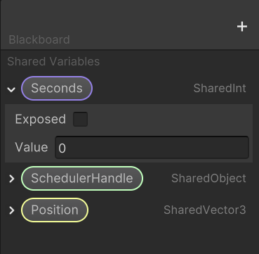
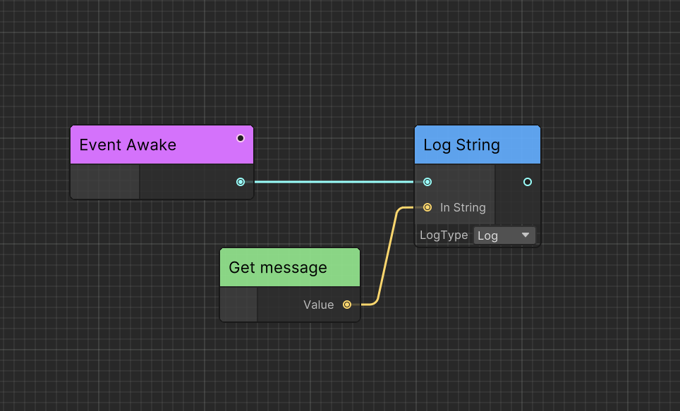

# Ceres Architecture and Concepts

Ceres is a unified Unity framework that spans reusable runtime services, graph and visual scripting infrastructure, and gameplay systems. The package is organized into Core, Graph, Flow, and Gameplay layers.

## Framework Layers

| Layer | Assembly | Responsibility |
| --- | --- | --- |
| Core | `Ceres` | Events, scheduling, configuration, serialization, resources, data, content, pooling, tasks, and modules |
| Graph | `Ceres.Graph` | Nodes, ports, variables, graph data, serialization, and editor-independent graph behavior |
| Flow | `Ceres.Flow` | Event-driven execution, C# API exposure, debugging, hot reload, and generated runtime programs |
| Gameplay | `Ceres.Gameplay` | Actor-based worlds, levels, animation, presentation, spatial queries, runtime content, and Flow integration |

Dependencies point in one direction:

```text
Ceres → Ceres.Graph → Ceres.Flow → Ceres.Gameplay
```

Use the lowest layer that owns the capability you need. Core services do not depend on gameplay code, while Gameplay may expose its APIs to Flow.

## Core Services

Ceres Core provides the application-level building blocks shared by the rest of the framework. Start with [Events](./core_events.md), [Schedulers](./core_schedulers.md), [Configs](./core_configs.md), [Serialization](./core_serialization.md), [Resource](./core_resource.md), [Data Driven](./core_data_driven.md), [Content Pipeline](./core_content_pipeline.md), [Collections](./core_collections.md), [Reactive Integration](./core_reactive.md), [Pool](./core_pool.md), [Tasks](./core_tasks.md), and [Modules](./core_modules.md).

## Graph Concepts

## Node

`CeresNode` is the logic and data container that forms a graph.

## Port

`CeresPort` enables you to get data from other nodes.

Ceres uses `CeresPort<T>` to receive typed data from another node. `NodePort` stores a `NodeReference` that can be resolved to a `CeresNode` at runtime.

## Graph

`CeresGraph` owns the nodes, variables, and connections and acts as the graph runtime.

## Data

Ceres serializes nodes, ports, and graphs into `CeresNodeData`, `CeresPortData`, and `CeresGraphData`, which contain the persisted data and metadata.

## Variable

`SharedVariable` is a data container that can be shared between nodes and graphs.

Unlike a `CeresPort`, a `SharedVariable` can be edited outside the graph and does not contain connection data because it does not need to know where its value originates.



## Execution Path

Nodes can be executed in two ways:

**Forward:** the graph executes nodes in sequence.

**Dependency:** the graph evaluates a node's data dependencies before executing that node.



In the example, `Log String` needs the `message` value. Because `Get message` is not part of the forward execution path, the graph treats it as a dependency and evaluates it before `Log String`.

## Flow and Gameplay

[Ceres Flow](./flow_concept.md) adds event-driven execution and exposes C# events and functions as strongly typed nodes. [Ceres Gameplay](./gameplay.md) builds on Core, Graph, and Flow to provide higher-level game architecture and ready-to-use systems.

## Related guides

- Follow the [Flow Quick Startup](./flow_startup.md) to create a visual script.
- Read [Gameplay](./gameplay.md) to build on GameWorld, Actor, and the gameplay modules.
- Explore [Code Generation](./ceres_codegen.md) to understand Ceres source generation.
