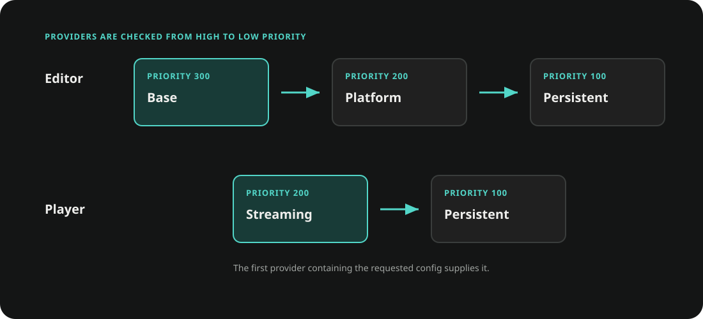
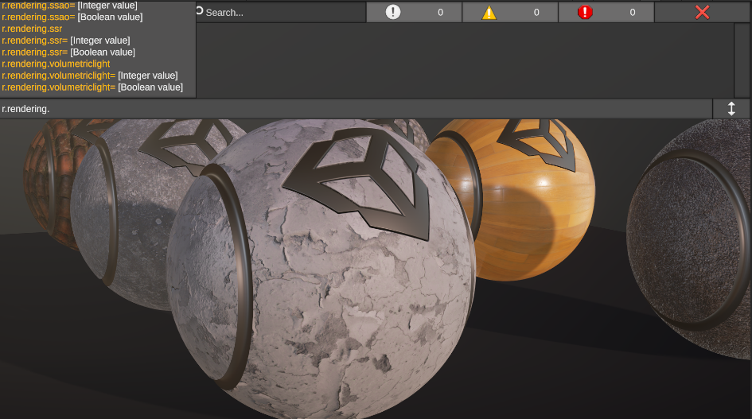

# Configs

The Configs module provides typed, process-wide configuration backed by layered
config files. Project defaults, platform files, packaged files, and persistent
files all enter the same provider pipeline.

Use it for settings that must be available before scene content loads or must be
overridden without replacing an entire configuration file. It is not a general
asset database; use ScriptableObjects or Data Tables for authored content with
Unity object references.

## Define and Read a Config

Derive from `Config<TConfig>` and optionally assign a two-part path with
`ConfigPath`. The first part selects the file and the second part selects the
entry within that file.

```csharp
using System;
using Ceres.Configs;

[Serializable]
[ConfigPath("Game.Combat")]
public sealed class CombatConfig : Config<CombatConfig>
{
    public float criticalDamage = 2f;
    public int maxCombo = 10;
}
```

Read the cached instance through the config type:

```csharp
var combat = CombatConfig.Get();
float multiplier = combat.criticalDamage;
```

Without `ConfigPath`, Ceres uses the type name as a root config. For
`Game.Combat`, `Config<CombatConfig>.ParentPath` is `Game`, `Name` is `Combat`,
and the file key is `Game.cfg`.

`Config<TConfig>.Get()` returns a shared cached instance. If no provider contains
the requested entry, Ceres creates `new TConfig()` and caches it.

## Providers and Precedence

`ConfigSystem` asks registered `IConfigFileProvider` instances for the same
`ConfigFileLocation`, then merges the resulting `IConfigFile` values. Providers
are evaluated from the highest numeric priority to the lowest. When two sources
contain the same property, the value already supplied by the higher-priority
provider is retained.



The built-in providers are:

| Environment | Priority | Source |
| --- | ---: | --- |
| Editor | 300 | Project-wide files under `Configs/` |
| Editor | 200 | Build-target files under `Configs/<BuildTarget>/` |
| Player | 200 | Packaged or extracted streaming config files |
| Editor and Player | 100 | Persistent files under `Saved/Configs/` |

Register a project-specific source before the first config is requested:

```csharp
using Ceres.Configs;

public sealed class RemoteConfigProvider : IConfigFileProvider
{
    public bool TryGetConfigFile(
        ConfigFileLocation location,
        out IConfigFile configFile)
    {
        // Resolve an IConfigFile owned by the project.
        configFile = null;
        return false;
    }
}

ConfigSystem.RegisterConfigFileProvider(
    new RemoteConfigProvider(),
    priority: 250);
```

Provider registration does not invalidate values that have already entered the
config caches. Register providers during startup, before calling `Get()`.

`ConfigSystem.GetConfigFile(location)` returns the merged view including
persistent data. `GetProjectConfigFile(location)` skips the persistent provider
and rebuilds the project-only view without using the merged-file cache.

## Save Runtime Overrides

Calling `Save()` writes the current config entry through
`ConfigsModule.PersistentSerializer`:

```csharp
var combat = CombatConfig.Get();
combat.maxCombo = 12;
combat.Save();
```

Use `Save(SaveLoadSerializer)` when the project owns the destination serializer.
Saving updates the entry inside its config file; other entries sharing the same
file are preserved.

Config payloads use Unity `JsonUtility` by default. Apply
`PreferJsonConvertAttribute` to a config class when it requires Newtonsoft.Json
features such as dictionaries:

```csharp
using System;
using System.Collections.Generic;
using Ceres.Configs;
using Ceres.Serialization;

[Serializable]
[PreferJsonConvert]
[ConfigPath("Game.Loot")]
public sealed class LootConfig : Config<LootConfig>
{
    public Dictionary<string, float> weights = new();
}
```

The persistent stream formatter is selected in **Project Settings > Ceres**.
Changing `ConfigsModule.ConfigSerializer` resets the persistent serializer and
clears the config caches.

## Live Config Variables

`ConfigVariableAttribute` exposes an instance field or read-write property to
the runtime variable registry. Supported value types are `int`, `float`, `bool`,
and `string`; the same values can be wrapped in `R3.ReactiveProperty<T>`.

```csharp
using System;
using Ceres.Configs;
using R3;

[Serializable]
[ConfigPath("Game.Combat")]
public sealed class CombatConfig : Config<CombatConfig>
{
    [ConfigVariable("combat.maxCombo")]
    public int maxCombo = 10;

    [ConfigVariable("combat.damageScale")]
    public ReactiveProperty<float> damageScale = new(1f);
}
```

Query and change variables through `ConfigVariableRegistry`:

```csharp
var variables = ConfigVariableRegistry.Get();

if (variables.TryGetVariable("combat.maxCombo", out var variable))
{
    variable.SetValue(12);
}
```

`SetValue` converts compatible input values, changes the cached config, and
saves it. Variable names are global; duplicate names are rejected. Set
`IsEditor = true` on the attribute to omit a variable from Player builds.

The registry discovers concrete `Config<TConfig>` types in `Ceres` and in loaded
assemblies that reference it. `GetAllVariables`, `GetVariable`, and `HasVariable`
provide the read-side registry API.



## Build and Storage Contract

The Editor stores project configuration as text `.cfg` files. Before a Player
build, Ceres exports the project files to `StreamingAssets/Configs`; platforms
that cannot read that directory directly receive a `Configs.zip` archive. The
runtime extracts the archive before modules are initialized.

Persistent configuration is stored below `SaveUtility.SavePath/Configs`. Treat
the generated streaming files and persistent files as implementation data; use
the config APIs instead of editing them while the application is running.

Related API: <xref:Ceres.Configs.Config%601>, <xref:Ceres.Configs.ConfigSystem>,
<xref:Ceres.Configs.IConfigFileProvider>, and
<xref:Ceres.Configs.ConfigVariableRegistry>.
