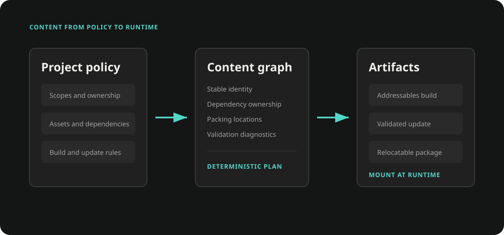
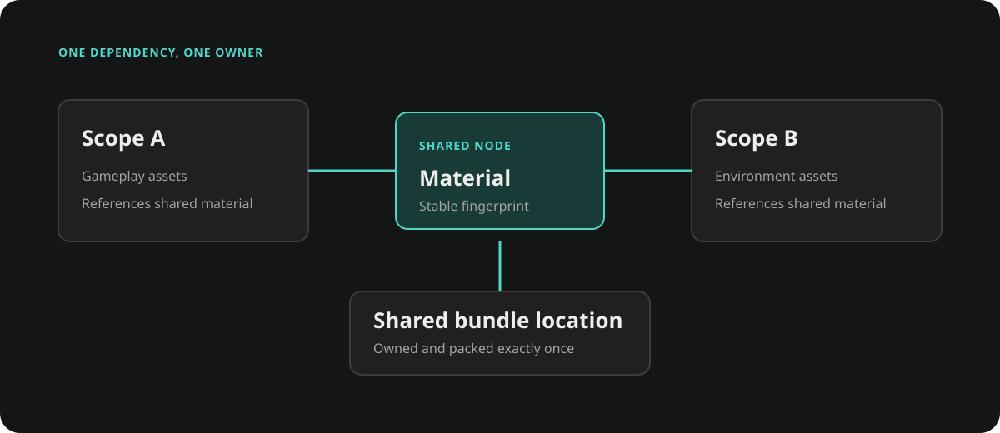
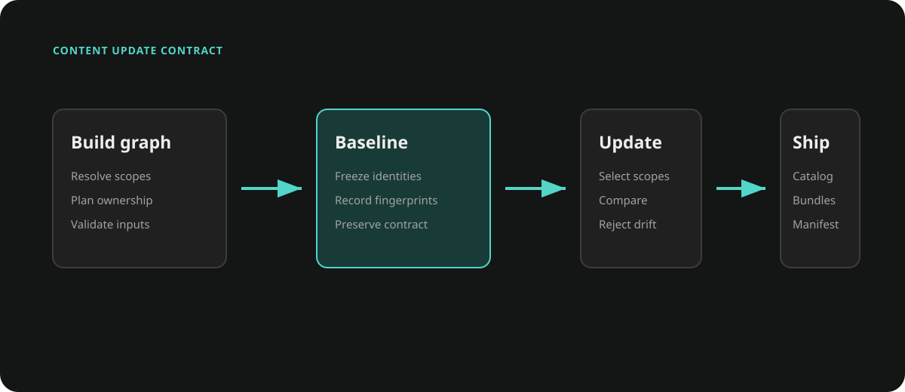

# Content Pipeline

Content Pipeline is an Editor-only, graph-driven build layer on top of Unity
Addressables and Scriptable Build Pipeline (SBP). It lets a project describe
content from its own source model, resolve transitive Unity dependencies, build
without persistent Addressable groups, create automatic incremental updates,
and describe releases without duplicating bundle payloads.

The pipeline does not replace Addressables. It creates a transient
`AddressableAssetSettings` model for each build and delegates bundle and catalog
generation to Addressables/SBP.

## When to Use It

Use Content Pipeline when:

- a project owns a higher-level content model such as DLC definitions,
  collections, packs, or generated metadata;
- persistent Addressable groups would only be intermediate build data;
- dependencies shared by several content scopes must have one deterministic
  owner and bundle;
- an update must infer all changed remote scopes from the previous successful content version;
- the runtime loads a second Addressables catalog from a local or downloaded
  content directory;
- Editor Play Mode needs to resolve the same graph directly through
  `AssetDatabase`.

Use the Resource module's `ResourceExporter` instead when existing persistent
Addressable groups are the authoritative source and a group-filtered export is
sufficient. Content Pipeline is the graph-driven path; `ResourceExporter` is the
group-driven path.

## Assembly and Compatibility

The public APIs are in:

```text
Assembly:  Ceres.ContentPipeline.Editor
Namespace: Ceres.ContentPipeline
Platform:  Editor only
```

The current transient backend explicitly supports Addressables `2.9.x`.
It rejects other Addressables versions before building because the backend
depends on internal group identity and transient settings behavior that must be
validated for each Addressables release.

The Addressables version declared by the Ceres package is the dependency floor
for the runtime Resource APIs, not a compatibility promise for this Editor
backend. A project using Content Pipeline must resolve Addressables `2.9.x`
explicitly.

The project's installed SBP version is recorded in every artifact manifest and
must match when producing an update.

## Pipeline Overview

```text
Project source model
        |
        v
IContentBuildGraphContributor
        |
        v
ContentBuildGraphBuilder
        |  resolves direct Unity dependencies recursively
        v
ContentBuildGraph
        |  scopes, assets, ownership, partitions, diagnostics
        |
        +------------------------------+
        |                              |
        v                              v
AddressablesContentBuildBackend        ContentBuildGraphAssetDatabaseMount
        |                              |
        v                              v
immutable build artifacts              Editor AssetDatabase locations
        |
        v
DynamicContentReleaseBuilder
        |
        v
catalog + immutable artifact source map
```

Projects are expected to provide the source-model adapter and workflow UI or
command-line entry point. Ceres provides the graph, build backend, manifests,
package materialization, diagnostics, and Editor mounting primitives.



The graph is the stable boundary between project policy and Ceres. Both the
build path and the Editor AssetDatabase path consume the same addresses and
explicit asset set.

## Core Concepts

### Scope

A `ContentScopeDefinition` is the unit a producer can independently identify,
version, and compare. A scope should use a stable, project-independent ID
such as a source asset GUID, package ID, or persisted collection ID.

```csharp
context.AddScope(new ContentScopeDefinition(
    id: "characters.base",
    displayName: "Base Characters",
    version: "3",
    enabled: true,
    defaultLocation: ContentLocation.Remote));
```

`Properties` can carry deterministic project metadata. Changing scope metadata
changes the scope fingerprint and is considered during update validation.
`Enabled` is also fingerprinted, but the generic backend does not use it as an
automatic build filter. A project adapter must omit disabled source content or
otherwise define its own inclusion policy before building the graph.

### Explicit Asset and Dependency Asset

A contributor adds explicit assets through `ContentAssetContribution`.
The graph builder then discovers their direct dependencies recursively.

An explicit asset can have:

- a stable asset ID;
- an `AssetDatabase` path;
- a runtime Addressables address;
- labels;
- a runtime type name;
- location and ownership hints;
- a packing hint.

Dependency assets do not need to be contributed manually. The
`IContentAssetDependencyResolver` discovers them and records every scope that
uses them.

For Unity assets, use the exact main-asset GUID as `assetId`:

```text
<asset-guid>
```

Explicit sub-assets are not currently supported end to end. Contributors must
promote them to standalone Unity assets instead of appending a suffix to the
main asset GUID. The graph rejects duplicate explicit paths before the
Addressables backend can collapse them onto one GUID entry.

### Location

`ContentLocation` describes delivery intent:

| Value | Meaning |
|---|---|
| `Local` | Part of an immutable local or Player baseline. |
| `Remote` | Eligible for external delivery and content updates. |
| `Unspecified` | No explicit decision; projects should normally avoid this for production scopes. |

When one dependency is used by both Local and Remote partitions, the backend
places it in Local content. Remote bundles can then depend on the immutable
Player baseline instead of duplicating the asset.

### Ownership

`ContentOwnership` determines which logical partition owns an asset:

| Value | Meaning |
|---|---|
| `Scope` | Owned by one scope. |
| `Shared` | Shared by several scopes and emitted once. |
| `BuiltIn` | Supplied by Unity or the Player; no explicit content entry is created. |
| `Metadata` | Generated or descriptive content managed by the pipeline. |
| `Excluded` | Tracked for analysis but excluded from explicit build entries. |
| `Unspecified` | Let the graph planner infer ownership. |

The planner promotes an asset to `Shared` when it is explicit in multiple scopes
or used by multiple scopes. A dependency shared by several collections is
therefore bundled once instead of being copied into every scope bundle.

### Packing Hint

`packingHint` is a stable sub-partition key. Scope-owned assets are grouped by
scope and packing hint. Shared assets are grouped by type family, such as
textures, materials, shaders, animations, or prefabs.

Packing hints affect bundle layout and should be treated as part of the build
contract. Changing them can produce new bundles and invalidate update
assumptions.

The build request selects one of two backend packing policies:

- `LogicalPartitions` preserves the scope plus packing-hint layout.
- `SizeOptimized` keeps location, scene, and semantic families separate, then
  groups explicit entries toward a configurable soft target size.

Both policies keep Local and Remote entries in separate partitions. A logical
scope or packing key is never allowed to make a Remote entry inherit Local
delivery accidentally.

Size optimization does not split one explicit asset or its indivisible
dependency closure. A single entry can therefore exceed the target. Baseline
builds freeze the generated partition plan; updates reuse the last successful
plan so a small change cannot rebalance unrelated bundles.



Shared ownership removes duplicate payloads. Location planning additionally
ensures that a dependency used by Local and Remote content remains in the Local
baseline instead of being emitted again for Remote delivery.

## Contributing a Build Graph

Implement `IContentBuildGraphContributor` to translate a project source model
into scopes and explicit assets.

```csharp
#if UNITY_EDITOR
using Ceres.ContentPipeline;
using UnityEditor;
using UnityEngine;

public sealed class CharacterContentContributor : IContentBuildGraphContributor
{
    private const string ScopeId = "characters.base";

    public string Id => "my-game.characters";

    public void Contribute(ContentBuildGraphContributionContext context)
    {
        context.AddScope(new ContentScopeDefinition(
            ScopeId,
            "Base Characters",
            version: "3",
            defaultLocation: ContentLocation.Remote));

        const string prefabPath = "Assets/Content/Characters/Hero.prefab";
        string guid = AssetDatabase.AssetPathToGUID(prefabPath);

        context.AddAsset(new ContentAssetContribution(
            scopeId: ScopeId,
            assetId: guid,
            assetPath: prefabPath,
            address: "Characters/Hero",
            labels: new[] { "Character", "Playable" },
            typeName: typeof(GameObject).AssemblyQualifiedName,
            locationHint: ContentLocation.Remote,
            ownershipHint: ContentOwnership.Scope,
            packingHint: "character-prefabs"));
    }
}
#endif
```

Contributor IDs, scope IDs, asset IDs, addresses, labels, and packing hints must
be deterministic. Do not derive them from enumeration order or transient object
instance IDs.

Build the graph with the Unity dependency resolver:

```csharp
var graph = new ContentBuildGraphBuilder().Build(
    new IContentBuildGraphContributor[]
    {
        new CharacterContentContributor()
    },
    new UnityContentAssetDependencyResolver());
```

Contributors are evaluated in stable ID order. If a contributor throws, the
builder throws `ContentBuildGraphContributorException` and preserves the
contributor ID and original exception.

## Inspecting and Validating the Graph

`ContentBuildGraph` exposes:

- `Scopes`: stable content units;
- `Assets`: explicit and discovered dependency nodes;
- `Edges`: direct dependency edges;
- `Diagnostics`: deterministic validation messages;
- `Fingerprint`: a deterministic fingerprint of the complete graph;
- `IsBuildable`: `false` when any Error diagnostic exists.

Always stop before invoking a backend when the graph is not buildable.

```csharp
if (!graph.IsBuildable)
{
    foreach (ContentBuildDiagnostic diagnostic in graph.Diagnostics)
    {
        Debug.LogError(
            $"{diagnostic.Code}: {diagnostic.Message} " +
            $"(scope: {diagnostic.ScopeId}, asset: {diagnostic.AssetId})");
    }

    return;
}
```

Typical errors include duplicate contributor or scope IDs, one asset ID mapping
to several paths, duplicate addresses, missing assets, conflicting type or
ownership hints, and dependency resolver failures.

The graph also provides query helpers:

```csharp
IReadOnlyList<ContentAssetNode> usedByScope =
    graph.GetForwardDependencyClosure("characters.base");

IReadOnlyList<ContentAssetNode> affectedAssets =
    graph.GetReverseImpactClosure("characters.base");

IReadOnlyList<string> affectedScopes =
    graph.GetImpactedScopes("characters.base");

IReadOnlyList<ContentAssetNode> directDependencies =
    graph.GetDirectDependencies(assetGuid);
```

`ContentBuildGraphReport.ToJson` produces a deterministic JSON report suitable
for build logs, code review, and comparing graph changes:

```csharp
string json = ContentBuildGraphReport.ToJson(graph, prettyPrint: true);
File.WriteAllText("Library/ContentGraph.json", json);
```

The JSON report is diagnostic output, not a runtime catalog or a persisted
source model.

## Building a Baseline

`AddressablesContentBuildBackend` creates transient Addressables settings and
groups in memory. It does not add groups to the project's real
`AddressableAssetSettings`.

```csharp
using Ceres.ContentPipeline;
using Ceres.Resource;
using UnityEditor;

var request = new ContentPipelineBuildRequest
{
    Graph = graph,
    OutputRoot = "Export/Content",
    Channel = "development",
    PlayerVersion = "1.0.0",
    RemoteLoadPath = ResourceSystem.DynamicLoadPath,
    Target = EditorUserBuildSettings.activeBuildTarget,
    DevelopmentBuild = false,
    BuildKind = ContentPipelineBuildKind.Baseline,
    Packing = new ContentBundlePackingOptions
    {
        Mode = ContentBundlePackingMode.SizeOptimized,
        TargetBundleSizeBytes = 128L * 1024L * 1024L
    }
};

ContentPipelineBuildResult result =
    new AddressablesContentBuildBackend().Build(request);

if (!result.Succeeded)
{
    throw result.Exception;
}

Debug.Log($"Manifest: {result.ManifestPath}");
```

The backend catches build exceptions and stores them in
`ContentPipelineBuildResult.Exception`; `Build` does not rethrow them. Callers
must check `Succeeded`.

The baseline records:

- the complete graph and configuration fingerprints;
- scope and asset snapshots;
- Unity, Addressables, and SBP versions;
- the remote load path;
- the Addressables Content State;
- every collected catalog, bundle, settings, and metadata artifact;
- SHA-256 and size for every artifact.
- the packing policy, partition membership, estimated/actual partition sizes,
  and bundle-size statistics.

Artifacts are committed only after a successful build. Staging output is
discarded on failure, and transient Addressables settings are destroyed in
cleanup.

### Baseline Output Layout

The backend writes under a channel and platform boundary:

```text
<OutputRoot>/
  <channel>/
    <BuildTarget>/
      current-baseline.json
      baselines/
        <build-id>/
          artifact-manifest.json
          remote/
          local/
          metadata/
```

`current-baseline.json` is updated atomically after commit. Retrieve its target
with:

```csharp
string baselineManifest =
    AddressablesContentBuildBackend.GetCurrentBaselineManifestPath(
        "Export/Content",
        "development",
        EditorUserBuildSettings.activeBuildTarget);

// Returns the latest successful content Manifest compatible with the current
// Baseline, or the Baseline Manifest when no Incremental exists.
string previousManifest =
    AddressablesContentBuildBackend.GetCurrentContentManifestPath(
        "Export/Content",
        "development",
        EditorUserBuildSettings.activeBuildTarget);
```

Build IDs are content-derived. Repeating the same build can reuse an already
committed directory after validating its manifest identity.

### Maintaining Artifact History

`baselines` and `updates` are immutable build records. Projects that do not
need arbitrary local history can preview and prune records not referenced by
the current Baseline or latest compatible Update:

```csharp
ContentBuildStorageCleanupPreview preview =
    ContentBuildStorageMaintenance.Preview(
        "Export/Content",
        "development",
        EditorUserBuildSettings.activeBuildTarget);

ContentBuildStorageCleanupResult cleanup =
    ContentBuildStorageMaintenance.Execute(
        "Export/Content",
        "development",
        EditorUserBuildSettings.activeBuildTarget);
```

Channels are stable machine-readable identifiers and must match
`[a-z0-9]+(?:-[a-z0-9]+)*`, for example `development` or `preview-android`.
The build backend, pointer queries, and storage maintenance use the same
validated channel-to-directory mapping; display names with spaces or uppercase
letters are not accepted as aliases.

Execution rebuilds the plan while holding the same platform build lock used by
the Addressables backend. Invalid pointers, mismatched manifests, unknown
artifact directories, or paths outside the expected containers stop pruning.
Deletion failures are returned individually and do not invalidate a build that
was already committed. Project adapters provide the Artifact Manifest paths
retained by active releases, deployments, or rollback references before
invoking artifact cleanup.

## Building an Incremental Update

An update requires:

- a compatible baseline artifact manifest;
- the complete current graph, not a producer-filtered subset;
- a previous successful content manifest used as the comparison head;
- automatic change detection from the previous successful content manifest.

```csharp
var updateRequest = new ContentPipelineBuildRequest
{
    Graph = currentGraph,
    OutputRoot = "Export/Content",
    Channel = "development",
    PlayerVersion = "1.0.0",
    RemoteLoadPath = ResourceSystem.DynamicLoadPath,
    Target = EditorUserBuildSettings.activeBuildTarget,
    BuildKind = ContentPipelineBuildKind.Update,
    BaselineManifestPath = baselineManifest,
    PreviousManifestPath = previousManifest,
    Packing = new ContentBundlePackingOptions
    {
        Mode = ContentBundlePackingMode.SizeOptimized,
        TargetBundleSizeBytes = 128L * 1024L * 1024L
    }
};

ContentPipelineBuildResult update =
    new AddressablesContentBuildBackend().Build(updateRequest);

if (!update.Succeeded)
{
    throw update.Exception;
}
```

Before Addressables builds the update, Ceres compares the previous successful
content snapshot with the current graph and derives the impacted remote scopes:

- changed Remote scopes require no project-side selection;
- shared changes expand the impacted scope set;
- Local content changes require a new baseline;
- scope metadata changes are included in the impacted scope set;
- Unity, Addressables, SBP, platform, channel, and remote load path must remain
  compatible with the baseline.
- packing mode, target size, algorithm, classifier, and configuration
  fingerprint must remain compatible with the baseline.

For `SizeOptimized`, existing assets retain their recorded partition ID.
Deleted assets leave capacity behind, while new assets fill compatible
capacity or create deterministic overflow partitions. Only a new baseline
globally rebalances the layout.

If the comparison reports no changes, the backend returns an up-to-date result
without invoking Addressables or advancing a pointer. Otherwise, the update
artifact contains a new catalog and changed bundles. A successful candidate
updates `latest-update-candidate.json`; it does not replace the current baseline
pointer.

```text
<OutputRoot>/<channel>/<BuildTarget>/
  latest-update-candidate.json
  updates/
    <build-id>/
      artifact-manifest.json
      remote/
      metadata/
```

## Creating a Content Release

Backend Artifact directories own the immutable Bundle payloads. Use
`DynamicContentReleaseBuilder` to create a small release index containing a
rewritten Catalog, Catalog Hash, and a direct Bundle-to-Artifact source map.

```csharp
DynamicContentReleaseResult release =
    new DynamicContentReleaseBuilder().Build(
        new DynamicContentReleaseRequest
        {
            ArtifactManifestPath = result.ManifestPath,
            StorageRoot = platformRoot,
            OutputRoot = Path.Combine(platformRoot, "output"),
            DynamicLoadPath = ResourceSystem.DynamicLoadPath
        });
```

The builder verifies the source Catalog and every referenced Bundle, rewrites
Bundle IDs to `{DYNAMIC_LOCAL_PATH}/<bundle-name>`, records each Bundle's direct
Artifact Manifest and file path, then atomically commits:

```text
<OutputRoot>/
  baselines|updates/
    <first-32-characters-of-build-id>/
      release-manifest.json
      catalog.bin|catalog.json
      catalog.hash
```

The Release directory contains no Bundle files and is not directly loadable.
Deployment uses the source map to transfer files into the final flat content
directory. An Editor may instead project a copy of the Catalog whose Bundle IDs
point directly to absolute Artifact paths. A standalone export may explicitly
materialize a Release as a relocatable Catalog-and-Bundle package.

### Indexing an Incremental Update

An incremental Release receives the Baseline and previous successful Release
Manifests. Changed Bundles point to the current Update Artifact; unchanged
Bundles retain their existing direct Artifact source. The flattened map keeps
the complete current lineage without traversing older Release chains.

```csharp
DynamicContentReleaseResult updateRelease =
    new DynamicContentReleaseBuilder().Build(
        new DynamicContentReleaseRequest
        {
            ArtifactManifestPath = update.ManifestPath,
            StorageRoot = platformRoot,
            OutputRoot = Path.Combine(platformRoot, "output"),
            DynamicLoadPath = ResourceSystem.DynamicLoadPath,
            BaselineReleaseManifestPath = baselineRelease.ManifestPath,
            PreviousReleaseManifestPath = previousRelease.ManifestPath
        });
```

`DynamicContentPackageMaterializer` is reserved for workflows that explicitly
need a self-contained package. It copies the Release Catalog, Hash, and all
mapped Bundle files into an atomic destination. The Release builder itself never
duplicates Bundle payloads.



### Windows Long Paths

Content Pipeline keeps ordinary absolute paths in diagnostics and public
results, while persisted source paths remain relative to the validated storage
root. At the direct `System.IO` boundary, Windows paths at or beyond
the legacy `MAX_PATH` limit are adapted to the `\\?\` form (or `\\?\UNC\` for
network shares). Artifact hashing, release indexing, explicit materialization,
atomic commits, pointer
I/O, and storage maintenance all use this boundary.

Addressables, SBP, AssetDatabase, and other Unity APIs continue to receive
ordinary paths. Long-path handling does not weaken source artifact size or
SHA-256 validation.

## Editor AssetDatabase Mount

`ContentBuildGraphAssetDatabaseMount` makes explicit graph assets resolvable by
Addressables in Editor Play Mode and Edit Mode tools without creating persistent
Addressable groups or building bundles.

The mount omits explicit assets owned as `BuiltIn` or `Excluded`, matching the
build contract: built-in content must come from Unity, the Player, or the main
Addressables catalog, while excluded content remains available only for graph
analysis. This prevents Editor Play Mode from exposing content that the dynamic
package will not contain.

Addressables must already be initialized:

```csharp
using Ceres.ContentPipeline;
using UnityEngine.AddressableAssets;

await Addressables.InitializeAsync().Task;

ContentBuildGraphAssetDatabaseMount mount =
    ContentBuildGraphAssetDatabaseMount.Create(
        graph,
        "MyGame.Content.EditorAssetDatabase");

Debug.Log($"Mounted {mount.LocationCount} explicit assets.");
```

Each explicit asset location uses:

- address, asset ID, and labels as lookup keys;
- the Unity asset path as the internal ID;
- `AssetDatabaseProvider` for normal assets;
- `SceneProvider` for scenes;
- the graph type name, with `AssetDatabase` type resolution as fallback.

Labels may overlap with another catalog, allowing
`Addressables.LoadAssetsAsync` to merge built-in and graph content. An address
or asset ID that already resolves to a different internal path is rejected.

The mount removes stale locators with the same locator ID before installation.
It reuses an existing `AssetDatabaseProvider` when possible and only removes a
provider it created itself. While at least one mount holds the provider, its
simulated load delay is zero so Edit Mode loads do not depend on
`Time.unscaledTime`. The mount also advances pending Addressables ResourceManager
callbacks from `EditorApplication.update`, because the hidden runtime callback
component is not scheduled reliably in Edit Mode. The final lease removes the
Editor callback and restores the delay of a reused provider.

Keep the mount alive for the complete Editor content-source lifetime and dispose
it on Play Mode exit, assembly reload, or Editor shutdown:

```csharp
mount.Dispose();
```

`Dispose` is idempotent. Only explicit assets are mounted; Unity loads their
dependencies naturally through `AssetDatabase`.

Do not mount an AssetDatabase graph locator at the same time as the runtime
catalog for the same content source. The project-level integration should choose
one source for a Play Mode session.

## Determinism and Build Safety

The pipeline enforces the following behavior:

- contributors, scopes, nodes, edges, diagnostics, and reports have stable
  ordering;
- graph and configuration fingerprints participate in build identity;
- group identity and bundle names are deterministic for channel, platform, and
  partition;
- only one content build may own one platform output root at a time;
- build output is created in staging and moved into place only after validation;
- pointer files are written atomically;
- a failed update cannot advance the baseline pointer;
- persistent project Addressables settings are not the pipeline's source of
  truth and are not populated by the transient backend.

The backend may temporarily override Addressables global editor state while SBP
is running. Content builds should therefore be treated as exclusive Editor
operations and should not overlap Player or Addressables builds in the same
Unity process.

## Project Integration Responsibilities

Ceres intentionally does not define:

- the project's content source model;
- generated metadata formats;
- menu items, build windows, or collection selection UI;
- Player build integration;
- CDN upload and release channels;
- client update checks, download, installation, rollback, or retention;
- Mod package formats;
- how Local content is copied into a Player.

A project adapter should own those policies and call the Ceres APIs in this
order:

```text
discover source data
    -> generate temporary metadata
    -> build the complete graph
    -> validate diagnostics
    -> build baseline or incremental update
    -> create release index
    -> publish or install through project-specific code
```

Keep temporary generated assets alive until graph construction and the
Addressables build complete. Release them only after no build or package step
references their AssetDatabase paths.
