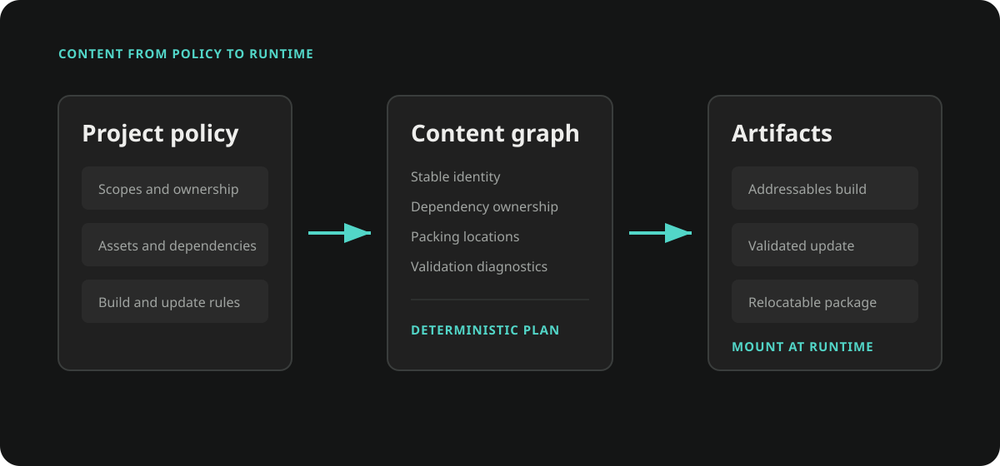
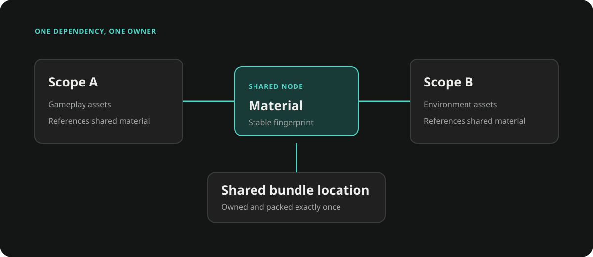
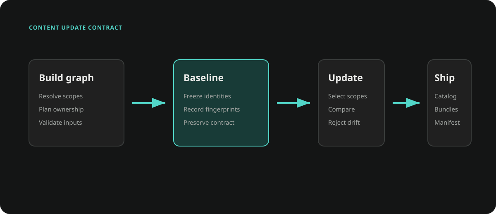

# Content Pipeline

Content Pipeline is an Editor-only, graph-driven build layer on top of Unity
Addressables and Scriptable Build Pipeline (SBP). It lets a project describe
content from its own source model, resolve transitive Unity dependencies, build
without persistent Addressable groups, create automatic incremental updates,
and describe releases without duplicating bundle payloads.

The pipeline does not replace Addressables. It creates a transient
`AddressableAssetSettings` model for each build and delegates bundle and catalog
generation to Addressables/SBP.

## When to Use It

Use Content Pipeline when:

- a project owns a higher-level content model such as DLC definitions,
  collections, packs, or generated metadata;
- persistent Addressable groups would only be intermediate build data;
- dependencies shared by several content scopes must have one deterministic
  owner and bundle;
- an update must infer all changed remote scopes from the previous successful content version;
- the runtime loads a second Addressables catalog from a local or downloaded
  content directory;
- Editor Play Mode needs to resolve the same graph directly through
  `AssetDatabase`.

Use the Resource module's `ResourceExporter` instead when existing persistent
Addressable groups are the authoritative source and a group-filtered export is
sufficient. Content Pipeline is the graph-driven path; `ResourceExporter` is the
group-driven path.

## Assembly and Compatibility

The public APIs are in:

```text
Assembly:  Ceres.ContentPipeline.Editor
Namespace: Ceres.ContentPipeline
Platform:  Editor only
```

The current transient backend explicitly supports Addressables `2.9.x`.
It rejects other Addressables versions before building because the backend
depends on internal group identity and transient settings behavior that must be
validated for each Addressables release.

The Addressables version declared by the Ceres package is the dependency floor
for the runtime Resource APIs, not a compatibility promise for this Editor
backend. A project using Content Pipeline must resolve Addressables `2.9.x`
explicitly.

The project's installed SBP version is recorded in every artifact manifest and
must match when producing an update.

## Pipeline Overview

Build a complete graph from your project sources, validate it, then choose a
baseline build, an incremental update, or an Editor AssetDatabase mount.
After a successful build, create a release index for your deployment workflow.
The examples below follow that order.



## Core Concepts

### Scope

A `ContentScopeDefinition` is the unit a producer can independently identify,
version, and compare. A scope should use a stable, project-independent ID
such as a source asset GUID, package ID, or persisted collection ID.

```csharp
context.AddScope(new ContentScopeDefinition(
    id: "characters.base",
    displayName: "Base Characters",
    version: "3",
    enabled: true,
    defaultLocation: ContentLocation.Remote));
```

`Properties` can carry deterministic project metadata. Changing scope metadata
changes the scope fingerprint and is considered during update validation.
`Enabled` is also fingerprinted, but the generic backend does not use it as an
automatic build filter. A project adapter must omit disabled source content or
otherwise define its own inclusion policy before building the graph.

### Explicit Asset and Dependency Asset

A contributor adds explicit assets through `ContentAssetContribution`.
The graph builder then discovers their direct dependencies recursively.

An explicit asset can have:

- a stable asset ID;
- an `AssetDatabase` path;
- a runtime Addressables address;
- labels;
- a runtime type name;
- location and ownership hints;
- a packing hint.

Dependency assets do not need to be contributed manually. The
`IContentAssetDependencyResolver` discovers them and records every scope that
uses them.

For Unity assets, use the exact main-asset GUID as `assetId`:

```text
<asset-guid>
```

Explicit sub-assets are not currently supported end to end. Contributors must
promote them to standalone Unity assets instead of appending a suffix to the
main asset GUID. The graph rejects duplicate explicit paths before the
Addressables backend can collapse them onto one GUID entry.

### Location

`ContentLocation` describes delivery intent:

| Value | Meaning |
|---|---|
| `Local` | Part of an immutable local or Player baseline. |
| `Remote` | Eligible for external delivery and content updates. |
| `Unspecified` | No explicit decision; projects should normally avoid this for production scopes. |

When one dependency is used by both Local and Remote partitions, the backend
places it in Local content. Remote bundles can then depend on the immutable
Player baseline instead of duplicating the asset.

### Ownership

`ContentOwnership` determines which logical partition owns an asset:

| Value | Meaning |
|---|---|
| `Scope` | Owned by one scope. |
| `Shared` | Shared by several scopes and emitted once. |
| `BuiltIn` | Supplied by Unity or the Player; no explicit content entry is created. |
| `Metadata` | Generated or descriptive content managed by the pipeline. |
| `Excluded` | Tracked for analysis but excluded from explicit build entries. |
| `Unspecified` | Let the graph planner infer ownership. |

The planner promotes an asset to `Shared` when it is explicit in multiple scopes
or used by multiple scopes. A dependency shared by several collections is
therefore bundled once instead of being copied into every scope bundle.

### Packing Hint

`packingHint` is a stable sub-partition key. Scope-owned assets are grouped by
scope and packing hint. Shared assets are grouped by type family, such as
textures, materials, shaders, animations, or prefabs.

Packing hints affect bundle layout and should be treated as part of the build
contract. Changing them can produce new bundles and invalidate update
assumptions.

The build request selects one of two backend packing policies:

- `LogicalPartitions` preserves the scope plus packing-hint layout.
- `SizeOptimized` keeps location, scene, and semantic families separate, then
  groups explicit entries toward a configurable soft target size.

Both policies keep Local and Remote entries in separate partitions. A logical
scope or packing key is never allowed to make a Remote entry inherit Local
delivery accidentally.

Size optimization does not split one explicit asset or its indivisible
dependency closure. A single entry can therefore exceed the target. Baseline
builds freeze the generated partition plan; updates reuse the last successful
plan so a small change cannot rebalance unrelated bundles.



Shared ownership removes duplicate payloads. Location planning additionally
ensures that a dependency used by Local and Remote content remains in the Local
baseline instead of being emitted again for Remote delivery.

## Contributing a Build Graph

Implement `IContentBuildGraphContributor` to translate a project source model
into scopes and explicit assets.

```csharp
#if UNITY_EDITOR
using Ceres.ContentPipeline;
using UnityEditor;
using UnityEngine;

public sealed class CharacterContentContributor : IContentBuildGraphContributor
{
    private const string ScopeId = "characters.base";

    public string Id => "my-game.characters";

    public void Contribute(ContentBuildGraphContributionContext context)
    {
        context.AddScope(new ContentScopeDefinition(
            ScopeId,
            "Base Characters",
            version: "3",
            defaultLocation: ContentLocation.Remote));

        const string prefabPath = "Assets/Content/Characters/Hero.prefab";
        string guid = AssetDatabase.AssetPathToGUID(prefabPath);

        context.AddAsset(new ContentAssetContribution(
            scopeId: ScopeId,
            assetId: guid,
            assetPath: prefabPath,
            address: "Characters/Hero",
            labels: new[] { "Character", "Playable" },
            typeName: typeof(GameObject).AssemblyQualifiedName,
            locationHint: ContentLocation.Remote,
            ownershipHint: ContentOwnership.Scope,
            packingHint: "character-prefabs"));
    }
}
#endif
```

Contributor IDs, scope IDs, asset IDs, addresses, labels, and packing hints must
be deterministic. Do not derive them from enumeration order or transient object
instance IDs.

Build the graph with the Unity dependency resolver:

```csharp
var graph = new ContentBuildGraphBuilder().Build(
    new IContentBuildGraphContributor[]
    {
        new CharacterContentContributor()
    },
    new UnityContentAssetDependencyResolver());
```

Contributors are evaluated in stable ID order. If a contributor throws, the
builder throws `ContentBuildGraphContributorException` and preserves the
contributor ID and original exception.

## Inspecting and Validating the Graph

`ContentBuildGraph` exposes:

- `Scopes`: stable content units;
- `Assets`: explicit and discovered dependency nodes;
- `Edges`: direct dependency edges;
- `Diagnostics`: deterministic validation messages;
- `Fingerprint`: a deterministic fingerprint of the complete graph;
- `IsBuildable`: `false` when any Error diagnostic exists.

Always stop before invoking a backend when the graph is not buildable.

```csharp
if (!graph.IsBuildable)
{
    foreach (ContentBuildDiagnostic diagnostic in graph.Diagnostics)
    {
        Debug.LogError(
            $"{diagnostic.Code}: {diagnostic.Message} " +
            $"(scope: {diagnostic.ScopeId}, asset: {diagnostic.AssetId})");
    }

    return;
}
```

Typical errors include duplicate contributor or scope IDs, one asset ID mapping
to several paths, duplicate addresses, missing assets, conflicting type or
ownership hints, and dependency resolver failures.

The graph also provides query helpers:

```csharp
IReadOnlyList<ContentAssetNode> usedByScope =
    graph.GetForwardDependencyClosure("characters.base");

IReadOnlyList<ContentAssetNode> affectedAssets =
    graph.GetReverseImpactClosure("characters.base");

IReadOnlyList<string> affectedScopes =
    graph.GetImpactedScopes("characters.base");

IReadOnlyList<ContentAssetNode> directDependencies =
    graph.GetDirectDependencies(assetGuid);
```

`ContentBuildGraphReport.ToJson` produces a deterministic JSON report suitable
for build logs, code review, and comparing graph changes:

```csharp
string json = ContentBuildGraphReport.ToJson(graph, prettyPrint: true);
File.WriteAllText("Library/ContentGraph.json", json);
```

The JSON report is diagnostic output, not a runtime catalog or a persisted
source model.

## Building a Baseline

`AddressablesContentBuildBackend` creates transient Addressables settings and
groups in memory. It does not add groups to the project's real
`AddressableAssetSettings`.

```csharp
using Ceres.ContentPipeline;
using Ceres.Resource;
using UnityEditor;

var request = new ContentPipelineBuildRequest
{
    Graph = graph,
    OutputRoot = "Export/Content",
    Channel = "development",
    PlayerVersion = "1.0.0",
    RemoteLoadPath = ResourceSystem.DynamicLoadPath,
    Target = EditorUserBuildSettings.activeBuildTarget,
    DevelopmentBuild = false,
    BuildKind = ContentPipelineBuildKind.Baseline,
    Packing = new ContentBundlePackingOptions
    {
        Mode = ContentBundlePackingMode.SizeOptimized,
        TargetBundleSizeBytes = 128L * 1024L * 1024L
    }
};

ContentPipelineBuildResult result =
    new AddressablesContentBuildBackend().Build(request);

if (!result.Succeeded)
{
    throw result.Exception;
}

Debug.Log($"Manifest: {result.ManifestPath}");
```

The backend catches build exceptions and stores them in
`ContentPipelineBuildResult.Exception`; `Build` does not rethrow them. Callers
must check `Succeeded`.

### Asset Build Dependencies

`ContentPipelineBuildRequest.AssetBuildDependencyHashes` accepts an optional
`IReadOnlyDictionary<string, string>` keyed by graph `AssetId`. Each value is a
stable, non-empty digest of additional build inputs for that asset, such as a
project-owned compilation policy that Unity's asset dependency hash does not
represent. The project computes the digest; Ceres does not interpret its policy.

Pass the complete current dictionary on both baseline and update requests.
Changed digests participate in incremental change detection and invalidate
cached output containing the affected asset. Adding the first entry or removing
the last entry requires a new baseline; changing values remains incremental.
Null and empty maps leave this feature disabled. Unknown asset IDs, empty
digests, and assets without a Unity asset GUID produce a failed build result.

Do not use these digests as a substitute for graph dependencies or packing hints.
They describe extra build inputs, not asset ownership or bundle layout.

### Baseline Output Layout

The backend writes under a channel and platform boundary:

```text
<OutputRoot>/
  <channel>/
    <BuildTarget>/
      current-baseline.json
      baselines/
        <build-id>/
          artifact-manifest.json
          remote/
          local/
          metadata/
```

`current-baseline.json` is updated atomically after commit. Retrieve its target
with:

```csharp
string baselineManifest =
    AddressablesContentBuildBackend.GetCurrentBaselineManifestPath(
        "Export/Content",
        "development",
        EditorUserBuildSettings.activeBuildTarget);

// Returns the latest successful content Manifest compatible with the current
// Baseline, or the Baseline Manifest when no Incremental exists.
string previousManifest =
    AddressablesContentBuildBackend.GetCurrentContentManifestPath(
        "Export/Content",
        "development",
        EditorUserBuildSettings.activeBuildTarget);
```

Build IDs are content-derived. Repeating the same build can reuse an already
committed directory after validating its manifest identity.

### Maintaining Artifact History

`baselines` and `updates` are immutable build records. Projects that do not
need arbitrary local history can preview and prune records not referenced by
the current Baseline or latest compatible Update:

```csharp
ContentBuildStorageCleanupPreview preview =
    ContentBuildStorageMaintenance.Preview(
        "Export/Content",
        "development",
        EditorUserBuildSettings.activeBuildTarget);

ContentBuildStorageCleanupResult cleanup =
    ContentBuildStorageMaintenance.Execute(
        "Export/Content",
        "development",
        EditorUserBuildSettings.activeBuildTarget);
```

Channels are stable machine-readable identifiers and must match
`[a-z0-9]+(?:-[a-z0-9]+)*`, for example `development` or `preview-android`.
The build backend, pointer queries, and storage maintenance use the same
validated channel-to-directory mapping; display names with spaces or uppercase
letters are not accepted as aliases.

Pass the Artifact Manifest paths retained by active releases, deployments, or
rollback references to cleanup. Review the preview before executing it. Cleanup
refuses invalid storage references and reports deletion failures individually;
inspect the result before reporting successful reclamation.

## Building an Incremental Update

An update requires:

- a compatible baseline artifact manifest;
- the complete current graph, not a producer-filtered subset;
- a previous successful content manifest used as the comparison head;
- automatic change detection from the previous successful content manifest.

```csharp
var updateRequest = new ContentPipelineBuildRequest
{
    Graph = currentGraph,
    OutputRoot = "Export/Content",
    Channel = "development",
    PlayerVersion = "1.0.0",
    RemoteLoadPath = ResourceSystem.DynamicLoadPath,
    Target = EditorUserBuildSettings.activeBuildTarget,
    BuildKind = ContentPipelineBuildKind.Update,
    BaselineManifestPath = baselineManifest,
    PreviousManifestPath = previousManifest,
    Packing = new ContentBundlePackingOptions
    {
        Mode = ContentBundlePackingMode.SizeOptimized,
        TargetBundleSizeBytes = 128L * 1024L * 1024L
    }
};

ContentPipelineBuildResult update =
    new AddressablesContentBuildBackend().Build(updateRequest);

if (!update.Succeeded)
{
    throw update.Exception;
}
```

Ceres automatically includes changed Remote scopes and the users of changed
shared assets. Do not prefilter the graph to selected scopes. Local content
changes require a new baseline.

Keep the baseline's Unity, Addressables and SBP versions, platform, channel,
remote load path and packing configuration. Incompatible requests fail rather
than producing an update. Existing size-optimized partitions are retained;
create a new baseline when you want to rebalance all content.

An unchanged request returns an up-to-date result without invoking Addressables.
A successful changed request writes a new catalog and changed bundles, and
updates `latest-update-candidate.json` without replacing the baseline pointer.

```text
<OutputRoot>/<channel>/<BuildTarget>/
  latest-update-candidate.json
  updates/
    <build-id>/
      artifact-manifest.json
      remote/
      metadata/
```

## Creating a Content Release

Backend Artifact directories own the immutable Bundle payloads. Use
`DynamicContentReleaseBuilder` to create a small release index containing a
rewritten Catalog, Catalog Hash, and a direct Bundle-to-Artifact source map.

```csharp
DynamicContentReleaseResult release =
    new DynamicContentReleaseBuilder().Build(
        new DynamicContentReleaseRequest
        {
            ArtifactManifestPath = result.ManifestPath,
            StorageRoot = platformRoot,
            OutputRoot = Path.Combine(platformRoot, "output"),
            DynamicLoadPath = ResourceSystem.DynamicLoadPath
        });
```

The result is a release index with the following layout:

```text
<OutputRoot>/
  baselines|updates/
    <first-32-characters-of-build-id>/
      release-manifest.json
      catalog.bin|catalog.json
      catalog.hash
```

The Release directory contains no Bundle files and is not directly loadable.
Deployment uses the source map to transfer files into the final flat content
directory. An Editor may instead project a copy of the Catalog whose Bundle IDs
point directly to absolute Artifact paths. A standalone export may explicitly
materialize a Release as a relocatable Catalog-and-Bundle package.

### Indexing an Incremental Update

Supply both the baseline and previous successful Release Manifests when
indexing an update:

```csharp
DynamicContentReleaseResult updateRelease =
    new DynamicContentReleaseBuilder().Build(
        new DynamicContentReleaseRequest
        {
            ArtifactManifestPath = update.ManifestPath,
            StorageRoot = platformRoot,
            OutputRoot = Path.Combine(platformRoot, "output"),
            DynamicLoadPath = ResourceSystem.DynamicLoadPath,
            BaselineReleaseManifestPath = baselineRelease.ManifestPath,
            PreviousReleaseManifestPath = previousRelease.ManifestPath
        });
```

`DynamicContentPackageMaterializer` is reserved for workflows that explicitly
need a self-contained package. It copies the Release Catalog, Hash, and all
mapped Bundle files into an atomic destination. The Release builder itself never
duplicates Bundle payloads.



### Windows Long Paths

Use ordinary absolute paths in requests, including on Windows. Do not add
extended-path prefixes before passing paths to Unity APIs. Ceres handles long
paths for its own file operations; limits in Unity and third-party build tools
still apply.

## Editor AssetDatabase Mount

`ContentBuildGraphAssetDatabaseMount` makes explicit graph assets resolvable by
Addressables in Editor Play Mode and Edit Mode tools without creating persistent
Addressable groups or building bundles.

The mount omits explicit assets owned as `BuiltIn` or `Excluded`, matching the
build contract: built-in content must come from Unity, the Player, or the main
Addressables catalog, while excluded content remains available only for graph
analysis. This prevents Editor Play Mode from exposing content that the dynamic
package will not contain.

Addressables must already be initialized:

```csharp
using Ceres.ContentPipeline;
using UnityEngine.AddressableAssets;

await Addressables.InitializeAsync().Task;

ContentBuildGraphAssetDatabaseMount mount =
    ContentBuildGraphAssetDatabaseMount.Create(
        graph,
        "MyGame.Content.EditorAssetDatabase");

Debug.Log($"Mounted {mount.LocationCount} explicit assets.");
```

Load mounted content by address, asset ID, or label. Labels may overlap with
another catalog, allowing `Addressables.LoadAssetsAsync` to merge results. An
address or asset ID that resolves to a different path is rejected.

Keep the mount alive for the complete Editor content-source lifetime and dispose
it on Play Mode exit, assembly reload, or Editor shutdown:

```csharp
mount.Dispose();
```

`Dispose` is idempotent. Only explicit assets are mounted; Unity loads their
dependencies naturally through `AssetDatabase`.

Do not mount an AssetDatabase graph locator at the same time as the runtime
catalog for the same content source. The project-level integration should choose
one source for a Play Mode session.

## Determinism and Build Safety

Run content builds as exclusive Editor operations. Do not overlap them with
Player or other Addressables builds in the same Unity process. Use the backend's
successful result and manifest queries instead of assuming a directory's presence
means the build completed.

## Project Integration Responsibilities

Your adapter supplies the source model, generated metadata, build UI, Player
integration and deployment policy. Keep generated assets alive until graph
construction, building and any packaging step using their paths have completed.

Use the APIs in this order: contribute the complete graph, check diagnostics,
build a baseline or update, check the result, create a release, then publish or
install through project-specific code. The release index is not itself a runtime
content installation.
