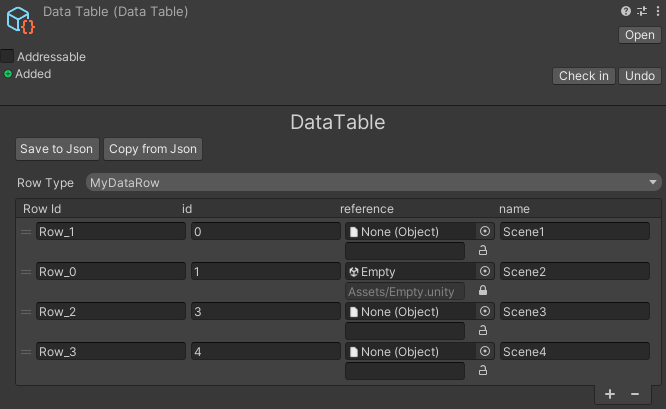
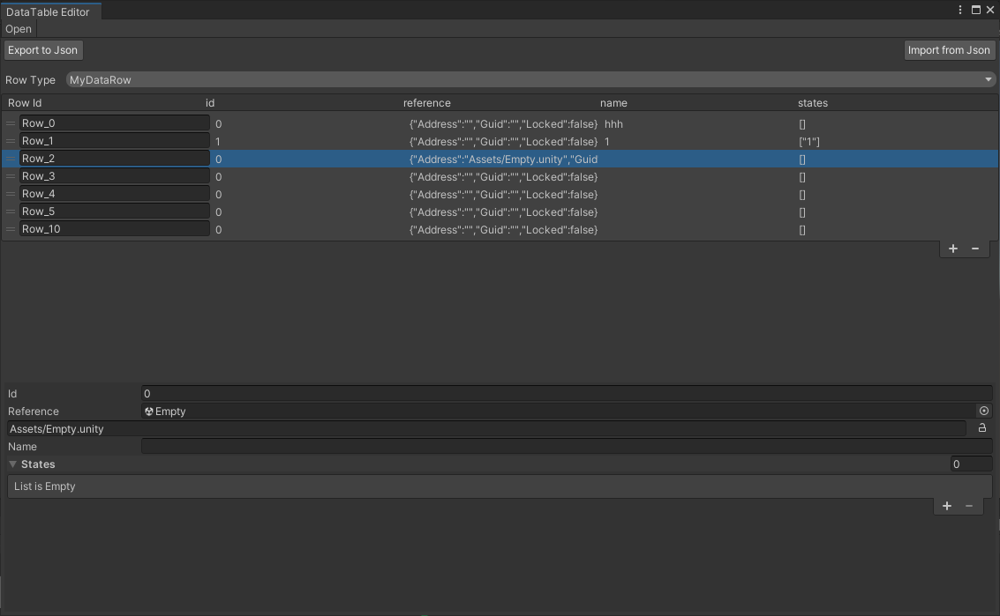

# Data Driven

The Data Driven module stores typed rows in `DataTable` ScriptableObjects and
loads those tables through the Ceres Resource system. Row schemas remain C#
types, while designers edit instances in the Inspector or Data Table window.

Use a Data Table for keyed, project-authored records such as items, levels, or
characters. Use Configs for process-wide settings and live overrides.

## Define a Row Schema

A row is a serializable class implementing `IDataTableRow`:

```csharp
using System;
using Ceres.DataDriven;

[Serializable]
[AddressableDataTable(
    group: "GameData",
    address: "items",
    Labels = new[] { "runtime-data" })]
public sealed class ItemRow : IDataTableRow, IValidateRow
{
    public string displayName;
    public int maxStack = 1;

    public bool ValidateRow(string rowId, out string reason)
    {
        if (maxStack > 0)
        {
            reason = null;
            return true;
        }

        reason = "maxStack must be greater than zero";
        return false;
    }
}
```

`IValidateRow` is optional. The Editor calls it when a table is updated and logs
the returned reason when validation fails.

`AddressableDataTableAttribute` is also optional. When present, the Editor
registers Data Tables using that row type in the specified Addressables group.
The address defaults to the asset name when `Address` is omitted; labels come
from `Labels`.

## Author a Table

1. Create a **Ceres > DataTable** asset.
2. Select `ItemRow` as the row type.
3. Add rows and assign a unique row ID to each record.
4. Edit inline or open the dedicated Data Table window from the asset Inspector.





Changing the row type updates the serialized row metadata. Data Table editing
supports Undo, JSON import and export, row validation, insertion, removal, and
reordering.

## Read Rows

`DataTable` exposes typed and untyped lookup APIs:

```csharp
ItemRow potion = table.GetRow<ItemRow>("potion");
ItemRow first = table.GetRow<ItemRow>(0);
ItemRow[] stackable = table.GetRows<ItemRow>(row => row.maxStack > 1);
ItemRow[] all = table.GetAllRows<ItemRow>();
```

`GetRow<T>(string)` returns `null` when the ID is absent. Index-based access uses
the table's current order and throws for an invalid index. `GetRowMap()` creates
a dictionary keyed by row ID.

The returned rows are cached deserialized objects owned by the table. Treat
authored tables as read-only at runtime. Editor tooling that needs independent
copies can use `DataTableEditorUtils.GetAllRowsSafe` or `GetRowMapSafe`.

The public mutation API consists of `AddRow`, `InsertRow`, `UpdateRow`,
`AddOrUpdateRow`, `RemoveRow`, `RemoveAllRows`, and `ReorderRow`. `AddRow` and
`InsertRow` return `false` when the requested row ID already exists;
`UpdateRow` returns `false` when it does not exist.

## Load Tables with a Manager

Derive from `DataTableManager<TManager>` to own a set of Addressable tables. A
concrete manager needs the public object constructor used by discovery.

```csharp
using Ceres.DataDriven;
using Cysharp.Threading.Tasks;

public sealed class GameData : DataTableManager<GameData>
{
    public GameData(object _) : base(_) { }

    protected override UniTask Initialize(bool sync)
    {
        return InitializeSingleTable("items", sync);
    }

    public ItemRow GetItem(string rowId)
    {
        return GetDataTable("items")?.GetRow<ItemRow>(rowId);
    }
}
```

Initialize managers explicitly when their data is required:

```csharp
await DataTableManager.InitializeAsync();
ItemRow item = GameData.Get().GetItem("potion");
```

`InitializeAsync()` first registers every discovered concrete manager, then
initializes the pending managers in parallel. Concurrent callers await the same
initialization, and managers from assemblies loaded later are added without
reloading managers that already completed. `Initialize()` uses the same
two-phase discovery with synchronous Addressables completion.

`Get()` is valid after initialization completes. It never enters synchronous
initialization while an asynchronous initialization is active. `ReleaseAll()`
invalidates the active initialization generation and clears the manager
registry, so late completions cannot publish stale state.

`InitializeSingleTable` loads through `ResourceSystem`. When
`DataDrivenConfig.ValidateDataTableBeforeLoad` is enabled, it first verifies the
address. Async initialization registers the value returned by the awaited load
directly; it does not depend on the later Addressables `Completed` callback.
A missing resource is ignored by the helper and the table remains unregistered.

Enable **Initialize Managers** in **Project Settings > Ceres** only when every
manager should load before normal gameplay. Otherwise initialize the required
managers from the project's own startup flow.

## Editor Integration

`DataTableEditorUtils` is the supported entry point for custom Editor tools. It
can set row types, import or export JSON, create safe row copies, validate IDs,
and register Addressables entries. `OnDataTablePreUpdate` and
`OnDataTablePostUpdate` allow tooling to observe table edits.

For a custom window, derive behavior from `DataTableEditorExtension` and open it
with `DataTableEditorWindow.OpenWindowWithExtensions`. The Editor serializer is
selected in **Project Settings > Ceres** and defaults to
`DataTableEditorJsonSerializer`.

Related API: <xref:Ceres.DataDriven.DataTable>,
<xref:Ceres.DataDriven.DataTableManager>,
<xref:Ceres.DataDriven.DataTableManager%601>, and
<xref:Ceres.DataDriven.Editor.DataTableEditorUtils>.
