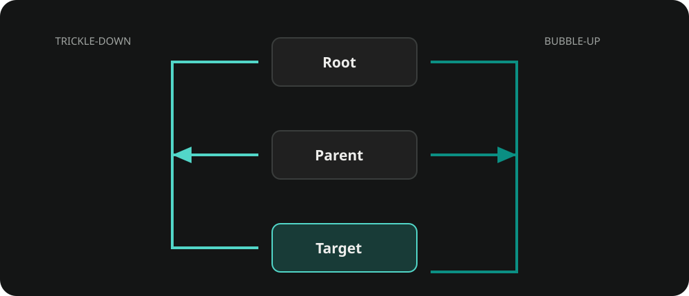

# Events

Ceres Events provides pooled event objects, callback routing, contextual propagation, frame-bound dispatch, and Editor tracing. Use `EventSystem` for application-wide messages and `CallbackEventHandler` hierarchies when an event needs a target and propagation path.

## Define and send an event

Declare a non-generic `partial` event with public readable properties. `Ceres.Events.SourceGenerator` generates `Create(...)`, obtains a pooled instance, and assigns those properties.

```csharp
using Ceres.Events;

public partial class DamageEvent : EventBase<DamageEvent>
{
    public int Amount { get; private set; }
}
```

Register the callback while its owner is active, then unregister the same delegate when that lifetime ends.

```csharp
using Ceres.Events;
using UnityEngine;

public sealed class DamageListener : MonoBehaviour
{
    private void OnEnable()
    {
        EventSystem.RegisterCallback<DamageEvent>(OnDamage);
    }

    private void Start()
    {
        using var evt = DamageEvent.Create(12);
        EventSystem.SendEvent(evt);
    }

    private void OnDisable()
    {
        EventSystem.UnregisterCallback<DamageEvent>(OnDamage);
    }

    private static void OnDamage(DamageEvent evt)
    {
        Debug.Log($"Damage: {evt.Amount}");
    }
}
```

`EventSystem.SendEvent` queues the event for `Update` by default. Select `FixedUpdate` or `LateUpdate` with `MonoDispatchType`, or use `DispatchMode.Immediate` when dispatch must finish inside the current call.

```csharp
using var evt = DamageEvent.Create(12);
EventSystem.SendEvent(
    evt,
    DispatchMode.Default,
    MonoDispatchType.LateUpdate);
```

## Contextual propagation

`CallbackEventHandler` can form a hierarchy through its `Parent` property. An event with `TricklesDown` or `Bubbles` enabled travels through that hierarchy around its target. Register a callback with `TrickleDown.TrickleDown` to receive the descending phase; the default registration receives the target or bubble phase.



During a callback, use `StopPropagation`, `StopImmediatePropagation`, or `PreventDefault` only when the handler owns that routing decision. Application-wide events usually do not need a custom hierarchy.

## Lifetime and ownership

- Event instances are pooled. Create them through generated `Create(...)` or `GetPooled()`, and dispose the caller's reference with `using`.
- Queued dispatch acquires its own reference, so disposing the caller's reference after `SendEvent` is safe.
- Do not retain an event instance after its dispatch or disposal. Copy the values that must outlive the callback.
- If an event supplies a custom static `Create` method, the generator leaves it unchanged.

## Event Debugger

Open **Tools > Ceres > Debug > Event Debugger** while the application is playing. The debugger can inspect coordinators, registered callbacks, propagation paths, callback timing, and default actions. It can also record, save, load, and replay selected events.

Debugger recording is an Editor diagnostic path, not a runtime persistence API.

## Related documentation

- [Schedulers](./core_schedulers.md) for time- and frame-based callbacks
- [Tasks](./core_tasks.md) for prerequisite-driven work and completion events
- [Reactive Integration](./core_reactive.md) for exposing callback handlers as R3 observables
