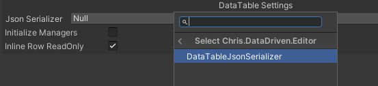

# Serialization

The Serialization module covers four separate concerns: file-backed JSON data,
serializable type metadata, polymorphic object snapshots, and process-local
object handles. Choose the smallest API that matches the lifetime of the data.

## Save Files

`SaveLoadSerializer` converts an object to JSON, then delegates the JSON string
to an `ISerializeFormatter` that reads or writes a stream.

```csharp
using System;
using Ceres.Serialization;
using UnityEngine;

[Serializable]
public sealed class PlayerProfile
{
    public int level;
    public string displayName;
}

var serializer = new SaveLoadSerializer(
    Application.persistentDataPath,
    "json",
    TextSerializeFormatter.Instance);

serializer.Serialize("profile", new PlayerProfile
{
    level = 12,
    displayName = "Ceres"
});

PlayerProfile profile = serializer.DeserializeOrNew<PlayerProfile>("profile");
```

The serializer exposes keyed `Serialize`, `Deserialize`, `DeserializeOrNew`,
`Overwrite`, `Exists`, `Delete`, and `DeleteAll` operations. `TryDeserialize`
reads the formatted JSON string without constructing an object.

Objects use Unity `JsonUtility` by default. Apply `PreferJsonConvertAttribute`
to a class or interface to use Newtonsoft.Json instead:

```csharp
using System;
using System.Collections.Generic;
using Ceres.Serialization;

[Serializable]
[PreferJsonConvert]
public sealed class InventoryState
{
    public Dictionary<string, int> counts = new();
}
```

The built-in stream formatters are:

| Formatter | Contract |
| --- | --- |
| `TextSerializeFormatter` | Reads and writes UTF-8 JSON text. |
| `BinarySerializeFormatter` | Stores the JSON string through .NET `BinaryFormatter`. |
| `EncryptedSerializeFormatter` | Encrypts the JSON string with password-derived AES-CBC. |

Implement `ISerializeFormatter` when storage needs a different stream encoding.
The formatter does not choose the JSON serializer.

`EncryptedSerializeFormatter` does not expose authenticated encryption. If save
data integrity matters, add project-owned authentication or validation.

### SaveUtility

`SaveUtility` is the fixed project save facade. It writes `.sav` files below
`SaveUtility.SavePath` with `BinarySerializeFormatter`:

```csharp
SaveUtility.Save(new PlayerProfile { level = 4 });

PlayerProfile profile = SaveUtility.LoadOrNew<PlayerProfile>();
bool exists = SaveUtility.Exists(nameof(PlayerProfile));
```

On Windows and in the Editor, `SavePath` is the project's `Saved` directory. On
other Players it is `Application.persistentDataPath/Saved`.

## Serializable Type References

`SerializedType<T>` stores assembly-qualified type metadata while constraining
the selected type to `T`. It is suitable for strategy, provider, formatter, or
module types selected in the Inspector.

```csharp
using System;
using Ceres.Serialization;

public interface ISpawnPolicy
{
    void Apply();
}

[Serializable]
public sealed class DefaultSpawnPolicy : ISpawnPolicy
{
    public void Apply() { }
}

SerializedType<ISpawnPolicy> policyType =
    SerializedType<ISpawnPolicy>.FromType(typeof(DefaultSpawnPolicy));

Type runtimeType = policyType.GetObjectType();
ISpawnPolicy policy = policyType.GetObject();
```

`GetObject()` constructs and caches an instance with `Activator.CreateInstance`,
so the selected concrete type must be constructible without arguments.
`GetObjectType()` resolves only the type. `IsValid()` reports whether the stored
metadata currently resolves.



The non-generic `SerializedType` helper converts types to and from the compact
metadata format used by Ceres and supplies the generic-port utilities used by
Graph and Flow. `FormerlySerializedTypeAttribute` and
`SerializedTypeRedirector.RedirectSerializedType` are explicit type-resolution
hooks; no redirect is created automatically.

## Polymorphic Object Snapshots

`SerializedObject<T>` stores the concrete type and a Unity JSON snapshot behind
a base type or interface:

```csharp
using System;
using Ceres.Serialization;

public interface IEffect
{
    void Apply();
}

[Serializable]
public sealed class DamageEffect : IEffect
{
    public float amount;
    public void Apply() { }
}

SerializedObject<IEffect> serialized =
    SerializedObject<IEffect>.FromObject(new DamageEffect { amount = 25f });

IEffect cached = serialized.GetObject();
IEffect independentCopy = serialized.NewObject();
```

`GetObject()` caches the first deserialized instance. `NewObject()` creates a
fresh instance from the stored snapshot. `CloneT()` copies the serialized data,
not the cached object.

The payload always uses `JsonUtility`; `PreferJsonConvertAttribute` does not
affect `SerializedObject<T>`. The usual Unity JSON restrictions apply, including
field-based serialization and no general-purpose Unity object graph support.

## Process-local Object Handles

`SoftObjectHandle` identifies an object registered with `GlobalObjectManager`.
The handle contains a sparse-array index and serial number, so a removed slot
cannot resolve a newer object that later reuses the same index.

```csharp
object value = new object();
var handle = new SoftObjectHandle(value);

object resolved = handle.GetObject();
GlobalObjectManager.UnregisterObject(handle);
```

These handles are valid only for the current process and registry lifetime.
`GlobalObjectManager.Cleanup()` invalidates all existing handles and raises
`OnGlobalObjectCleanup`. The manager holds registered objects until they are
unregistered or the registry is cleaned.

Use **Tools > Ceres > Debug > Serialization Debugger** to inspect the live
registry in the Editor.

Related API: <xref:Ceres.Serialization.SaveLoadSerializer>,
<xref:Ceres.Serialization.SerializedType%601>,
<xref:Ceres.Serialization.SerializedObject%601>, and
<xref:Ceres.Serialization.GlobalObjectManager>.
