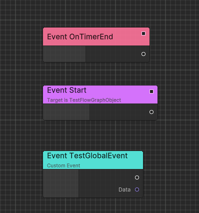

# Flow Concepts

Ceres Flow is an event-driven visual scripting layer built on the typed Ceres Graph model. A Flow graph starts execution from an event, calls C# functions through nodes, and runs inside a container that owns its runtime lifetime.

Read [Ceres Architecture and Concepts](./ceres_concept.md) first if you need the dependency boundary between Core, Graph, Flow, and Gameplay.

## Events

An event is an entry point into an execution chain and may provide typed input values. Events can be declared by the graph or exposed from C#.

Use [Executable Events](./flow_executable_event.md) to expose C# delegates or implementable methods. Graph-local behavior can use custom events without adding a C# declaration.

## Functions

Function nodes call typed C# APIs. Ceres generates nodes for supported executable functions and function libraries, so graph ports follow the method's parameter and return types.

Use [Executable Functions](./flow_executable_function.md) for instance APIs and [Function Libraries](./flow_function_library.md) for shared static APIs.

## Containers

Every runtime Flow graph belongs to an `IFlowGraphContainer`. A container supplies the graph instance, execution context, and lifetime. It can be a custom `MonoBehaviour` or one of the container bases provided by Ceres.

[Runtime Architecture](./flow_runtime_architecture.md) describes the available container models and how graph assets become runtime instances.

## Execution model

Flow combines two paths:

- Forward execution connects event and function nodes in the order they should run.
- Data dependencies are evaluated when an executing node needs an input value.

Start with [Quick Start](./flow_startup.md), then use [Code Generation](./flow_codegen.md) when a graph needs generated C# execution for a production or IL2CPP build.
