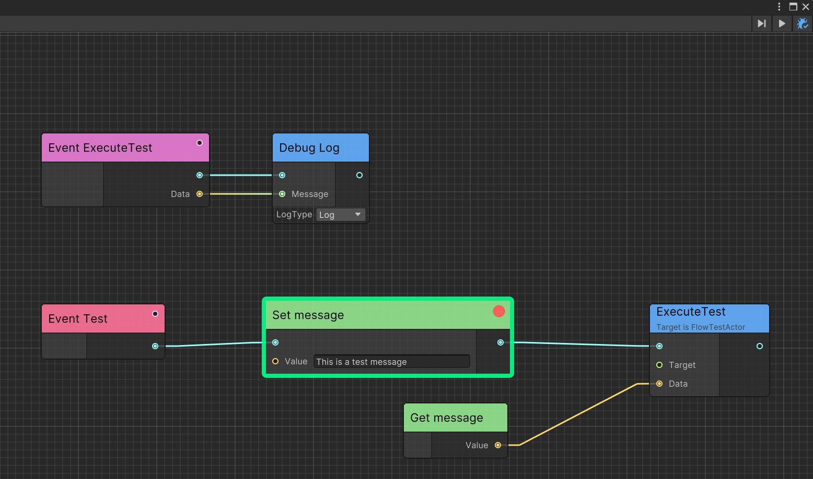
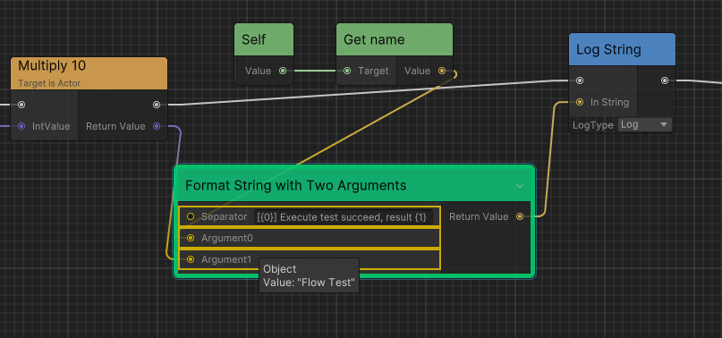
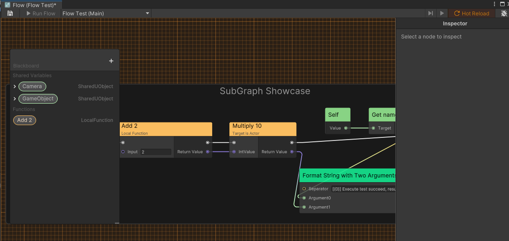

# Debugging

Ceres can pause graph execution, inspect ports, and replace active editor-play-mode graph instances.

## Debug mode

Click `Enable Debug Mode` in the upper-right toolbar. Use `Next Frame` to advance node by node.

## Breakpoints

Right-click an executable node and select `Add breakpoint`, then use `Next Breakpoint` in the toolbar.

## Port values

Ceres editor can display the current value of an input port when the mouse hovers over the port of the node at the current breakpoint.

## Graph tracker
`FlowGraphTracker` is a class that can be used to track the execution of the graph for advanced debugging scenarios.

See [Graph Tracker](./flow_graph_tracker.md) for scoped runtime tracing.

## Hot reload

Ceres supports hot reload for active `FlowGraphObjectBase` instances in editor play mode. Saving replaces the runtime graph used by subsequent events; execution already in progress may finish on the previous graph.

Enable `Hot Reload` in the Flow editor toolbar, then save the graph while in play mode.

## Related guides

- Learn about [Graph Tracker](./flow_graph_tracker.md) for advanced debugging and execution tracking
- Explore [Custom Nodes](./flow_custom_node.md) to understand node execution flow
- Check [Runtime Architecture](./flow_runtime_architecture.md) for container types and execution context
