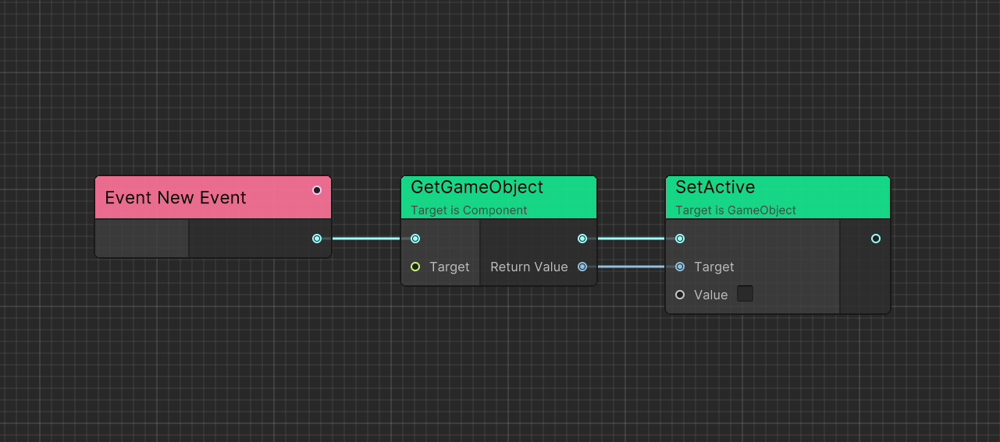
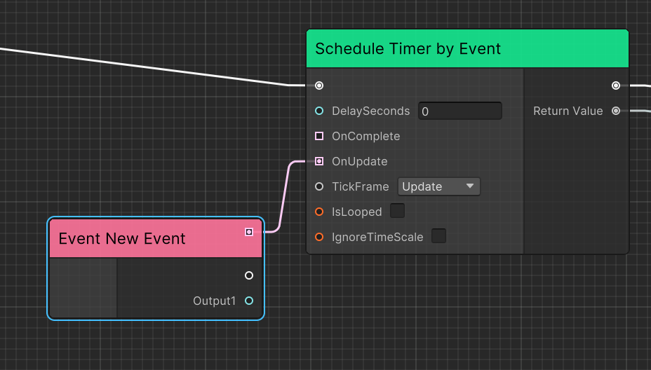
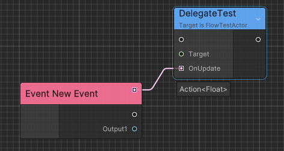
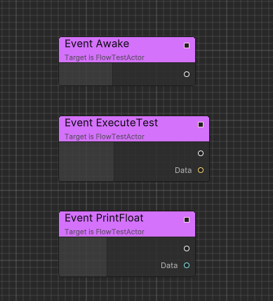
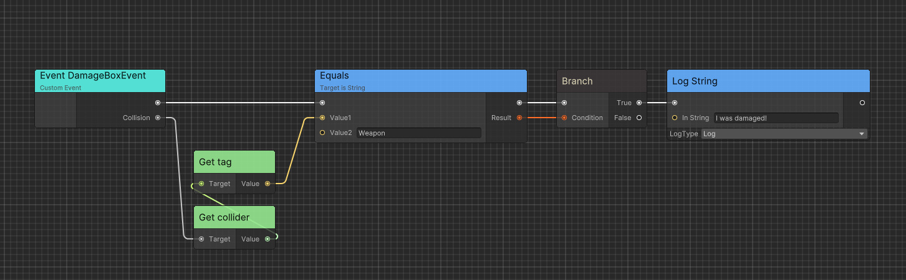

# Executable Events

Events are graph entry points. Flow supports named execution events, implementable C# methods, and typed Ceres events.

## Execution Event

`ExecutionEvent` is a common event that can be used to trigger the execution of a FlowGraph instance.



> You can double click the event node and rename it.

By default, `ExecutionEvent` without parameters can be created in search window.

`ExecutionEvent` with parameters can be created when you drag any port with type `EventDelegate<>`.



`Action<>` ports are also supported through [implicit conversion](./flow_advanced.md#implicit-port-conversion).



## Implementable Event

Implementable events can be defined on a [container](./flow_concept.md#containers) so C# can invoke graph behavior through the annotated method.

Following is an implementation example.

```csharp
using Ceres.Flow;
using Ceres.Flow.Annotations;

public class FlowTest : FlowGraphObject /* Inherit from MonoBehaviour */
{
    [ImplementableEvent]
    public void Awake()
    {

    }

    [ImplementableEvent]
    public void PrintFloat(float data)
    {

    }

    [ImplementableEvent]
    public void ExecuteTest(string data)
    {

    }
}
```



## Custom Event

Custom executable events carry typed data between C# and Flow without requiring a matching container method.

Here is an implementation example:

```csharp
using Ceres.Events;
using Ceres.Flow;
using Ceres.Flow.Annotations;
using UnityEngine;

[ExecutableEvent]
public class DamageBoxEvent: EventBase<DamageBoxEvent>
{
    public Collision Collision { get; private set; }

    [ExecutableEvent]
    public static DamageBoxEvent Create(Collision collision)
    {
        var evt = GetPooled();
        evt.Collision = collision;
        return evt;
    }
}

public class DamageBox: MonoBehaviour
{
    private void OnCollisionEnter(Collision other) 
    {
        using var evt = DamageBoxEvent.Create(other);
        GetComponentInParent<FlowGraphObject>().SendEvent(evt);
    }
}
```



The event type generates an implementation node. Marking the static factory also generates a node that creates the event. Public getters become output ports.

### Implementation

Custom event nodes are generated from `[ExecutableEvent]` and use the [Ceres event system](./core_events.md) for dispatch.

## Related guides

- Learn about [Executable Functions](./flow_executable_function.md) for exposing C# methods to Flow
- Explore [Runtime Architecture](./flow_runtime_architecture.md) to understand how events are executed
- Check [Code Generation](./flow_codegen.md) for technical details on event implementation
- See [Quick Startup](./flow_startup.md) for a complete example using events
