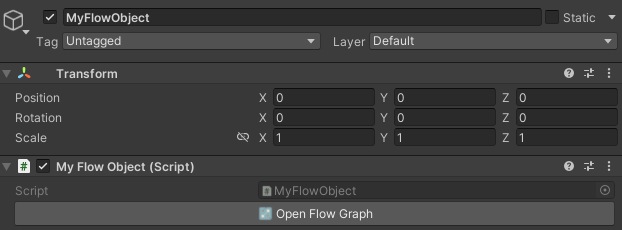
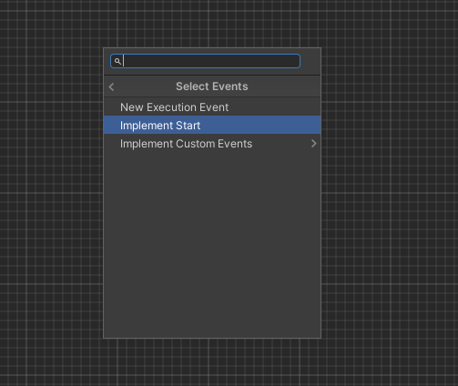
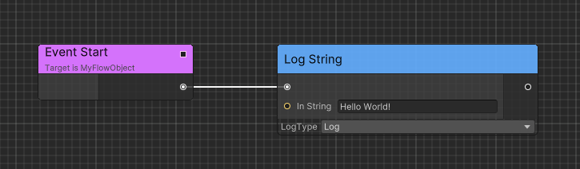

# Quick Start

Here is an example of using Flow to output a "Hello World" message.

1. Create `MyFlowObject.cs` and derive it from `FlowGraphObject`.

2. Add a `Start` method to the newly created class so that Unity can call this method when the game starts.

3. Mark `Start` with `[ImplementableEvent]` so the graph can implement it.

```csharp
using Ceres.Flow;
using Ceres.Flow.Annotations;
public class MyFlowObject: FlowGraphObject
{
    [ImplementableEvent]
    private void Start()
    {

    }
}
```

4. Now create a new GameObject in the scene and attach `MyFlowObject` component to it.

5. Click `Open Flow Graph` in the Inspector panel to open the Flow Graph Editor.

    

6. Right-click the graph, then select `Create Node > Select Events > Implement Start`.

    

7. Open `Create Node`, search for `Log String`, and connect the `Start` execution output to it.

8. Fill in "Hello World!" in the `In String` field of the `Log String` node.
    
    

9. Save the graph from the toolbar.

10. Play the game and you will see "Hello World!" in the console.

## Related guides

- Learn about [Flow Concept](./flow_concept.md) to understand Flow's architecture
- Explore [Executable Events](./flow_executable_event.md) for different event types
- Check [Executable Functions](./flow_executable_function.md) for exposing C# methods to Flow
- See [Runtime Architecture](./flow_runtime_architecture.md) for container types and usage patterns
