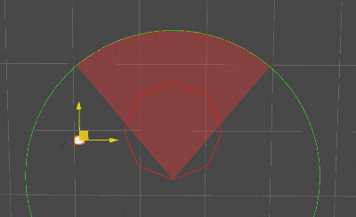

# AI Spatial Queries

Ceres provides a small set of Actor-oriented spatial queries: field-of-view
tests and cover-post sampling. These APIs are building blocks for project AI;
they do not provide behavior trees, scoring contexts, or a complete EQS.

## Query Paths

Choose between direct physics work and world-snapshot work:

| Path | Source data | Completion | Occlusion |
| --- | --- | --- | --- |
| `FieldView.Detect` | One target position plus Physics | Immediate | `Physics.Linecast` |
| `EnvironmentQuery.OverlapFieldView` | `ActorQuerySystem` snapshot | Immediate, completes a Burst job in the call | No |
| `FieldViewQuerySystem` | `ActorQuerySystem` snapshot | Batched across fixed frames | No |
| `PostQueryParameters.QueryPosts` | Physics raycasts | Immediate | Raycast hits are the result |
| `PostQuerySystem` | Actor snapshot plus batched raycasts | Queued across fixed frames | Raycast hits are the result |

### ActorQuerySystem Snapshot

`ActorQuerySystem` stores a compact `ActorData` array containing each Actor's
handle, layer, active flag, position, and rotation. Position, rotation, and the
active flag are refreshed on its world tick. The Actor list and layers are
rebuilt when the world's Actor set becomes dirty.

`GetAllActors(Allocator)` returns a copy owned by the caller. Each scheduled
query therefore observes the snapshot captured when that query begins, not
later Transform changes.

The current field-view jobs filter by layer and handle, but do not filter the
`ActorData.Active` value. Remove inactive Actors from the relevant world/layer
or filter the returned Actors in project code when activity matters.

## Direct Field of View

`FieldView` combines a close polygon with a radius and view angle. `Detect`
tests one world-space point and then performs a linecast for visibility.

```csharp
using Ceres.Gameplay.AI.EQS;
using UnityEngine;

var view = new FieldView(
    radius: 20f,
    angle: 120f,
    sides: 8,
    blend: 0.5f);

bool visible = view.Detect(
    target.position,
    observer.position,
    observer.rotation,
    occlusionMask,
    filterTags: new[] { "Target" });
```

`filterTags` identifies collider tags that are accepted when the linecast hits
them. With no accepted tag, any hit blocks visibility. The test uses horizontal
distance for its range limit; it is not a volumetric frustum query.

`AllocatePolygonCorners` and `IsPointInPolygon` expose the close-range geometry.
The caller must dispose the `NativeArray` returned by
`AllocatePolygonCorners`. `DrawGizmos` renders the same shape in the Editor.

## Actor World Queries

Use `EnvironmentQuery.OverlapFieldView` for an immediate Actor lookup:

```csharp
using System.Collections.Generic;
using Ceres.Gameplay;
using Ceres.Gameplay.AI.EQS;

var actors = new List<Actor>();

EnvironmentQuery.OverlapFieldView(
    actors,
    observer.position,
    observer.forward,
    radius: 20f,
    angle: 120f,
    targetMask,
    ignoredActor: observerActor);
```

The method appends to the supplied list, schedules a parallel job over the
current Actor snapshot, completes it before returning, and resolves handles
back to Actors. It tests radius, angle, layer, and the ignored handle. It does
not perform line-of-sight raycasts.

### Batched FieldView Queries

Attach `FieldViewQueryComponent` to an Actor for recurring batched queries:

```csharp
if (fieldViewQuery.RequestFieldViewQuery())
{
    // The request is registered; results are not ready in this frame.
}

visibleActors.Clear();
fieldViewQuery.CollectViewActors(visibleActors);
```

The first request registers a persistent command for that Actor; later requests
replace its parameters. `FieldViewQuerySystem` schedules all registered commands
every `FramePerTick` fixed frames (`25` by default), then completes the batch
three fixed frames later. Until completion, `CollectViewActors` returns the
previous cache or no results. It appends to the supplied list.

Set `FieldViewQuerySystem.FramePerTick` before the subsystem is created. Values
of `3` or less violate the subsystem's scheduling assertion.



## Cover-post Queries

`PostQueryParameters` samples raycast boundaries across a fan. `step` controls
the number of angular intervals; `depth` controls how many times a boundary is
refined.

For a synchronous query:

```csharp
using System.Collections.Generic;
using Ceres.Gameplay.AI.EQS;
using UnityEngine;

var posts = new List<Vector3>();
bool found = parameters.QueryPosts(
    posts,
    sourceTransform,
    sourceTransform.forward,
    coverMask);
```

The method appends hit points to the supplied list and returns whether the list
contains any result.

Attach `PostQueryComponent` when the work should be queued:

```csharp
if (postQuery.RequestPostQuery(targetActor))
{
    // Poll on later fixed frames.
}

var posts = postQuery.GetPosts();
```

Each component has one worker keyed by its owning Actor. A request is rejected
while that worker already has pending or running work, and the target cannot be
the owner itself. The default system consumes up to `MaxWorkerCount` commands
(`5`) every `FramePerTick` fixed frames (`25`), then completes that batch three
fixed frames later. `GetPosts` continues to expose the last completed cache.

Set `PostQuerySystem.MaxWorkerCount` and `FramePerTick` before creating the
subsystem; its persistent buffers and scheduler are allocated during
initialization.

Related API: <xref:Ceres.Gameplay.ActorQuerySystem>,
<xref:Ceres.Gameplay.AI.EQS.FieldView>,
<xref:Ceres.Gameplay.AI.EQS.EnvironmentQuery>,
<xref:Ceres.Gameplay.AI.EQS.FieldViewQuerySystem>, and
<xref:Ceres.Gameplay.AI.EQS.PostQuerySystem>.
