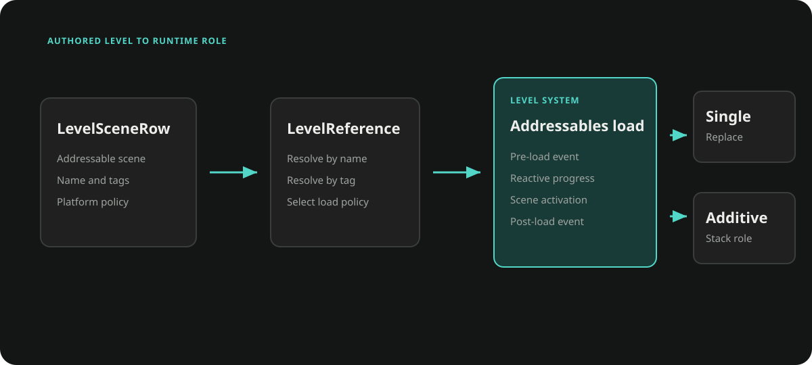

# Level

Ceres Level groups one or more Addressables scenes into a named gameplay level. `LevelSceneRow` defines scene membership and platform policy, while `LevelSystem` owns scene handles, load progress, notifications, and additive unloading.



## Author a level table

Create a DataTable with `LevelSceneRow` as its row type. The row type automatically labels the table as `LevelSceneTable`, allowing `LevelSceneDataTableManager` to discover all level tables through Addressables.

Each row describes one scene:

- `levelName` groups rows into one `LevelReference`;
- `reference` stores the Addressables scene address;
- `loadMode` selects `Single` or `Additive`;
- `loadPolicy` includes or excludes the row on PC, mobile, or console;
- `tags` provide an alternate lookup path.

A level should contain at most one `Single` row. That scene becomes the base scene; all `Additive` rows with the same level name load on top of it.

## Load a level

Resolve a level by name or tag, then await `LevelSystem.LoadAsync`.

```csharp
using Ceres.Gameplay.Level;
using Cysharp.Threading.Tasks;
using R3;
using System;
using UnityEngine;

public static class LevelLoader
{
    public static async UniTask LoadGameplayAsync()
    {
        LevelReference level = LevelSceneDataTableManager.Get().FindLevel("Gameplay");
        if (level.Scenes.Length == 0)
        {
            Debug.LogError("Level 'Gameplay' was not found.");
            return;
        }

        using IDisposable progress = LevelSystem.LoadingProgress
            .Subscribe(value => Debug.Log($"Loading: {value:P0}"));

        await LevelSystem.LoadAsync(level);
    }
}
```

`LoadAsync(string)` performs the same lookup. Use an explicit `LevelReference` when code has already selected by tag or inspected the scene rows.

## Load lifecycle

For a level with a `Single` row, `LevelSystem`:

1. publishes `LevelPreload` and resets `LoadingProgress` to `0`;
2. moves `CurrentLevel` to `LastLevel` and assigns the incoming reference;
3. loads the base scene in Single mode while keeping `GameWorld` access valid across the scene transition;
4. loads the remaining Additive scenes in parallel and tracks their Addressables handles;
5. sets progress to `1` and publishes `LevelPostLoad`.

`LoadingProgress` is an R3 read-only reactive property. For multi-scene loads, each scene contributes an equal slot to the aggregate progress.

Levels containing only Additive rows do not change `CurrentLevel` or `LastLevel`, but they still publish the level load notifications.

## Platform policy

`LevelSceneDataTableManager` evaluates `LoadLevelPolicy` while building its level references. `Never` excludes a row. Mobile and console use their matching flags; other platforms use `PC`.

Policy applies to DataTable discovery. A manually constructed `LevelReference` is not filtered again by `LevelSystem`.

## Runtime additive scenes

Use `LoadAdditiveByAddressAsync` for content that is not represented by the level tables.

```csharp
using Ceres.Gameplay.Level;
using Cysharp.Threading.Tasks;
using UnityEngine.SceneManagement;

public static async UniTask OpenRuntimeMap(string sceneAddress)
{
    LevelSystem.RegisterBaseScene(SceneManager.GetActiveScene());

    await LevelSystem.LoadAdditiveByAddressAsync(
        sceneAddress,
        setActiveAfterLoad: true,
        roleOverride: AdditiveSceneRole.RuntimeOverride);
}
```

Direct additive loading updates `LoadingProgress` and the additive stack. It does not change `CurrentLevel` or publish `LevelPreload` and `LevelPostLoad`.

## Unload additive content

`UnloadLastAdditiveAsync` removes the most recent tracked scene, or the most recent entry matching a requested `AdditiveSceneRole`. Set `restoreRegisteredBaseBeforeUnload` when an override scene is active and the registered base scene must become active first.

```csharp
bool unloaded = await LevelSystem.UnloadLastAdditiveAsync(
    restoreRegisteredBaseBeforeUnload: true,
    unloadOnlyRole: AdditiveSceneRole.RuntimeOverride);
```

Use `UnloadRuntimeAdditiveStackAsync` for the standard runtime primary/secondary stack, or `UnloadAdditiveAsync` to unload every tracked additive scene.

## Ownership and constraints

- Scene references must be valid Addressables scene addresses. `LevelSceneRow` validation rejects an empty address.
- `LevelSystem` owns the Addressables handles for tracked additive scenes. Do not release those handles separately.
- Loading a new Single scene releases the previous additive handles because Unity unloads those scenes as part of the Single load.
- A failed direct additive load is removed from the stack and its handle is released.
- `LevelPreload`, `LevelPostLoad`, and `LoadingProgress` are process-wide reactive streams; dispose subscriptions with their owner.
- `[LevelName]` can be applied to a string field to select known level names through the Editor drawer.

## Related documentation

- [World and Actors](./gameplay_world.md) for `GameWorld` ownership during scene changes
- [Data Driven](./core_data_driven.md) for DataTable authoring and validation
- [Resource](./core_resource.md) for Addressables-based runtime loading
- [Reactive Integration](./core_reactive.md) for subscription lifetimes
