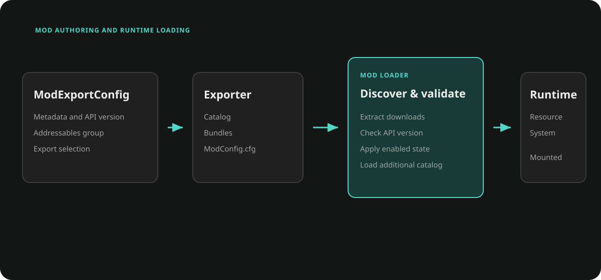

# Mod Packages

The Mod module exports selected Addressables groups and loads their catalogs
from an external directory at runtime. A package contains a catalog, its bundle
dependencies, and `ModConfig.cfg` metadata.

This workflow is group-driven. `ModExportConfig` delegates to the Resource
module's `ResourceExporter` and selects Addressables groups by name. It does not
use the graph-driven [Content Pipeline](./core_content_pipeline.md), its scope
model, baselines, or update validation.



## Authoring

### Create an Export Configuration

Create **Ceres > Mod > Export Config** and set:

| Field | Purpose |
| --- | --- |
| `modName` | Package name and Addressables group prefix. |
| `version` | Author-defined package version. |
| `authorName` | Author metadata. |
| `description` and `iconData` | Optional catalog metadata. |
| `customBuilders` | Additional `CustomBuilder` steps. |

`ModExportConfig` is also a `FlowGraphScriptableObject`. Its
`Flow_OnBuild(buildPath)` event runs before the Addressables build, and
`Flow_OnCleanup()` runs during exporter cleanup.

### Select and Export Groups

Open **Tools > Ceres > Mod > Mod Exporter**.

1. Select the export configuration.
2. Choose **Create Addressable Group** to create or update `Mod_<modName>`.
3. Add the package assets to that group or another group whose name starts with
   the same prefix.
4. Choose **Export Mod**.

`CreateResourceExporter()` builds the matching groups through
`AddressableAssetBuilder`, runs custom builders, writes `ModConfig.cfg`, and
post-processes the generated catalog so bundle locations resolve from the
package directory. The default exporter writes a zip below
`Export/<BuildTarget>` and removes the temporary build directory after zipping.

When exporting from the same source project as the Player, add
`DefaultBundleNamePatchBuilder` if built-in shader or MonoScript bundle names
could collide with the Player's bundles.

Custom builders derive from `Ceres.Resource.Editor.CustomBuilder`:

```csharp
using System.IO;
using Ceres.Resource.Editor;

public sealed class LicenseBuilder : CustomBuilder
{
    public override string Description => "Write package license metadata.";

    public override void Build(ResourceExportContext context)
    {
        File.WriteAllText(
            Path.Combine(context.BuildPath, "LICENSE.txt"),
            "Project-owned license text");
    }
}
```

Cleanup runs in reverse builder order even when a later build step fails.

## Runtime Loading

Initialize the API once from project startup:

```csharp
using Ceres.Gameplay.Mod;

await ModAPI.Initialize(ModConfig.Get());
```

`ModConfig.LoadingPath` defaults to `Mods` beside the application on desktop and
in the Editor, and to `Application.persistentDataPath/Mods` on Android Players.
The default loader:

1. Creates the loading directory when it does not exist.
2. Extracts every zip found below it and deletes the zip.
3. Reads package `.cfg` metadata into `ModInfo`.
4. Applies the stored `ModStatus`.
5. Loads each enabled package directory through
   `ResourceSystem.LoadCatalogAsync`.

After initialization, `ModAPI.Initialized` reports readiness, `Refresh` signals
state-list changes, and `GetAllInfos()` returns a copy of the discovered package
metadata. The list includes disabled packages; deleted packages are removed
from it.

### API Validation

`APIValidator` accepts a mod only when its parsed `apiVersion` exactly equals
the configured API version. `ModLoader.LoadModAsync` applies that validator
before loading one catalog.

The current bulk `LoadAllModsAsync` path used by the default
`ModAPI.Initialize` does not invoke `IModValidator`. Projects that require API
validation for startup discovery must supply an `IModLoader` implementation
that validates every package before calling `ResourceSystem.LoadCatalogAsync`.

```csharp
await ModAPI.Initialize(
    ModConfig.Get(),
    projectModLoader);
```

Validation covers version equality only. Package trust, signatures, dependency
compatibility, and content policy belong to the project.

## State Changes Apply on the Next Launch

`EnabledMod` and `DeleteMod` update `ModConfig.States`; they do not unload a
catalog that is already mounted. A disabled package stops loading on the next
initialization. A package marked `Delete` is removed from disk when the next
loader pass processes it.

Persist state changes explicitly:

```csharp
ModAPI.EnabledMod(modInfo, isEnabled: false);
ModConfig.Get().Save();
```

```csharp
ModAPI.DeleteMod(modInfo);
ModConfig.Get().Save();
```

Do not call `DeleteModFromDisk` after initialization unless the project has
already released every asset and catalog that may reference that directory.

States are keyed by `ModInfo.FullName`, which combines mod name, mod version,
and API version. Changing any of those values creates a different installed
identity. During initialization, states whose identity is no longer present are
removed from the in-memory config; save the config if that cleanup must persist.

Related API: <xref:Ceres.Gameplay.Mod.ModAPI>,
<xref:Ceres.Gameplay.Mod.ModLoader>, <xref:Ceres.Gameplay.Mod.ModConfig>, and
<xref:Ceres.Gameplay.Mod.Editor.ModExportConfig>.
