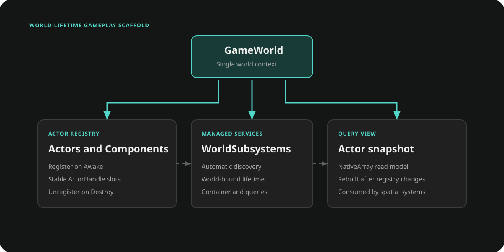

# World and Actors

The Gameplay world is a scene-level ownership boundary. `GameWorld` tracks Actors and owns `WorldSubsystem` instances; `WorldContext` and versioned handles provide safe access without turning every service into a process-wide singleton.



## Create a world subsystem

Apply `[InitializeOnWorldCreate]` when a subsystem must exist for every world. Ceres constructs it, calls `Initialize`, ticks it with the world, and calls `Release` when the world is destroyed.

```csharp
using Ceres.Gameplay;

[InitializeOnWorldCreate]
public sealed class ScoreSubsystem : WorldSubsystem
{
    public int Score { get; private set; }

    protected override void Initialize()
    {
        Score = 0;
    }

    public void AddScore(int value)
    {
        Score += value;
    }

    protected override void Release()
    {
        Score = 0;
    }
}
```

Retrieve it through a valid `WorldContext`.

```csharp
WorldContext world = GameWorld.Get();
ScoreSubsystem scores = world.GetSubsystem<ScoreSubsystem>();
scores.AddScore(100);
```

Use `WorldSubsystem.GetOrCreate<T>()` for an optional subsystem that should be created on first use instead of world creation. Override `CanCreate(WorldContext)` when availability depends on the current world.

## Actors and components

`Actor` is a `FlowGraphObject` placed on a GameObject. It registers with the current world in `Awake` and unregisters in `OnDestroy`. An `ActorComponent` must share that GameObject; it registers itself with the Actor during its own `Awake`.

```csharp
using Ceres.Gameplay;
using UnityEngine;

public sealed class EnemyActor : Actor
{
}

public sealed class HealthComponent : ActorComponent
{
    [field: SerializeField]
    public int Current { get; private set; } = 100;

    public void ApplyDamage(int amount)
    {
        Current = Mathf.Max(0, Current - amount);
    }
}
```

Resolve a component from its Actor without a scene-wide component search.

```csharp
HealthComponent health = enemy.GetActorComponent<HealthComponent>();
health.ApplyDamage(10);
```

`PlayerController` is an Actor that can possess one other Actor through `SetActor`. The controlled Actor exposes that relationship through `GetController()` or `GetTController<T>()`.

## Actor handles

`ActorHandle` contains a sparse-array index and serial number. Store the handle when another system needs a non-owning reference, then resolve it through the world at the point of use.

```csharp
ActorHandle handle = enemy.GetActorHandle();

Actor current = GameWorld.Get().GetActor(handle);
if (current != null)
{
    // The same Actor version is still registered.
}
```

After an Actor leaves the world, its old handle no longer resolves even if the sparse slot is reused.

## World services

`ContainerSubsystem` is created with every world and stores services for that world lifetime.

```csharp
public sealed class CombatRules
{
}

public static class WorldServices
{
    public static CombatRules RegisterRules()
    {
        IContainerSubsystem container = ContainerSubsystem.Get();
        container.Register(new CombatRules());
        return container.Resolve<CombatRules>();
    }
}
```

Registrations and registration callbacks are cleared when the world is released. A registration callback has world lifetime and has no individual unregister API.

## Actor query snapshots

`ActorQuerySystem` maintains native actor data for spatial and job-based queries. `GetAllActors` returns a copied snapshot owned by the caller.

```csharp
using Ceres.Gameplay;
using Unity.Collections;

ActorQuerySystem query = WorldSubsystem.GetOrCreate<ActorQuerySystem>();
using NativeArray<ActorData> actors = query.GetAllActors(Allocator.Temp);

foreach (ActorData actor in actors)
{
    if (actor.Active)
    {
        // Read actor.Handle, actor.Position, actor.Rotation, and actor.Layer.
    }
}
```

Positions, rotations, and active state are refreshed during the subsystem tick. Layer values are refreshed when the Actor set is rebuilt.

## Lifecycle and constraints

- `GameWorld.Get()` returns the current world or creates one when access is safe. If a scene already contains a `GameWorld`, that instance becomes current; duplicate worlds are destroyed.
- Retained `WorldContext` values must be checked with `IsValid()` before use. `Cast()` asserts when the world is no longer valid.
- Auto-created subsystems must have a parameterless constructor. Their lifetime ends with the world.
- Runtime-created subsystems join ticking after the world rebuilds its subsystem snapshot.
- Actors register in `Awake`; do not expect a valid handle from an earlier Unity callback.
- A query snapshot is independent native memory and must be disposed by its caller.

## Related documentation

- [Actor Flow](./gameplay_flow.md) for graph-backed Actor behavior
- [Level](./gameplay_level.md) for world lifetime across scene transitions
- [Collections](./core_collections.md) for the sparse storage behind Actor handles
- [AI and Spatial Queries](./gameplay_ai.md) for consumers of actor query snapshots
