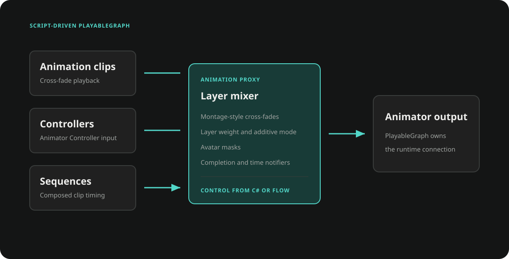

  <section class="ceres-hero">
    

    

      

        
C#-first Unity framework

        <h1>Build gameplay. <em>Extend behavior visually.</em></h1>
        

          <a class="ceres-button ceres-button-primary" href="docs/getting_started.md">Get started</a>
          <a class="ceres-button ceres-button-secondary" href="https://github.com/AkiKurisu/Ceres" target="_blank" rel="noopener">View on GitHub</a>
        

        

          Unity Package Manager
          

            <code>https://github.com/AkiKurisu/Ceres.git?path=Packages/com.kurisu.ceres</code>
            <button type="button" data-copy aria-label="Copy Git package URL">
              <svg viewBox="0 0 24 24" width="15" height="15" fill="none" stroke="currentColor" stroke-width="2" stroke-linecap="round" stroke-linejoin="round"><rect width="14" height="14" x="8" y="8" rx="2"/><path d="M4 16c-1.1 0-2-.9-2-2V4c0-1.1.9-2 2-2h10c1.1 0 2 .9 2 2"/></svg>
              <svg viewBox="0 0 24 24" width="15" height="15" fill="none" stroke="currentColor" stroke-width="2" stroke-linecap="round" stroke-linejoin="round"><path d="M20 6 9 17l-5-5"/></svg>
              Copy
            </button>
          

        

      

      <figure class="ceres-hero-media ceres-reveal">
        
      </figure>
    

  </section>

  <section class="ceres-stories">
    <article class="ceres-story">
      

        

          
From iteration to runtime

          <h2>Visual logic without a throwaway execution path.</h2>
          
Debug and hot reload Flow graphs while iterating. Generate typed C# runtime programs when the same graph needs production execution.

          
<a href="docs/flow_startup.md">Explore Flow</a><a href="docs/flow_codegen.md">Code generation</a>

        

        <figure class="ceres-story-media"></figure>
      

    </article>
    <article class="ceres-story ceres-story-flip">
      

        

          
Gameplay presentation

          <h2>Drive animation and presentation from code or Flow.</h2>
          
A script-driven PlayableGraph runtime sits alongside reactive graphics settings, pooled audio and effects, and data-driven level orchestration.

          
<a href="docs/gameplay_animation.md">Animation runtime</a><a href="xref:Ceres.Gameplay.Animations">Animation API</a>

        

        <figure class="ceres-story-media"></figure>
      

    </article>
  </section>

  <section class="ceres-pillars" aria-labelledby="ceres-pillars-title">
    

      
Why Ceres

      <h2 id="ceres-pillars-title">A focused stack for gameplay programmers.</h2>
      
Use the parts you need. Keep your C# architecture in control.

    

    

      <a class="ceres-pillar ceres-reveal" href="docs/flow_concept.md">01<h3>C#-first visual scripting</h3>
Expose typed APIs to Flow, iterate with live graphs, then generate C# for performance-sensitive and IL2CPP builds.
</a>
      <a class="ceres-pillar ceres-reveal" href="docs/gameplay.md">02<h3>Actor-based world design</h3>
Build on a lightweight scaffold of Actors, Components, controllers, and lifecycle-managed world services.
</a>
      <a class="ceres-pillar ceres-reveal" href="docs/core_data_driven.md">03<h3>Data-driven gameplay</h3>
Author typed Data Tables and hierarchical configuration, then tune live parameters through console variables.
</a>
      <a class="ceres-pillar ceres-reveal" href="docs/core_content_pipeline.md">04<h3>Graph-driven content pipeline</h3>
Create deterministic Addressables builds, validated updates, and relocatable runtime content packages.
</a>
      <a class="ceres-pillar ceres-reveal" href="docs/gameplay.md">05<h3>PlayableGraph animation</h3>
Compose clips and Animator Controllers with cross-fades, layers, masks, sequences, and notifications.
</a>
      <a class="ceres-pillar ceres-reveal" href="docs/ceres_concept.md">06<h3>Low-overhead foundations</h3>
Use pooled lifetimes, sparse storage, reactive state, and allocation-free scheduling paths in hot gameplay code.
</a>
    

  </section>

  <section class="ceres-final">
    

      
Start with the architecture you need

      <h2>Bring Ceres into your Unity project.</h2>
      

        <a class="ceres-button ceres-button-primary" href="docs/getting_started.md">Read the documentation</a>
        <a class="ceres-button ceres-button-secondary" href="xref:Ceres">Browse the API</a>
      

    

  </section>

