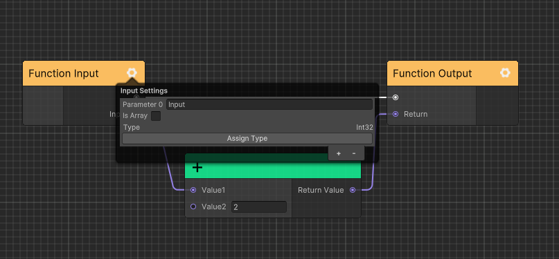
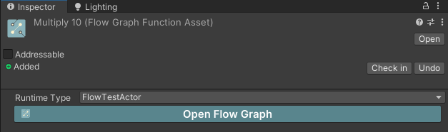
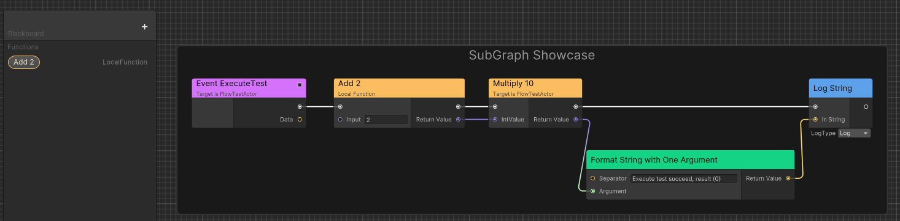

# Advanced

The following is an explanation of the advanced usages in Flow. 
You can use the following features to improve your workflow while 
maintaining high performance.

## Port Implict Conversation

For reference type objects, such as `MonoBehaviour`, `Component`, 
ports can be converted based on the inheritance hierarchy automatically.

For example, output port `MonoBehaviour` can be connected to input port `Component`.

However, for value type objects, such as `int`, `float`, `struct`, etc and other types that require implicit conversion. 
You need to register them manually.

Here is an example that convert custom `struct` to `double`:

```C#
public class GameplaySetup
{
    [RuntimeInitializeOnLoadMethod]
#if UNITY_EDITOR
    [UnityEditor.InitializeOnLoadMethod]
#endif
    private static unsafe void InitializeOnLoad()
    {
        CeresPort<SchedulerHandle>.MakeCompatibleTo<double>(handle =>
        {
            double value = default;
            UnsafeUtility.CopyStructureToPtr(ref handle, &value);
            return value;
        });
        CeresPort<double>.MakeCompatibleTo<SchedulerHandle>(d =>
        {
            SchedulerHandle handle = default;
            UnsafeUtility.CopyStructureToPtr(ref d, &handle);
            return handle;
        });
    }
}
```

## Node has Port Array

For nodes that need a resizeable port array for example `FlowNode_Sequence`, 
you can implement `IPortArrayNode` to define the port array, however, only 
one port array is supported for each node type.

```C#
public class FlowNode_Sequence : ForwardNode, ISerializationCallbackReceiver, IPortArrayNode
{
    // DefaultLength metadata is used to define the default port array length
    [OutputPort(false), CeresLabel("Then"), CeresMetadata("DefaultLength = 2")]
    public NodePort[] outputs;

    [HideInGraphEditor]
    public int outputCount;
    
    protected sealed override async UniTask Execute(ExecutionContext executionContext)
    {
        foreach (var output in outputs)
        {
            var next = output.GetT<ExecutableNode>();
            if(next == null) continue;
            await executionContext.Forward(output.GetT<ExecutableNode>());
        }
    }


    public void OnBeforeSerialize()
    {
        
    }

    public void OnAfterDeserialize()
    {
        outputs = new NodePort[outputCount];
        for (int i = 0; i < outputCount; i++)
        {
            outputs[i] = new NodePort();
        }
    }

    public int GetPortArrayLength()
    {
        return outputCount;
    }

    public string GetPortArrayFieldName()
    {
        return nameof(outputs);
    }

    public void SetPortArrayLength(int newLength)
    {
        outputCount = newLength;
    }
}

```

## Generic Node

Generic nodes define type restrictions through template classes, so that argument 
types can be obtained in the editor and the generic node instance can be constructed 
at runtime. This helps reduce lines of code.

Following is an implementation example.

```C#
[NodeGroup("Utilities")]
[CeresLabel("Cast to {0}")]
[CeresMetadata("style = ConstNode")]
public class FlowNode_CastT<T, TK>: ForwardNode where TK: T
{
    [OutputPort(false), CeresLabel("")]
    public NodePort exec;
    
    // HideInGraphEditorAttribute is used in input port to restrict
    // users to edit fields only by connecting edges
    [InputPort, HideInGraphEditor, CeresLabel("Source")]
    public CeresPort<T> sourceValue;
    
    [OutputPort, CeresLabel("Cast Failed")]
    public NodePort castFailed;
            
    [OutputPort, CeresLabel("Result")]
    public CeresPort<TK> resultValue;

    protected sealed override UniTask Execute(ExecutionContext executionContext)
    {
        try
        {
            resultValue.Value = (TK)sourceValue.Value;
            executionContext.SetNext(exec.GetT<ExecutableNode>());
        }
        catch (InvalidCastException)
        {
            executionContext.SetNext(castFailed.GetT<ExecutableNode>());
        }

        return UniTask.CompletedTask;
    }
}
```

Then define a class named as `{node name}_Template` implementing `IGenericNodeTemplate` or 
derived from `GenericNodeTemplate`.

```C#
public class FlowNode_CastT_Template: GenericNodeTemplate
{
    // Notify editor FlowNode_CastT need user to drag a port
    public override bool RequirePort()
    {
        return true;
    }
    
    public override Type[] GetGenericArguments(Type portValueType, Type selectArgumentType)
    {
        return new[] { portValueType, selectArgumentType };
    }

    public override Type[] GetAvailableArgumentTypes(Type portValueType)
    {
        return CeresPort.GetAssignedPortValueTypes()
                        .Where(x => x.IsAssignableTo(portValueType) && x != portValueType)
                        .ToArray();
    }
    
    protected override string GetGenericNodeBaseName(string label, Type[] argumentTypes)
    {
        /* Cast to {selectArgumentType} */
        return string.Format(label, argumentTypes[1].Name);
    }
}
```

## Custom Function

### Local Function

You can define local function inside your flow graph to reuse logic.

You can create a local function by following these steps:

1. Click blackboard `+` button and select `Function` in menu which will let you open subGraph view.
2. Configure the function input and output parameters.

    

3. Save the local function subGraph.
4. Enter uber graph and drag the function from blackboard to graph.

    

5. You can modify the name of local function just like modifing a variable.

### Flow Graph Function

You can define a shared function across multiple graph containers using `FlowGraphFunctionAsset`.

You can create a flow graph function by following these steps:

1. Right click project browser and select `Create/Ceres/Flow Graph Function` to create a new `FlowGraphFunctionAsset`.
2. Configure the function input and output parameters.
3. Save the flow graph.
4. Rename `FlowGraphFunctionAsset` asset name which will also be the function name.
5. Set your flow graph function [runtime type](./flow_runtime_architecture.md) in inspector.
    
6. Open another flow graph.
7. Select your flow graph function by its asset name in search window.
    