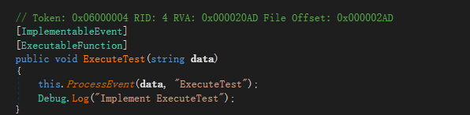
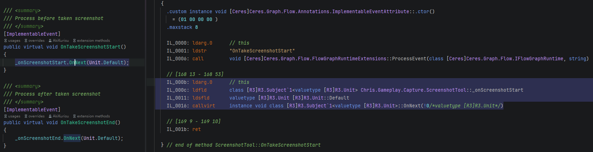

# Code Generation

The following are some details about the code generation technology used in Flow, 
which may help you understand the principles.

## IL Post Process

IL Post Process (ILPP) will inject IL to execute event into user's [ImplementableEvent](./flow_executable_event.md#implementable-event) method body.

Below is the code decompiled using `dnspy`.

```C#
[ImplementableEvent, ExecutableFunction]
public void ExecuteTest(string data)
{
    Debug.Log("Implement ExecuteTest");
}
```



If you want to customize the timing for calling bridge methods, you can add bridge method explicitly as shown below.

```C#
[ImplementableEvent]
public void Test()
{
    var stopWatch = new Stopwatch();
    stopWatch.Start();
    this.ProcessEvent();
    stopWatch.Stop(); 
    Debug.Log($"{nameof(Test)} used: {stopWatch.ElapsedMilliseconds}ms");
}
```

Recommended to use the newest version of Rider to view the IL code after ILPP directly.



## Source Generator

In [executable function part](./flow_executable_function.md#executable-function), it is mentioned that source generator will register static methods to improve runtime performance.

The following shows what SourceGenerator does.

Source code:

```C#
/// <summary>
/// Executable function library for ceres
/// </summary>
[CeresGroup("Ceres")]
public partial class CeresExecutableLibrary: ExecutableFunctionLibrary
{
    [ExecutableFunction, CeresLabel("Set LogLevel")]
    public static void Flow_SetLogLevel(LogType logType)
    {
        CeresAPI.LogLevel = logType;
    }
    
    [ExecutableFunction(ExecuteInDependency = true), CeresLabel("Get LogLevel")]
    public static LogType Flow_GetLogLevel()
    {
        return CeresAPI.LogLevel;
    }
}
```

Generated code:

```C#
[CompilerGenerated]
public partial class CeresExecutableLibrary
{
    protected override unsafe void CollectExecutableFunctions()
    {                
        RegisterExecutableFunction<CeresExecutableLibrary>(nameof(Flow_SetLogLevel), 1, (delegate* <LogType, void>)&Flow_SetLogLevel);                
        RegisterExecutableFunction<CeresExecutableLibrary>(nameof(Flow_GetLogLevel), 0, (delegate* <LogType>)&Flow_GetLogLevel);
    }
}
```
