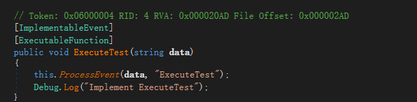
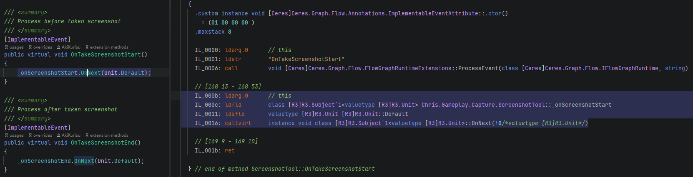

# Code Generation

The following are some details about the code generation technology used in Flow, 
which may help you understand the principles.

## IL Post Process

IL Post Process (ILPP) will inject IL to execute event into user's [ImplementableEvent](./flow_executable_event.md#implementable-event) method body.

Below is the code decompiled using `dnspy`.

```C#
[ImplementableEvent, ExecutableFunction]
public void ExecuteTest(string data)
{
    Debug.Log("Implement ExecuteTest");
}
```



If you want to customize the timing for calling bridge methods, you can add bridge method explicitly as shown below.

```C#
[ImplementableEvent]
public void Test()
{
    var stopWatch = new Stopwatch();
    stopWatch.Start();
    this.ProcessEvent();
    stopWatch.Stop(); 
    Debug.Log($"{nameof(Test)} used: {stopWatch.ElapsedMilliseconds}ms");
}
```

Recommended to use the newest version of Rider to view the IL code after ILPP directly.



## Source Generator

In [executable function part](./flow_executable_function.md#executable-function), it is mentioned that source generator will register static methods to improve runtime performance.

The following shows what SourceGenerator does.

Source code:

```C#
/// <summary>
/// Executable function library for ceres
/// </summary>
[CeresGroup("Ceres")]
public partial class CeresExecutableLibrary: ExecutableFunctionLibrary
{
    [ExecutableFunction, CeresLabel("Set LogLevel")]
    public static void Flow_SetLogLevel(LogType logType)
    {
        CeresAPI.LogLevel = logType;
    }
    
    [ExecutableFunction(ExecuteInDependency = true), CeresLabel("Get LogLevel")]
    public static LogType Flow_GetLogLevel()
    {
        return CeresAPI.LogLevel;
    }
}
```

Generated code:

```C#
[CompilerGenerated]
public partial class CeresExecutableLibrary
{
    protected override unsafe void CollectExecutableFunctions()
    {                
        RegisterExecutableFunction<CeresExecutableLibrary>(nameof(Flow_SetLogLevel), 1, (delegate* <LogType, void>)&Flow_SetLogLevel);                
        RegisterExecutableFunction<CeresExecutableLibrary>(nameof(Flow_GetLogLevel), 0, (delegate* <LogType>)&Flow_GetLogLevel);
    }
}
```

## Generated C# Runtime

Generated C# Runtime compiles enabled Flow graphs into C# runtime programs. The generated program uses typed event methods, data slots, cached shared variables, and prewarmed invokers so event hot paths do not need graph object traversal or reflection lookup.

Enable it from the Flow Graph Editor right-side Graph Inspector: turn on `Generated C# Runtime`, then click `Generate C# Runtime`.

You can also use menu commands:

- `Tools/Ceres/Flow/Generate C# Runtime/Selected Assets`
- `Tools/Ceres/Flow/Generate C# Runtime/Selected Objects`
- `Tools/Ceres/Flow/Generate C# Runtime/All Enabled Assets`

Generated sources are written to `Assets/Ceres.Generated`. Flow program files use the `FlowProgram_*.generated.cs` pattern, and a shared registry file maps generated program ids to their factories.

In Editor, missing or stale generated runtime can fall back to the normal graph runtime. In Build, an enabled graph with missing, stale, or unsupported generated runtime fails validation.

Custom Flow nodes must provide an editor codegen handler before they can be used by Generated C# Runtime. The generated path does not mix in old `ExecutableNode.ExecuteNode` graph thunks.

## Next Steps

- Learn about [Function Library](./flow_function_library.md) for detailed explanation of source generator usage
- Explore [Executable Functions](./flow_executable_function.md) for using executable functions in Flow
- Check [Ceres Code Generation](./ceres_codegen.md) for core library code generation
- See [Executable Events](./flow_executable_event.md) for ILPP usage with events
