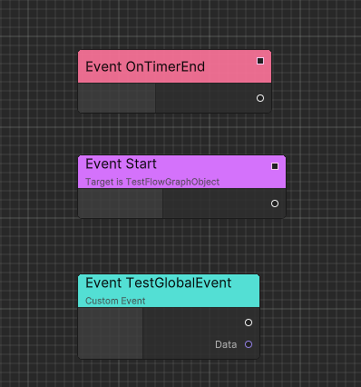

# Flow Conecpt

Before start up Flow, I recommend to read [Ceres Concept](./ceres_concept.md) before.

Flow thinks of game logic as an execution chain to let the game objects do things in order according to your design.

Flow visualizes these executions as nodes so that you can connect them to implement gameplay and functionality.

The following are the core parts of Flow:

## Events

Each execution chain starts from an event which can contain input data.

You can define events in Flow Graph or C# scripts.

## Functions

Functions are components that implement game functions. They complete specified functions by calling the engine or your custom API. Through wiring, you can combine these method calls to complete your creativity.

## Container

We already have events and functions, so how do I apply logic to my GameObject? 

For any FlowGraph instance, there needs to be a specified Container at runtime. 

It can be your custom `MonoBehaviour` (need to implement interface) or inherit from a series of parent classes provided by Ceres. 

You can find more details in [Runtime Architecture](./flow_runtime_architecture.md).

## Next Steps

- Start with [Quick Startup](./flow_startup.md) for a hands-on tutorial
- Learn about [Executable Events](./flow_executable_event.md) to understand event-driven execution
- Explore [Executable Functions](./flow_executable_function.md) for exposing C# methods
- Check [Runtime Architecture](./flow_runtime_architecture.md) for container types and usage