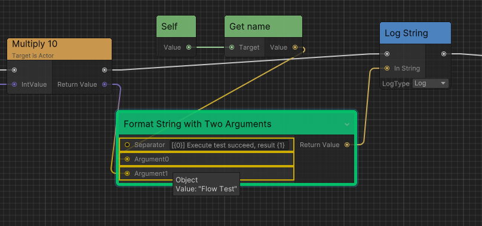
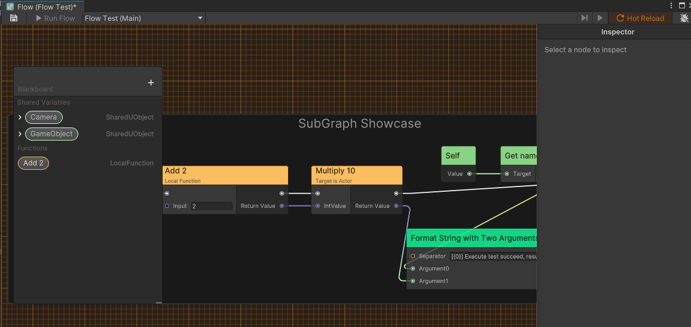

# Debugging

Ceres provides powerful debugging capabilities to help you troubleshoot your visual scripts.

### Enable Debug Mode
To enable and disable debug mode, click the `debug` button in the upper right corner. Then, you can click `Next Frame` to execute the graph node by node.

### Breakpoints
You can right click any node and select `Add Breakpoint`, then click `Next Breakpoint` in the toolbar to execute the graph breakpoint by breakpoint.

### Port Debugging

Ceres editor can display the current value of an input port when the mouse hovers over the port of the node at the current breakpoint.

### Graph Tracker
`FlowGraphTracker` is a class that can be used to track the execution of the graph for advanced debugging scenarios.

For more details, you can see the sample [FlowGraphDependencyTracker](https://github.com/AkiKurisu/Ceres/blob/main/Runtime/Flow/Models/FlowGraphTracker.cs).

### Hot Reload

Ceres supports hot reloading of `FlowGraphObject`. When you modify a `FlowGraphObject` in playing mode, the changes can be reflected immediately.

To enable hot reload, you need toggle the `Hot Reload` option in Flow Editor's toolbar and then try to save your graph in playing mode.

## Next Steps

- Learn about [Graph Tracker](./flow_graph_tracker.md) for advanced debugging and execution tracking
- Explore [Custom Nodes](./flow_custom_node.md) to understand node execution flow
- Check [Runtime Architecture](./flow_runtime_architecture.md) for container types and execution context