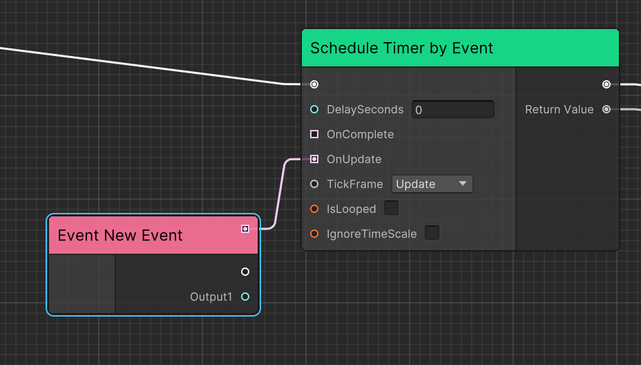
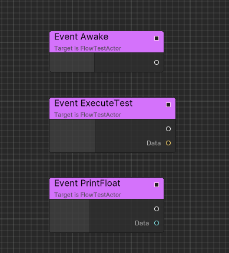
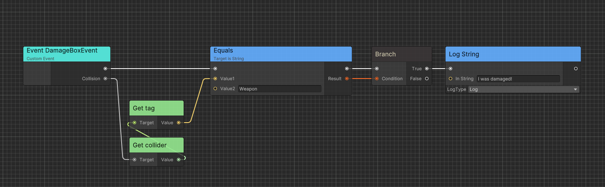

# Executable Event

Following are the different types of Events in Flow.

## Execution Event

`ExecutionEvent` is a common event that can be used to trigger the execution of a FlowGraph instance.


> You can double click the event node and rename it.

By default, `ExecutionEvent` without parameters can be created in search window.

`ExecutionEvent` with parameters can be created when you drag any port with type `EventDelegate<>`.



Also support port with type `Action<>` by [implicit conversation](#port-implict-conversation).


## Implementable Event

Implementable events can be defined in [Container](#container) C# script to allow the script side to execute Flow logic.

Following is an implementation example.

```C#
public class FlowTest : FlowGraphObject /* Inherit from MonoBehaviour */
{
    [ImplementableEvent]
    public void Awake()
    {

    }

    [ImplementableEvent]
    public void PrintFloat(float data)
    {

    }

    [ImplementableEvent]
    public void ExecuteTest(string data)
    {

    }
}
```



## Custom Event

`CustomEvent` allows you to define a event across flow graph and containers. 

Here is an implementation example:

```C#
/* Add ExecutableEventAttribute to custom event in order to let event be exposed in flow graph */
[ExecutableEvent]
public class DamageBoxEvent: EventBase<DamageBoxEvent>
{
    public Collision Collision { get; private set; }

    /* Add ExecutableEventAttribute to static create function in order to let event can be created in flow graph */
    [ExecutableEvent]
    public static DamageBoxEvent Create(Collision collision)
    {
        var evt = GetPooled();
        evt.Collision = collision;
        return evt;
    }
}

public class DamageBox: MonoBehaviour
{
    private void OnCollisionEnter(Collision other) 
    {
        using var evt = DamageBoxEvent.Create(other);
        GetComponentInParent<FlowGraphObject>().SendEvent(evt);
    }
}
```



In this case, we create a collision event and send an Event to the Flow Graph when the DamageBox is hit. 
By using `CustomEvent`, we can ignore whether the `Container` has a corresponding implementation and only focus on the event itself.
Similar to the usage of Unity's `GameObject.SendMessage`.

### Technique Details

The implementation of `CustomEvent` is based on source generator and [Chris.Events](https://github.com/AkiKurisu/Chris/blob/main/Docs/Events.md), a contextual event system.

## Next Steps

- Learn about [Executable Functions](./flow_executable_function.md) for exposing C# methods to Flow
- Explore [Runtime Architecture](./flow_runtime_architecture.md) to understand how events are executed
- Check [Code Generation](./flow_codegen.md) for technical details on event implementation
- See [Quick Startup](./flow_startup.md) for a complete example using events