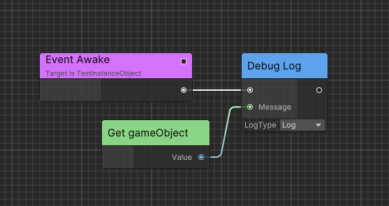

# Runtime Architecture

Following is the runtime architecture of Flow. Flow provides a variety of different Container types, 
which are highly compatible with Unity's native `MonoBehaviour` and `ScriptableObject` architecture, allowing you to choose your favorite workflow.

## FlowGraphObject

In Unity, we use MonoBehaviour to add functionality to GameObjects in the scene. 
In Flow, you can use `FlowGraphObject` and its inherited components to implement your game logic, such as character controllers, interactions, etc.

## FlowGraphAsset

`FlowGraphAsset` is a ScriptableObject used to reuse FlowGraph. You can set the `IFlowGraphRuntime` type it plays at runtime. 


In Editor Mode, the graph editor will consider the owner of the Flow Graph to be the type you set, which is the `Actor` type as shown in the figure. Create `Property/Self Reference` node, you will see the port type is `Actor`.


## FlowGraphInstanceObject

`FlowGraphInstanceObject` is a MonoBehaviour used to creating flow graph from `FlowGraphAsset` at runtime.

Here is an example, create a new class named `TestInstanceObject`:

```C#
using Ceres.Graph.Flow;
using Ceres.Graph.Flow.Annotations;
public class TestInstanceObject: FlowGraphInstanceObject
{
    [ImplementableEvent]
    public void Awake()
    {

    }
}
```

Then create a new `FlowGraphAsset` and set the `RuntimeType`. Open flow graph and implement `Awake` event.



Create a new `GameObject` in scene and add `TestInstanceObject` component to the `GameObject`. Drag the `FlowGraphAsset` to the `TestInstanceObject` and you will see the `Awake` event is invoked after entering play mode.

## FlowGraphScriptableObject

Beside the use of data sharing, `ScriptableObject` can also be used as a logic container. You can use `FlowGraphScriptableObject` to implement logic from `ScriptableObject` directly which is useful to create skill, state machine, buff, dialogue, etc.

Compared with `FlowGraphAsset`, `FlowGraphScriptableObject` owns an instance of `FlowGraph` at runtime.