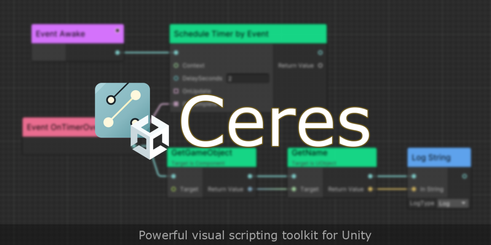
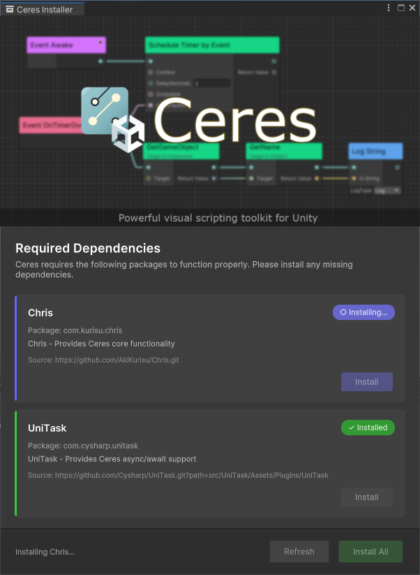

<div class="ceres-hero">
  <div class="ceres-hero-inner">
    <div class="ceres-hero-copy">
      <h1 class="ceres-hero-title">Unity <span class="grad">visual scripting</span> toolkit</h1>
      <p class="ceres-hero-sub">Highly-optimized runtime performance and code generation — design Flow graphs that map directly to your C#, with zero reflection overhead.</p>
      <div class="ceres-hero-actions">
        <a class="ceres-btn ceres-btn-primary" href="docs/flow_startup.md">Get Started →</a>
        <a class="ceres-btn ceres-btn-ghost" href="https://github.com/AkiKurisu/Ceres" target="_blank" rel="noopener">View on GitHub</a>
      </div>
      <div class="ceres-hero-badges">
        <span>Unity 2022.3 LTS+</span>
        <span>ILPP Code Generation</span>
        <span>MIT Licensed</span>
        <span>Open Source</span>
      </div>
    </div>
    
  </div>
</div>

## Features

<div class="ceres-features">
  <div class="ceres-card">
    <div class="ceres-card-icon">🧩</div>
    <h3><a class="stretched" href="docs/flow_concept.md">Flow Graph</a></h3>
    <p>Node-based visual scripting that maps directly to your C# methods, events and properties.</p>
  </div>
  <div class="ceres-card">
    <div class="ceres-card-icon">⚡</div>
    <h3><a class="stretched" href="docs/flow_codegen.md">Code Generation</a></h3>
    <p>Compile graphs to fast runtime code paths via ILPP — no reflection overhead at runtime.</p>
  </div>
  <div class="ceres-card">
    <div class="ceres-card-icon">📚</div>
    <h3><a class="stretched" href="docs/flow_function_library.md">Function Library</a></h3>
    <p>Expose your own static methods to graphs as reusable, strongly-typed function nodes.</p>
  </div>
  <div class="ceres-card">
    <div class="ceres-card-icon">🛠️</div>
    <h3><a class="stretched" href="docs/flow_custom_node.md">Custom &amp; Generic Nodes</a></h3>
    <p>Author custom and generic nodes plus editor views to fit any gameplay workflow.</p>
  </div>
  <div class="ceres-card">
    <div class="ceres-card-icon">🧭</div>
    <h3><a class="stretched" href="docs/flow_graph_tracker.md">Graph Tracker</a></h3>
    <p>Track and inspect live graph instances across your scene from a single window.</p>
  </div>
  <div class="ceres-card">
    <div class="ceres-card-icon">🐞</div>
    <h3><a class="stretched" href="docs/flow_debugging.md">Live Debugging</a></h3>
    <p>Inspect execution paths, set breakpoints and debug ports right inside the editor.</p>
  </div>
</div>

## Get Started

Install Ceres directly, then let the built-in **Ceres Installer** pull in the dependencies for you — no manual `manifest.json` editing required.

<div class="ceres-install">
  <div class="ceres-steps">
    <div class="ceres-step">
      <span class="ceres-step-num">1</span>
      <div class="ceres-step-body">
        <h3>Add Ceres to your project</h3>
        <p>In Unity, open <strong>Package Manager → Add package from git URL</strong> and paste:</p>
        <pre><code>https://github.com/AkiKurisu/Ceres.git</code></pre>
        <p class="ceres-step-note">Or clone the repo into your project's <code>Packages/</code> folder.</p>
      </div>
    </div>
    <div class="ceres-step">
      <span class="ceres-step-num">2</span>
      <div class="ceres-step-body">
        <h3>Open the Ceres Installer</h3>
        <p>From the menu bar, choose <strong>Tools ▸ Ceres ▸ Installer</strong>.</p>
      </div>
    </div>
    <div class="ceres-step">
      <span class="ceres-step-num">3</span>
      <div class="ceres-step-body">
        <h3>Install dependencies</h3>
        <p>Click <strong>Install All</strong> to automatically download the required packages — <strong>Chris</strong> and <strong>UniTask</strong>. You're ready to build your first Flow graph.</p>
      </div>
    </div>
  </div>
  <figure class="ceres-install-shot">
    
    <figcaption>The Ceres Installer resolves dependencies for you.</figcaption>
  </figure>
</div>

> **Prefer manual setup?** Add these to your `manifest.json` instead:
>
> ```json
> "dependencies": {
>   "com.kurisu.chris": "https://github.com/AkiKurisu/Chris.git",
>   "com.cysharp.unitask": "https://github.com/Cysharp/UniTask.git?path=src/UniTask/Assets/Plugins/UniTask"
> }
> ```

Requires Unity **2022.3 LTS** or later — compatible with Unity 6.

<div class="ceres-next">
  <a class="ceres-next-item" href="docs/ceres_concept.md">
    <strong>Concept →</strong>
    <span>Core ideas behind Ceres</span>
  </a>
  <a class="ceres-next-item" href="docs/flow_startup.md">
    <strong>Quick Startup →</strong>
    <span>Build your first Flow graph</span>
  </a>
  <a class="ceres-next-item" href="docs/flow_runtime_architecture.md">
    <strong>Runtime Architecture →</strong>
    <span>How graphs execute under the hood</span>
  </a>
  <a class="ceres-next-item" href="api/Ceres.Graph.Flow.html">
    <strong>Scripting API →</strong>
    <span>Full API reference</span>
  </a>
</div>
