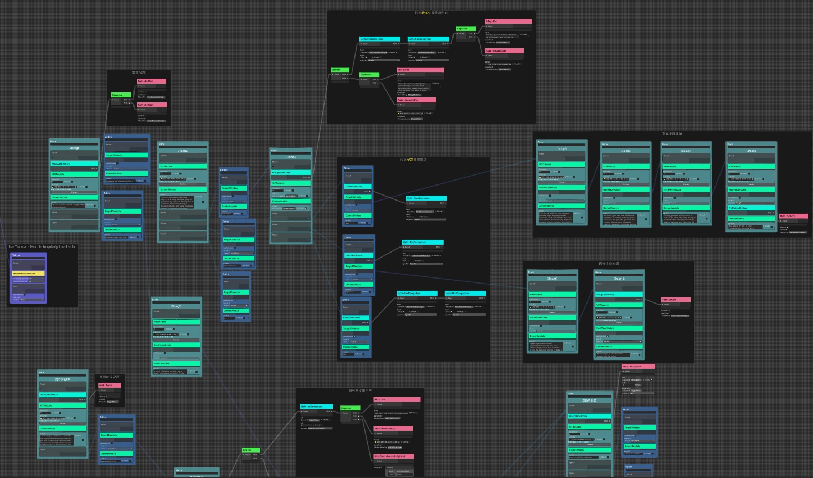

<div align="center">

# Ceres
Powerful visual scripting toolkit for Unity.


<b>*Still in earlier development and may have frequent API changes, 
do not use it in any production environment*</b>

</div>

## Dependencies

Add following dependencies to `manifest.json`.

```json
  "dependencies": {
    "com.kurisu.chris": "https://github.com/AkiKurisu/Chris.git",
    "com.cysharp.unitask":"https://github.com/Cysharp/UniTask.git?path=src/UniTask/Assets/Plugins/UniTask",
    "com.unity.nuget.newtonsoft-json": "3.2.1"
  }

```

## HighLights

- Generic and delegate support
- Graph and C# integration
- Editor debugging
- Easy implementation
- Optimized runtime performance

## Platform

Unity 2022.3 LTS or later.

Support Mono, IL2CPP.

## Documentation

[Tutorial](https://akikurisu.github.io/Ceres/docs/ceres_concept.html)

[API Reference](https://akikurisu.github.io/Ceres/api/Ceres.html)

## Wiki

[Ceres Wiki](https://deepwiki.com/AkiKurisu/Ceres/) generated by [DeepWiki](https://deepwiki.com).

## Implementation

### Flow

Powerful visual scripting solution inspired from Unreal's Blueprint.
  
Included in this repository. 

See [Startup Flow](https://akikurisu.github.io/Ceres/docs/flow_startup.html)


### Flow Hotupdate

Implement a Data-Driven and Per-Actor hotupdate solution.

See [Chris.Gameplay](https://github.com/AkiKurisu/Chris.Gameplay) for more details.


 
### Next Gen Dialogue

AI powered dialogue visual designer for Unity.

See [Next-Gen-Dialogue](https://github.com/AkiKurisu/Next-Gen-Dialogue).



## Reference

[Chris](https://github.com/AkiKurisu/Chris) 

> Support Ceres to serialize any object and edit them in editor, 
also providing contextual event used in Flow.

[UniTask](https://github.com/Cysharp/UniTask) 

> Support Ceres to execute node in async.

## Articles

Technique articles related to Ceres.

[如何设计一个Unity可视化脚本框架（一）](https://zhuanlan.zhihu.com/p/20500696157)

[如何设计一个Unity可视化脚本框架（二）](https://zhuanlan.zhihu.com/p/20711259559)

[如何设计一个Unity可视化脚本框架（三）](https://zhuanlan.zhihu.com/p/23323693948)

[让Unity IL2CPP下的反射性能提高100倍的方法](https://zhuanlan.zhihu.com/p/25806713882)

## License

MIT