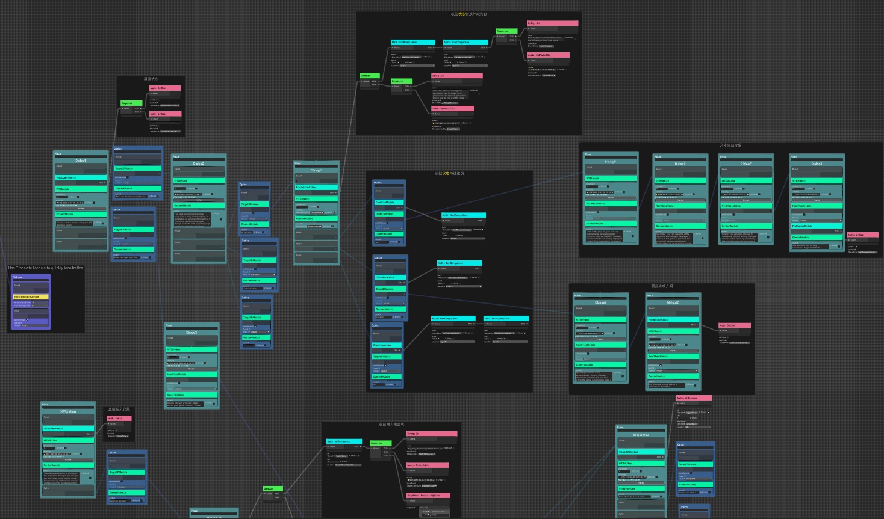

<div align="center">

# Ceres
Powerful visual scripting toolkit for Unity.


<b>*Still in earlier development and may have frequent API changes, 
do not use it in any production environment*</b>

</div>

## Dependencies

Add following dependencies to `manifest.json`.

```json
  "dependencies": {
    "com.kurisu.chris": "https://github.com/AkiKurisu/Chris.git",
    "com.cysharp.unitask":"https://github.com/Cysharp/UniTask.git?path=src/UniTask/Assets/Plugins/UniTask",
    "com.unity.nuget.newtonsoft-json": "3.2.1"
  }

```

## HighLights

- Generic and delegate support
- Graph and C# integration
- Editor debugging
- Easy implementation
- Optimized runtime performance

## Contents

[Concept of Ceres](./Docs/ceres_concept.md)
> Introducing the core concepts of Ceres.

[Code Generation in Ceres](./Docs/ceres_codegen.md)
> Introducing the code generation inside Ceres.

[Startup Flow](./Docs/flow_startup.md)
> Introducing the visual scripting solution Flow inside Ceres.

## Platform

Unity 2022.3 LTS or later.

Support Mono, IL2CPP.
> To use Ceres in IL2CPP scripting backend, `Project Settings/Player/Optimization/Managed Stripping Level` must be `Minimal`.

## API Reference

https://akikurisu.github.io/Ceres/api/Ceres.html

## Implementation

### Ceres.Flow

Powerful visual scripting solution inspired from Unreal's Blueprint.
  
Included in this repository. 

See [Startup Flow](./Docs/flow_startup.md).


 
### Next Gen Dialogue

AI powered dialogue visual designer for Unity.

See [Next-Gen-Dialogue](https://github.com/AkiKurisu/Next-Gen-Dialogue).



## Reference

[Chris](https://github.com/AkiKurisu/Chris) 

>Support Ceres to serialize any object and edit them in editor, 
also providing contextual event used in Flow.

[UniTask](https://github.com/Cysharp/UniTask) 

>Support Ceres to execute node in async.

## Articles

[如何设计一个Unity可视化脚本框架（一）](https://zhuanlan.zhihu.com/p/20500696157)

[如何设计一个Unity可视化脚本框架（二）](https://zhuanlan.zhihu.com/p/20711259559)

[如何设计一个Unity可视化脚本框架（三）](https://zhuanlan.zhihu.com/p/23323693948)