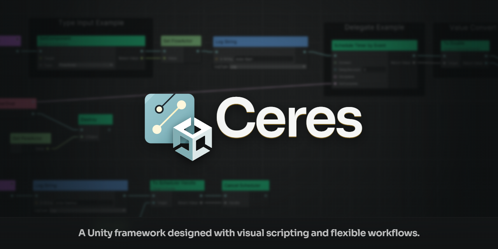
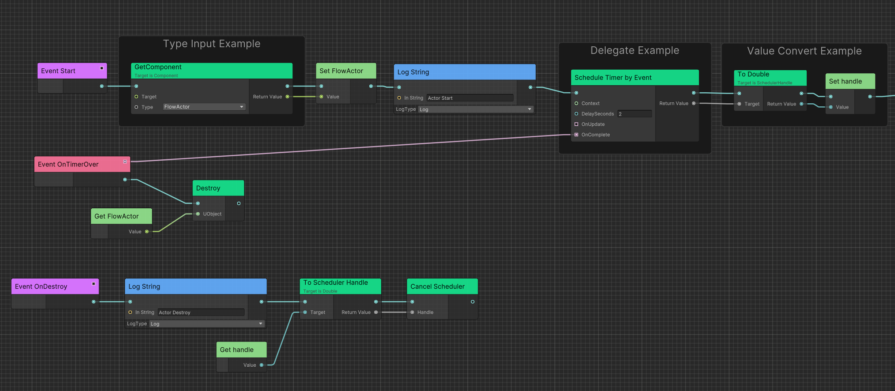

<div align="center">

[](https://github.com/AkiKurisu/Ceres/releases)
[](./LICENSE)
[](https://www.zhihu.com/people/akikurisu)
[](https://space.bilibili.com/20472331)
[](https://deepwiki.com/AkiKurisu/Ceres)



Ceres is my personal Unity framework designed with visual scripting and flexible workflows.

> Ceres wasn't built with commercial games in mind, it was initially intended for my indie games and student projects. I've maintained it since my student days, and it's now become the main infrastructure for my Unity projects, so it's been constantly updated. I hope you like it.

</div>

## Why Ceres?

Ceres is a C#-first Unity framework for building gameplay systems, authoring content, and extending behavior through visual scripting.

- **C#-first visual scripting:** build systems and typed APIs in C#, iterate with debuggable, hot-reloadable Flow graphs, and generate C# runtime programs for performance-sensitive or IL2CPP builds.
- **Actor-based world design:** organize gameplay around Actors, Components, controllers, and lifecycle-managed world services through a lightweight scaffold that projects can extend.
- **Data-driven gameplay:** build on typed Data Tables and hierarchical configuration, then tune live parameters through console variables without rebuilding or restarting the game.
- **Graph-driven content pipeline:** turn project-defined content scopes into deterministic Addressables builds, validated updates, and relocatable packages that can be mounted at runtime.
- **Script-driven PlayableGraph animation:** compose clips and Animator Controllers in code or Flow with cross-fades, layers, masks, sequences, and animation notifications.
- **Low-overhead runtime foundations:** use pooled lifetimes, stable-index sparse storage, reactive state, and allocation-free scheduling paths in performance-sensitive gameplay code.

Production utilities cover reactive graphics settings, data-driven render profiles and levels, pooled audio and effects, Burst-accelerated AI spatial queries, and Addressables-based mod loading.

## Platforms

Ceres requires Unity 2022.3 LTS or later and is developed on Unity 6.

## Install

1. Install [NuGetForUnity](https://github.com/GlitchEnzo/NuGetForUnity) through Unity Package Manager with:

   ```text
   https://github.com/GlitchEnzo/NuGetForUnity.git?path=/src/NuGetForUnity
   ```

2. Open **NuGet > Manage NuGet Packages** and install `R3` version `1.3.0`.

3. Add UniTask and Ceres to your project's `Packages/manifest.json`:

```json
"dependencies": {
    "com.kurisu.ceres": "https://github.com/AkiKurisu/Ceres.git?path=Packages/com.kurisu.ceres",
    "com.cysharp.unitask": "https://github.com/Cysharp/UniTask.git?path=src/UniTask/Assets/Plugins/UniTask#2.5.3"
}
```

See [Getting Started](https://akikurisu.github.io/Ceres/docs/getting_started.html) for the complete installation flow.

## Documentation

- [Documentation](https://akikurisu.github.io/Ceres/)
- [Getting Started](https://akikurisu.github.io/Ceres/docs/getting_started.html)
- [Ceres Core](https://akikurisu.github.io/Ceres/docs/ceres_concept.html)
- [Ceres Flow](https://akikurisu.github.io/Ceres/docs/flow_startup.html)
- [Ceres Gameplay](https://akikurisu.github.io/Ceres/docs/gameplay.html)
- [Scripting API](https://akikurisu.github.io/Ceres/api/Ceres.html)

## Modules and Ecosystem

### Ceres Core

Ceres's foundation modules, including Events, Schedulers, Configs, Serialization, Resources, Data Driven workflows, Content Pipeline, Pool, Tasks, and Modules.

### Ceres Flow



Ceres' built-in event-driven visual scripting solution.

See [Startup Flow](https://akikurisu.github.io/Ceres/docs/flow_startup.html).

### Ceres Gameplay

Ceres Gameplay is a lightweight, Actor-based gameplay foundation with lifecycle-managed world services, level orchestration, PlayableGraph animation, graphics, audio and effects, AI spatial queries, mod support, and Flow integration.

See [Gameplay](https://akikurisu.github.io/Ceres/docs/gameplay.html).

### Next Gen Dialogue


AI-powered dialogue visual designer for Unity.

See [Next-Gen-Dialogue](https://github.com/AkiKurisu/Next-Gen-Dialogue).

## Articles

Technique articles related to Ceres.

### Design

[如何设计一个Unity可视化脚本框架（一）](https://zhuanlan.zhihu.com/p/20500696157)

[如何设计一个Unity可视化脚本框架（二）](https://zhuanlan.zhihu.com/p/20711259559)

[如何设计一个Unity可视化脚本框架（三）](https://zhuanlan.zhihu.com/p/23323693948)

### Performance

[让Unity IL2CPP下的反射性能提高100倍的方法](https://zhuanlan.zhihu.com/p/25806713882)

## License

[MIT](./LICENSE)
