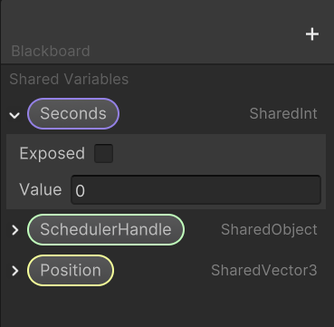
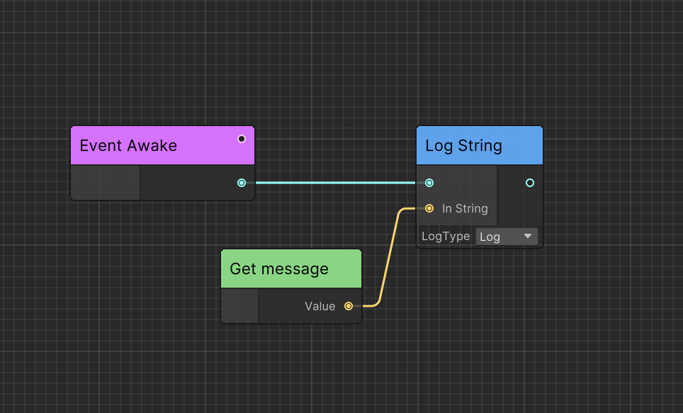
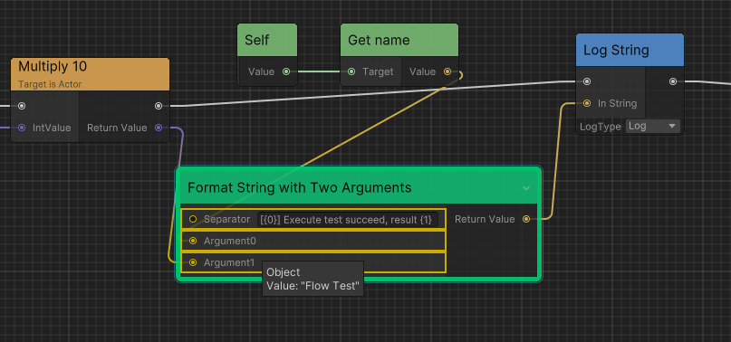
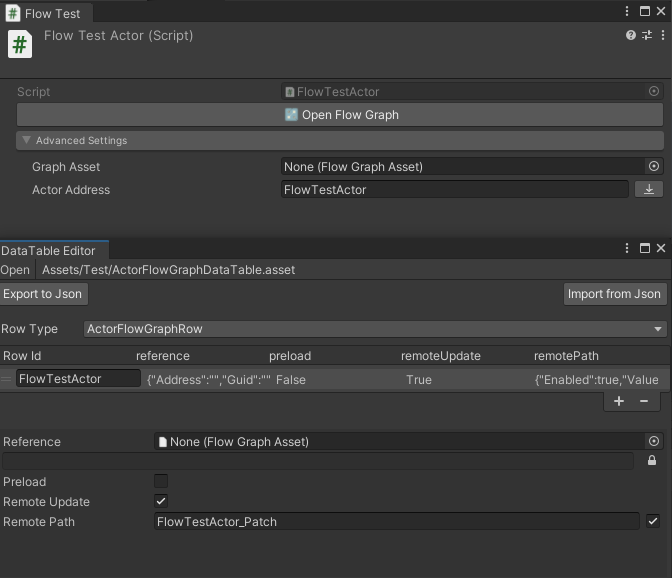

<div align="center">

# Ceres

Powerful visual scripting toolkit for Unity.


</div>

## Table of Contents

- [Install](#install)
- [Highlights](#highlights)
- [Platforms](#platforms)
- [Core Concepts](#core-concepts)
- [Quick Start Guide](#quick-start-guide)
- [Flow Visual Scripting](#flow-visual-scripting)
- [ExecutableReflection](#executablereflection)
- [Debugging](#debugging)
- [Advanced Features](#advanced-features)
- [Type Preservation](#type-preservation)
- [Code Generation](#code-generation)
- [Performance](#performance)
- [Documentation](#documentation)
- [Implementation](#implementation)
- [Articles](#articles)
- [License](#license)

## 📦 Install

### Install from UPM

Add following dependencies to `manifest.json`.

```json
"dependencies": {
    "com.kurisu.chris": "https://github.com/AkiKurisu/Chris.git",
    "com.cysharp.unitask":"https://github.com/Cysharp/UniTask.git?path=src/UniTask/Assets/Plugins/UniTask"
}
```

Use git URL to download package by Unity Package Manager ```https://github.com/AkiKurisu/Ceres.git```.

### Install from Disk

Clone repo to your project `Packages` folder.

Use `Tools/Ceres/Installer` to install dependencies.


## ✨ Highlights

> **Powerful visual scripting toolkit** that brings the best of both worlds - visual programming and C# code integration.

### 🚀 **Core Features**

- **🎯 Generic & Delegate Support** - Full support for C# generics and delegates in visual scripting
- **🔗 Graph & C# Integration** - Seamless integration between visual graphs and traditional C# code
- **🐛 Editor Debugging** - Built-in debugging tools with breakpoints and step-by-step execution
- **⚡ Easy Implementation** - Simple setup with minimal configuration required
- **🏃‍♂️ Optimized Runtime Performance** - High-performance execution with IL2CPP optimizations
- **📱 IL2CPP Compatible** - Fully compatible with IL2CPP builds and recommended for production

### 🎨 **Visual Excellence**

- **Intuitive Node-Based Editor** - Clean, modern interface for creating visual scripts
- **Real-time Preview** - See your logic flow as you build it
- **Professional Workflow** - Industry-standard tools and practices

## Platforms

Unity 2022.3 LTS or later, compatible with Unity 6.

## Core Concepts

Understanding the fundamental concepts of Ceres will help you get started quickly.

### Node
`CeresNode` is the logic and data container that forms the building blocks of your visual scripts.

### Port
`CeresPort` enables you to get data from other nodes. Ceres uses `CeresPort<T>` to get generic data from other nodes and `NodePort` to get a `NodeReference` which can convert to `CeresNode` at runtime.

### Graph
`CeresGraph` contains everything and acts as a virtual machine that executes your visual scripts.

### Data
Ceres serializes node, port and graph to additional data structures: `CeresNodeData`, `CeresPortData` and `CeresGraphData` which contain the actual serialized data and metadata.

### Variable
`SharedVariable` is a data container that can be shared between nodes and graphs. Compared with `CeresPort`, `SharedVariable` can be edited outside of the graph and doesn't contain any connection data since it doesn't need to know where the data comes from.



### Execution Path
Nodes can be executed in two ways:

**Forward**: Graph can execute nodes one by one.

**Dependency**: Graph should execute node's dependencies before executing the node.



As shown in the figure, to execute `Log String`, we need to first get the variable `message`. However, since `Get message` has no outer connection, it has not been executed before. So the graph needs to consider `Get message` as a dependency and execute it before executing `Log String`.

## Quick Start Guide

Here's a step-by-step example of using Flow to output a "Hello World" message:

### 1. Create a Flow Object
Create a new C# script `MyFlowObject.cs` and make it inherit from `FlowGraphObject`:

```csharp
using Ceres.Graph.Flow;
using Ceres.Graph.Flow.Annotations;

public class MyFlowObject: FlowGraphObject
{
    [ImplementableEvent]
    private void Start()
    {

    }
}
```

### 2. Setup in Scene
Create a new GameObject in the scene and attach the `MyFlowObject` component to it.

### 3. Open Flow Graph Editor
Click `Open Flow Graph` in the Inspector panel to open the Flow Graph Editor.


### 4. Create Start Event
Right-click the graph and click `Create Node/Select Events/Implement Start`.


### 5. Add Log String Node
Click `Create Node` and search `Log String`, then connect the white port (exec) to the `Start` node's output (exec). Fill in "Hello World!" in the `In String` field of the `Log String` node.


### 6. Save and Test
Click the save button in the left upper corner, then play the game. You will see "Hello World!" in the console.

## Flow Visual Scripting

Flow thinks of game logic as an execution chain to let game objects do things in order according to your design. Flow visualizes these executions as nodes so that you can connect them to implement gameplay and functionality.

### Events
Each execution chain starts from an event which can contain input data.


You can define events in Flow Graph or C# scripts.

### Functions
Functions are components that implement game functions. They complete specified functions by calling the engine or your custom API. Through wiring, you can combine these method calls to complete your creativity.

### Container
For any FlowGraph instance, there needs to be a specified Container at runtime. It can be your custom `MonoBehaviour` (need to implement interface) or inherit from a series of parent classes provided by Ceres.

## ExecutableReflection

ExecutableReflection allows you to expose C# methods to Flow graphs, making them available as nodes. There are three main ways to define executable functions:

### 1. Instance Functions

For instance methods, add `ExecutableFunctionAttribute` directly to your method:

```csharp
using Ceres.Graph.Flow.Annotations;
using UnityEngine;

public class MyComponent : MonoBehaviour
{
    [ExecutableFunction]
    public void DoSomething(int arg1, float arg2)
    {
        Debug.Log($"Doing something with {arg1} and {arg2}");
    }
    
    [ExecutableFunction]
    public string GetPlayerName()
    {
        return "Player";
    }
}
```

### 2. Static Functions

For static methods, create a **partial** class that inherits from `ExecutableFunctionLibrary` and add `ExecutableFunctionAttribute`:

```csharp
using Ceres.Graph.Flow;
using Ceres.Graph.Flow.Annotations;
using Ceres.Annotations;
using UnityEngine;

public partial class GameplayFunctionLibrary : ExecutableFunctionLibrary
{
    [ExecutableFunction(IsScriptMethod = true, IsSelfTarget = true)]
    [CeresLabel("Get GameObject Name")]
    public static string Flow_GetGameObjectName(GameObject gameObject)
    {
        return gameObject.name;
    }
    
    [ExecutableFunction(ExecuteInDependency = true)]
    public static float Flow_CalculateDistance(Vector3 pointA, Vector3 pointB)
    {
        return Vector3.Distance(pointA, pointB);
    }
    
    [ExecutableFunction]
    public static Component Flow_FindComponent(
        GameObject target,
        [ResolveReturn] SerializedType<Component> componentType)
    {
        return target.GetComponent(componentType);
    }
}
```

> **Important**: You must add the `partial` modifier to let the source generator work. The source generator registers static function pointers to enhance runtime performance instead of using MethodInfo.

### 3. Always Included Assemblies

Flow automatically includes assemblies matched by `Always Included Assembly Wildcards` in `Project Settings/Ceres/Flow Settings`. Methods in these assemblies can be invoked without adding attributes:

```csharp
public class UtilityClass
{
    public void AutomaticallyIncludedMethod(string message)
    {
        Debug.Log($"Auto-included: {message}");
    }
}
```

### Best Practices and Conventions

1. **Unique Method Names**: Methods with the same name and parameter count in the same class hierarchy can only have one `ExecutableFunctionAttribute`.

2. **Method Overloads**: For methods with the same name but different parameters, use `CeresLabelAttribute` to distinguish them:

```csharp
[ExecutableFunction, CeresLabel("Log Message")]
public static void Flow_Log(string message)
{
    Debug.Log(message);
}

[ExecutableFunction, CeresLabel("Log Message with Color")]
public static void Flow_Log(string message, Color color)
{
    Debug.Log($"<color=#{ColorUtility.ToHtmlStringRGB(color)}>{message}</color>");
}
```

3. **Parameter Limits**: Keep input parameters ≤ 6 for optimal editor performance. Methods with more parameters use Uber nodes with greater runtime overhead.

4. **Generic Methods**: Generic methods are not supported with `ExecutableFunctionAttribute`. Use [Generic Nodes](#generic-nodes) instead.

## Debugging

Ceres provides powerful debugging capabilities to help you troubleshoot your visual scripts.

### Enable Debug Mode
To enable and disable debug mode, click the `debug` button in the upper right corner. Then, you can click `Next Frame` to execute the graph node by node.

### Breakpoints
You can right click any node and select `Add Breakpoint`, then click `Next Breakpoint` in the toolbar to execute the graph breakpoint by breakpoint.


### Port Debugging

Ceres editor can display the current value of an input port when the mouse hovers over the port of the node at the current breakpoint.



### Graph Tracker
`FlowGraphTracker` is a class that can be used to track the execution of the graph for advanced debugging scenarios.

### Hot Reload

Ceres supports hot reloading of `FlowGraphObject`. When you modify a `FlowGraphObject` in playing mode, the changes can be reflected immediately.

To enable hot reload, you need toggle the `Hot Reload` option in Flow Editor's toolbar and then try to save your graph in playing mode.


## Advanced Features

### Port Implicit Conversion
For reference type objects, such as `MonoBehaviour` and `Component`, ports can be converted based on the inheritance hierarchy automatically. For value types, you need to register conversions manually.

### Generic Nodes
Generic nodes define type restrictions through template classes, allowing argument types to be obtained in the editor and generic node instances to be constructed at runtime.

### Custom Functions
You can define both local functions within your flow graph and shared functions across multiple graph containers using `FlowGraphFunctionAsset`.

### Port Arrays
For nodes that need resizable port arrays, you can implement `IPortArrayNode` to define dynamic port collections.


## Type Preservation

Ceres provides an automatic type preservation system that prevents IL2CPP code stripping from removing types used in your visual scripts. 

### How It Works

`CeresLinker` will cache types used in nodes during your development and identifies all types that need to be preserved. It will generate a temporal `link.xml` file in build time to prevent IL2CPP from stripping these essential types.

### Manual Type Registration

You can manually register additional types that should be preserved using the `CeresLinker` API:

```csharp
using Ceres.Editor;

// Register a single type
CeresLinker.LinkType(typeof(MyCustomClass));

// Register multiple types
CeresLinker.LinkTypes(new Type[] { 
    typeof(MyCustomClass), 
    typeof(AnotherClass) 
});

// Save the registered types to settings
CeresLinker.Save();
```

### Editor Integration

You can view and manage preserved types through Unity's Project Settings:

1. Go to `Edit > Project Settings > Ceres`
2. Check the "Preserved Types" section to see all registered types
3. Manually add type names if needed

## Code Generation

Ceres uses multiple code generation techniques to enhance runtime performance:

### Source Generator
Analyzes partial classes annotated with `GenerateFlowAttribute` and generates their implementation automatically, reducing code duplication.

### IL Post Process (ILPP)
Uses ILPP to emit IL for initialization logic of `CeresNode` and methods annotated with `ImplementableEventAttribute` to enhance runtime performance.

Recommended to use the newest version of Rider to view the IL code after ILPP directly.


## Performance

Ceres provides a variety of performance enhancements to improve the runtime performance of your visual scripts.

### Flat Relay Nodes
Relay nodes are completely flattened during serialization. At runtime, connections bypass relay nodes entirely, connecting source nodes directly to target nodes.


The picture above shows relay nodes do not effect execution flow (only forward execution three times for `Start`, `Find GameObject`, and `Log String`).


### IL2CPP Call

Ceres implements sophisticated IL2CPP optimizations to achieve near-native performance for executable function calls. The optimization strategy varies by platform to maximize performance while maintaining compatibility.

## Documentation

For more detailed information, you can also visit:

- [Online Tutorial](https://akikurisu.github.io/Ceres/docs/ceres_concept.html)
- [API Reference](https://akikurisu.github.io/Ceres/api/Ceres.html)
- [Ceres Wiki](https://deepwiki.com/AkiKurisu/Ceres/) generated by [DeepWiki](https://deepwiki.com)

## Implementation

### Flow

Ceres built-in event-driven visual scripting solution. 

See [Startup Flow](https://akikurisu.github.io/Ceres/docs/flow_startup.html)


### Flow Hotupdate

Implement a Data-Driven and Per-Actor hotupdate solution.

See [Chris.Gameplay](https://github.com/AkiKurisu/Chris.Gameplay) for more details.


 
### Next Gen Dialogue

AI powered dialogue visual designer for Unity.

See [Next-Gen-Dialogue](https://github.com/AkiKurisu/Next-Gen-Dialogue).


## Articles

Technique articles related to Ceres.

### Design

[如何设计一个Unity可视化脚本框架（一）](https://zhuanlan.zhihu.com/p/20500696157)

[如何设计一个Unity可视化脚本框架（二）](https://zhuanlan.zhihu.com/p/20711259559)

[如何设计一个Unity可视化脚本框架（三）](https://zhuanlan.zhihu.com/p/23323693948)

### Performance

[让Unity IL2CPP下的反射性能提高100倍的方法](https://zhuanlan.zhihu.com/p/25806713882)

## License

MIT
